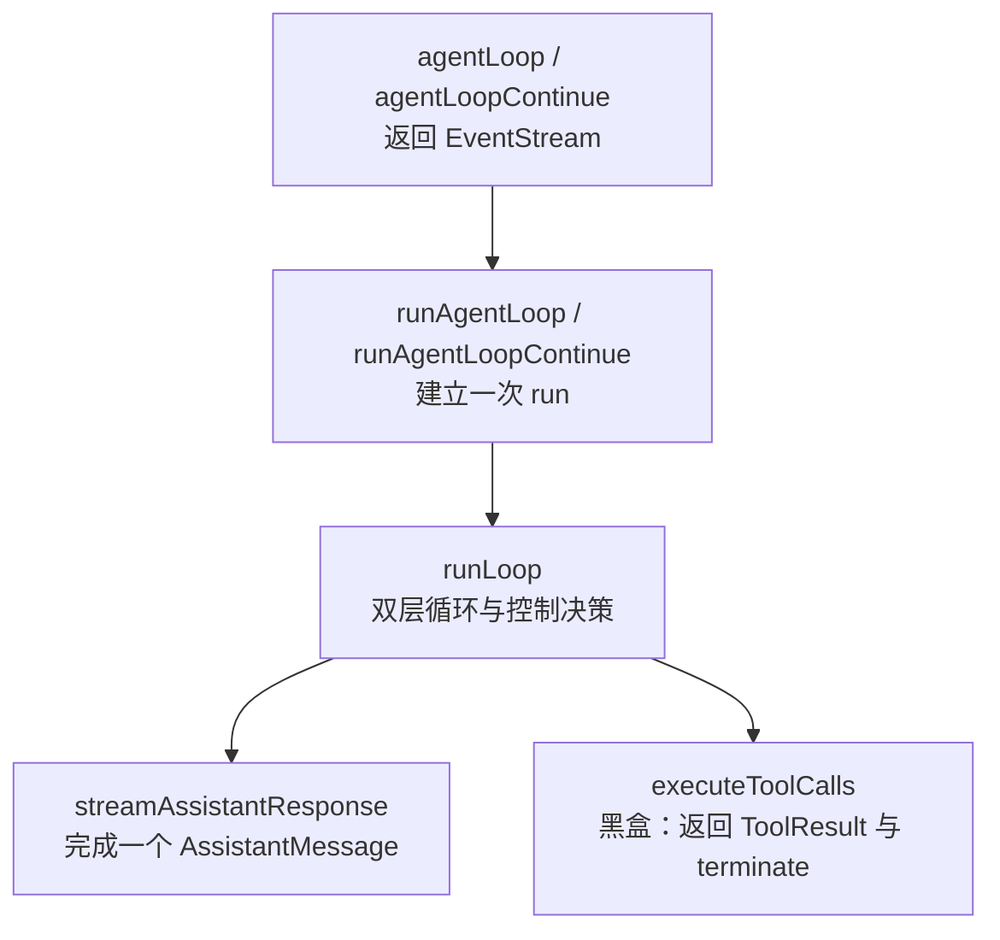
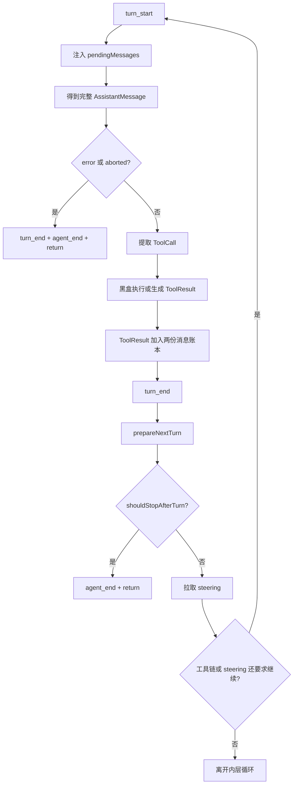
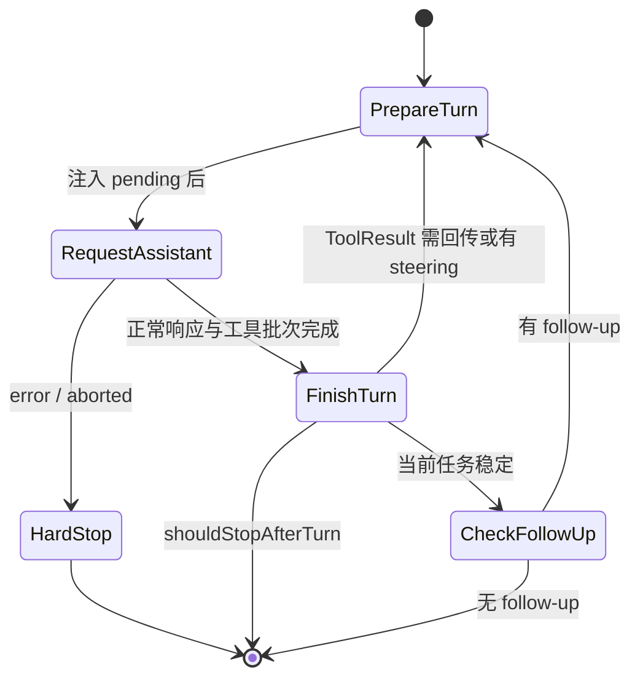

# Agent Loop 双层循环架构详解

本文只回答一个问题：`packages/agent/src/agent-loop.ts` 如何让 Agent 一轮接一轮地运行，并最终在正确的时机停止。

本文把“请求 LLM”和“执行工具”当作两个黑盒，不展开 Provider、HTTP、参数校验或工具内部实现。阅读完成后，你应该能只看一条 AssistantMessage，就判断循环接下来会继续、等待新消息，还是结束。

## 1. 先给结论

Pi Agent 的循环不是递归，也不是“模型自己在运行”。它是本地 TypeScript 代码维护的一个状态机：

```text
准备上下文
  → 请求一次 AssistantMessage
  → 如有 ToolCall，则得到 ToolResult
  → 把新消息追加到上下文
  → 根据 ToolCall、steering、follow-up 和停止条件决定下一步
  → 再请求一次，或结束
```

让它持续运行的核心只有三种动力：

1. 当前 AssistantMessage 产生了需要回传给模型的 ToolResult。
2. 用户在运行期间加入了 steering 消息。
3. Agent 本来准备结束时，队列里还有 follow-up 消息。

`runLoop()` 用内外两层 `while` 分开处理这三种动力：

- 内层循环处理“当前任务还没有稳定下来”的情况：ToolCall 因果链和 steering。
- 外层循环处理“任务已经稳定，但还有排队的新任务”的情况：follow-up。

## 2. 先统一几个名词

这些概念在日常对话里很容易混用，但在源码里边界很明确。

| 概念 | 在本文件中的含义 |
|---|---|
| message | 一条用户、助手或工具结果消息 |
| turn | 一次 Assistant 响应，加上这次响应触发的整批工具结果 |
| run | 从 `agent_start` 到 `agent_end` 的完整运行，可包含多个 turn |
| context | 下一次请求模型时可见的完整对话和工具集合 |
| prompt | 启动本次 run 时新加入的消息 |
| steering | run 尚未结束时，在 turn 边界注入的改向消息 |
| follow-up | run 本来要结束时才取出的后续消息 |

最容易误解的是 turn。一次工具调用不会单独构成一个 turn。下面整个过程才是一个 turn：

```text
turn_start
  → AssistantMessage
  → 0 到多个 ToolCall
  → 0 到多个 ToolResultMessage
turn_end
```

如果工具结果还需要交给模型解释，就会开始下一个 turn。

## 3. 相关源码地图

第一次跳转源码时，建议先认清这些文件：

| 文件 | 作用 |
|---|---|
| [`packages/agent/src/agent-loop.ts`](../../packages/agent/src/agent-loop.ts) | 无持久化的循环内核 |
| [`packages/agent/src/agent.ts`](../../packages/agent/src/agent.ts) | 有状态外壳；管理队列、运行状态和事件订阅 |
| [`packages/agent/src/types.ts`](../../packages/agent/src/types.ts) | `AgentContext`、`AgentLoopConfig`、`AgentEvent` 等契约 |
| [`packages/ai/src/utils/event-stream.ts`](../../packages/ai/src/utils/event-stream.ts) | `EventStream` 和 Assistant 流的实际实现 |
| [`packages/agent/test/agent-loop.test.ts`](../../packages/agent/test/agent-loop.test.ts) | 循环、队列、停止和动态切换的行为证明 |

`agent-loop.ts` 从 `@earendil-works/pi-ai` 导入 `EventStream`。这个名字看起来像外部依赖，但在当前 monorepo 中实现位于 `packages/ai/src/utils/event-stream.ts`。遇到类似“跳不进去”的类型或函数，可以先在仓库根目录搜索导出名，而不是只沿编辑器的 package 跳转。

还要区分“类型”和“实现”。例如 `StreamFn` 是函数类型，只规定输入输出，没有唯一实现；真正使用哪个实现，由上层注入。

## 4. 五层函数为什么要分开

文件顶部几个名字很像，但它们处在不同抽象层。



### 4.1 `agentLoop()`：事件流外观

`agentLoop()` 创建 `EventStream` 后，以 `void runAgentLoop(...)` 启动异步生产者，并立即把 stream 返回给调用方。

因此调用方可以同时做两件事：

```ts
const stream = agentLoop(...);

for await (const event of stream) {
  // 实时渲染事件
}

const messages = await stream.result();
```

这里有两个完成概念：

- `agent_end` 被 push 时，`EventStream` 提取最终 `messages`，使 `result()` 可以完成。
- `runAgentLoop()` 返回后调用 `stream.end()`，关闭异步迭代器。

### 4.2 `runAgentLoop()`：建立新 run

它负责：

1. 创建本次运行的 `newMessages`。
2. 把 prompt 追加到内部 context 副本。
3. 发送 `agent_start`、第一个 `turn_start` 和 prompt 的 message 事件。
4. 调用共享的 `runLoop()`。
5. 返回本次运行新增的消息。

它不直接决定第二轮是否开始，决定权在 `runLoop()`。

### 4.3 `runAgentLoopContinue()`：从已有尾部继续

它不添加新 prompt，适用于已有 context 以 user 或 toolResult 结尾的情况，例如重试。

与普通入口的主要差异是：

- `newMessages` 初始为空。
- 不发送新 prompt 的 message 事件。
- 已有历史不会出现在返回的 `newMessages` 中。

如果 context 为空，或最后一条是 assistant，会立即拒绝继续。这是因为通常不能让模型在没有新 user/toolResult 输入时凭空再接一条 assistant。

这里说的是低层 `runAgentLoopContinue()`。高层 `Agent.continue()` 遇到 assistant 尾部时还有一层特殊处理：它会先尝试取出已经排队的 steering 或 follow-up，把取出的消息作为新 prompt 启动，而不是直接调用低层 continue。

### 4.4 `runLoop()`：循环内核

它只关心控制流：什么时候请求一条 AssistantMessage，什么时候把新消息加入 context，什么时候再跑一轮，什么时候退出。

### 4.5 `streamAssistantResponse()`：单次响应适配器

它只负责把一次流式响应收敛为一条完整 AssistantMessage，并维护相关 message 事件。对 `runLoop()` 来说，它可以被理解成：

```ts
const message = await getOneCompleteAssistantMessage();
```

## 5. 两份消息列表：完整账本与本次增量

`runLoop()` 同时维护两个看起来相似的数组，这是理解代码的关键。

### `currentContext.messages`

默认情况下，这是循环内部持续增长的工作账本，包含：

- 运行前已有的历史消息。
- 本次 prompt。
- 每轮 AssistantMessage。
- 每个 ToolResultMessage。
- 注入的 steering 和 follow-up。

下一次请求模型时以它为基础。`prepareNextTurn()` 可以在 turn 边界主动替换整份工作 context，例如换成压缩后的消息；这种替换不会改写 `newMessages`，也不等于删除 `Agent.state.messages` 中的正式 transcript。

### `newMessages`

这是本次 run 的增量账本，只记录这次运行新产生或新注入的消息。它最终放进 `agent_end`，也是低层函数的返回值。

例如在没有替换 context 的情况下，运行前已有 20 条历史，本次产生：

```text
user prompt
assistant tool call
tool result
assistant final answer
```

那么：

- `currentContext.messages` 最终有 24 条。
- `newMessages` 只有这次新增的 4 条。

这种设计让循环既能拿到完整上下文，又不需要在结束时重新比较数组来计算“这次新增了什么”。

`Agent` 外壳并不在 run 结束时整批替换自己的 transcript。它监听 `message_end`，逐条把最终消息加入 `Agent.state.messages`。流式 partial 只放在 `streamingMessage`，不会被当作一条新历史反复追加。

### 5.1 请求边界使用的是“临时视图”

在每次 Assistant 请求前，`streamAssistantResponse()` 按顺序执行：

```text
currentContext.messages
  → transformContext（可选）
  → convertToLlm
  → 本次请求使用的 messages
```

`transformContext()` 返回的数组只赋给局部变量 `messages`，不会自动替换 `currentContext.messages`。因此它可以为本次请求裁剪旧消息，而不破坏循环维护的完整账本。

`convertToLlm()` 再把可扩展的 AgentMessage 转成模型认识的 user、assistant 和 toolResult 消息。UI 通知等自定义消息可以留在 Agent transcript 中，但在这个边界被过滤。

这个分层解决的是两类不同问题：

- working context：当前循环准备带入下一轮的运行快照。
- request view：这一轮具体让模型看到什么。

更外层的 `Agent.state.messages` 才是公开 transcript；它由最终的 `message_end` 事件逐条更新。

完成转换后，`streamFunction` 才作为黑盒取得 model、请求 context 和 options。循环并不知道它最终使用哪个 Provider；这也是测试可以注入假 stream、而不发真实网络请求的原因。

## 6. 启动阶段：为什么第一轮不会重复发 `turn_start`

`runAgentLoop()` 在进入 `runLoop()` 之前已经发送：

```text
agent_start
turn_start
message_start(prompt)
message_end(prompt)
```

而 `runLoop()` 的每次内层迭代也需要发送 `turn_start`。如果不做保护，第一轮就会收到两个 `turn_start`。

所以代码使用：

```ts
let firstTurn = true;
```

进入内层循环时：

- 第一轮只把 `firstTurn` 改成 `false`，不再 emit。
- 后续每轮先 emit 新的 `turn_start`。

这不是循环驱动条件，只是跨函数分工后用来保证事件序列正确的标记。

## 7. 内层循环：处理还没稳定的当前任务

先把代码压缩成只保留控制逻辑的伪代码：

```ts
let firstTurn = true;
let pendingMessages = await getSteeringMessages();

while (true) {                    // 外层：follow-up
  let hasMoreToolCalls = true;    // true 用来启动第一轮

  while (hasMoreToolCalls || pendingMessages.length > 0) {
    startTurnUnlessFirst();
    inject(pendingMessages);

    const message = await getAssistantMessage();

    if (isHardStop(message)) return;

    const batch = await handleToolCalls(message);
    hasMoreToolCalls = batch.hasCalls && !batch.terminate;

    await endTurn();
    await prepareNextTurn();
    if (await shouldStopAfterTurn()) return;

    pendingMessages = await getSteeringMessages();
  }

  const followUps = await getFollowUpMessages();
  if (followUps.length > 0) {
    pendingMessages = followUps;
    continue;
  }

  break;
}
```

真实代码中 `hasMoreToolCalls` 的设置方式略有不同，但控制含义就是：工具链是否要求自动发起下一次模型请求。

### 7.1 `hasMoreToolCalls = true` 为什么不是 bug

第一次进入循环前还没有 AssistantMessage，自然也没有 ToolCall。这里把它初始化为 `true`，不是说真的存在工具，而是借它启动第一次内层迭代。

可以把它理解成：

```text
“至少还需要请求模型一次”
```

第一次响应回来后，它才获得真实含义：

- 没有 ToolCall：变成 `false`。
- 有 ToolCall，且工具批次没有请求终止：保持 `true`。
- 有 ToolCall，但整个批次请求终止：变成 `false`。

### 7.2 一次内层迭代的固定顺序

每个正常 turn 严格按下面顺序运行：



这个顺序带来几个重要结果：

- steering 不会打断正在生成的 AssistantMessage。
- steering 也不会跳过当前 AssistantMessage 已经提出的工具调用。
- `shouldStopAfterTurn` 是“完成当前 turn 后停止”，不是立刻中断。
- 每轮动态配置发生在下一轮请求之前。

## 8. ToolCall 为什么会让循环继续

循环并不是看到 `stopReason === "toolUse"` 就继续，而是直接检查 AssistantMessage 的 `content`：

```ts
const toolCalls = message.content.filter((c) => c.type === "toolCall");
```

只要真实存在 ToolCall，循环就把处理结果写成 ToolResultMessage，再让下一轮模型读取这些结果。因果链是：

```text
Assistant: 请调用 read
ToolResult: 文件内容是……
Assistant: 根据文件内容，答案是……
```

如果第二轮仍产生 ToolCall，链就继续。如果第二轮只产生文本，`hasMoreToolCalls` 变成 `false`，内层循环才可能退出。

工具执行函数的内部细节可以暂时忽略。对 loop 架构来说，它只提供两个输出：

```ts
type ExecutedToolCallBatch = {
  messages: ToolResultMessage[];
  terminate: boolean;
};
```

- `messages` 追加到 context，成为下一轮输入。
- `terminate` 决定这批工具是否还要自动推动下一轮。

## 9. Steering：在 turn 边界软改向

用户可能在 Agent 正在工作时又输入一句：

```text
先别分析全部，只看 packages/agent。
```

`Agent.prompt()` 不允许并发启动第二个 run。上层应调用 `agent.steer(message)`，把消息放入 steering queue。

`runLoop()` 在两个位置拉取 steering：

1. 进入双层循环前拉一次，接住模型请求开始前已经排队的消息。
2. 每个正常 turn 完成后再拉一次。

拉到的消息先放进 `pendingMessages`。下一次内层迭代开始时，才发送它们的 message 事件，并追加到 `currentContext.messages` 和 `newMessages`，然后再请求模型。

因此 steering 的语义是：

```text
不破坏当前 turn
  → 在下一个安全边界写入用户新意图
  → 让下一次模型请求看到它
```

这是一种协作式改向，不是抢占式中断。如果要立刻取消当前请求，应使用 abort。

### 队列的 `all` 与 `one-at-a-time`

具体队列在 `Agent` 中由 `PendingMessageQueue` 管理：

- `all`：一次取出当前全部消息，作为同一个 turn 前的输入。
- `one-at-a-time`：每次只取最早的一条，其余消息留到下一个 drain 点。

默认是 `one-at-a-time`。如果连续加入两条 steering，即使模型每次都直接给最终文本，仍可能产生两个新的 turn：每轮只消费一条 steering。

### 从 assistant 尾部 `continue()` 的防并吞处理

当公开 transcript 最后一条已经是 assistant 时，低层 continue 不允许直接再生成 assistant。此时高层 `Agent.continue()` 会先 drain 一批 steering：

```text
assistant 尾部
  → 取出第一批 steering
  → 把它作为新 prompt 启动 run
  → 首次 steering poll 暂时跳过一次
```

“跳过一次”由 `skipInitialSteeringPoll` 完成。它看起来很细，但对默认 `one-at-a-time` 很重要。假设队列有 `S1`、`S2`：

- `continue()` 已经取出 `S1` 作为本次 prompt。
- 如果 `runLoop()` 开头立刻再 drain，`S2` 会被并入同一个首轮请求。
- 跳过首次 poll 后，`S2` 要等 Turn 1 结束才被取出，于是仍保持“一轮一条”的语义。

如果 assistant 尾部没有 steering，`Agent.continue()` 再尝试取 follow-up；两种队列都为空时才报错。

## 10. 外层循环：为什么 follow-up 不能和 steering 共用一个检查点

当以下两个条件同时为假时，内层循环退出：

```text
hasMoreToolCalls === false
pendingMessages.length === 0
```

这表示当前任务已经稳定：没有工具因果链，也没有运行中改向。此时外层循环才调用 `getFollowUpMessages()`。

如果存在 follow-up：

1. 把它赋给 `pendingMessages`。
2. `continue` 外层循环。
3. 新一轮内层循环把 follow-up 当作待注入消息处理。

如果不存在 follow-up，才真正 `break` 并 emit `agent_end`。

steering 与 follow-up 使用相同的“注入 pending 消息”路径，但取消息的时机不同：

| 队列 | 何时检查 | 适合表达 |
|---|---|---|
| steering | run 开始前，以及每个正常 turn 后 | 修改当前正在进行的任务 |
| follow-up | 当前任务已没有自动续转条件时 | 等当前任务做完，再做一件事 |

外层循环的价值就是保留这层语义差异。如果只有一个 `while`，follow-up 很容易被过早取出，与当前工具链混在一起。

## 11. 五种停止与继续信号不要混淆

### 11.1 自然结束

AssistantMessage 没有 ToolCall，steering 为空，follow-up 也为空。内层退出，外层也退出，最后 emit `agent_end`。

### 11.2 `stopReason: "error" | "aborted"`：硬停止

这两种结果在 AssistantMessage 完成后立即触发：

```text
turn_end（toolResults 为空）
agent_end
return
```

不会执行该消息中的工具，不会调用 `prepareNextTurn`，不会调用 `shouldStopAfterTurn`，也不会检查 steering 或 follow-up。

`abort()` 本身只是触发 `AbortSignal`。流、工具和 hook 需要协作响应 signal，并最终让循环收到 aborted 结果。它不是强行杀掉 JavaScript 任务。

### 11.3 `shouldStopAfterTurn()`：优雅但明确的停止

它在当前 AssistantMessage 和工具批次都处理完成、`turn_end` 已发送之后运行。

返回 `true` 时直接发送 `agent_end` 并退出，且不会再检查 steering 或 follow-up。它适合表达：

- 当前 turn 做完即可停。
- context 即将过大，不要再发新请求。
- 宿主策略决定结束当前 run。

### 11.4 工具结果的 `terminate`：只取消工具驱动的自动续转

只有同一批中每个最终工具结果都满足 `terminate === true`，批次才被认为 terminate。

它的直接效果只是：

```text
hasMoreToolCalls = false
```

它不是无条件的 `return`。如果此时有 steering，内层仍可继续；如果之后取到 follow-up，外层也仍可继续。绝对停止应使用 `shouldStopAfterTurn` 或 abort。

### 11.5 `stopReason: "length"` 的保护

如果输出达到 token 上限，同时消息里含有 ToolCall，工具参数可能只生成了一半。循环不会冒险执行这些调用，而是为每个调用生成错误 ToolResult，然后让模型有机会在下一轮重新发出完整调用。

这是一个“用错误结果继续恢复”的机制，不是硬停止。如果 length 消息里根本没有 ToolCall，则没有工具链推动下一轮，循环按普通无工具响应处理。

### 汇总表

| 情况 | 当前工具会执行吗 | 检查 steering | 检查 follow-up | 是否直接结束 |
|---|---:|---:|---:|---:|
| 普通文本，无队列 | 不涉及 | 是 | 是 | 自然结束 |
| 有 ToolCall，批次不 terminate | 是 | 是 | 暂不检查 | 否，自动下一轮 |
| 工具批次全部 terminate | 是 | 是 | 内层静止后检查 | 不一定 |
| `shouldStopAfterTurn=true` | 已完成 | 否 | 否 | 是 |
| `error` / `aborted` | 否 | 否 | 否 | 是 |
| `length` + ToolCall | 不执行真实工具，生成错误结果 | 是 | 暂不检查 | 否，通常恢复一轮 |

## 12. `prepareNextTurn()`：在边界替换下一轮运行快照

每个正常 turn 的 `turn_end` 之后，循环会构造：

```ts
{
  message,
  toolResults,
  context: currentContext,
  newMessages,
}
```

交给 `prepareNextTurn()`。回调可以返回下一轮要使用的：

- `context`
- `model`
- `thinkingLevel`

这使循环无需重启 run，就能在 turn 边界完成 context 压缩、模型切换或推理等级切换。

顺序非常重要：

```text
turn_end
  → prepareNextTurn
  → shouldStopAfterTurn
  → getSteeringMessages
  → 下一轮（如果需要）
```

所以 `shouldStopAfterTurn` 看到的是替换后的 `currentContext`。另外，即使当前 turn 看起来已经是最终文本，`prepareNextTurn` 仍会被调用；只有后面的控制判断才知道会不会真的存在下一轮。

`prepareNextTurn` 替换的是运行快照，不会自动重写 `newMessages`。两者职责不同：一个决定下一次请求看到什么，一个记录本次 run 实际新增了什么。

## 13. 单次流式响应如何保持“只追加一条 AssistantMessage”

虽然本文不展开 LLM 请求，但 `streamAssistantResponse()` 的消息处理方式与 loop 状态密切相关。

典型流式事件是：

```text
start
text_start
text_delta × N
text_end
done
```

它使用一个 `partialMessage` 和 `addedPartial` 标记：

1. 收到 `start`：把 partial 作为占位消息 push 到内部 context。
2. 收到 delta：原地替换 context 最后一条，不继续 push 新消息。
3. 收到 done/error：用 finalMessage 替换占位消息。
4. 返回 finalMessage 后，`runLoop()` 才把它加入 `newMessages`。

因此无论有多少 delta，内部完整账本最终都只有一条 AssistantMessage，不会出现“一段文字一条历史消息”。

事件订阅侧稍有不同：

- `message_start` 告诉 UI 创建一个正在生成的消息。
- `message_update` 更新展示中的 partial。
- `message_end` 才表示最终消息可以进入 Agent 的正式 transcript。

如果底层流直接给 `done` 而没有 `start`，代码会补发 `message_start`，保证上层仍看到完整生命周期。

## 14. 事件不仅用于 UI，也保证状态顺序

`emit` 的类型允许同步或异步：

```ts
type AgentEventSink = (event: AgentEvent) => Promise<void> | void;
```

循环在关键位置都使用 `await emit(...)`。在 `Agent` 外壳中，`processEvents()` 会先归约内部状态，再按订阅顺序等待所有 listener。

结果是：

- `message_end` listener 返回前，下一阶段不会越过去。
- `turn_end` 的观察者一定能看到当前 turn 已经完整收尾。
- `agent_end` 是最后一个 loop 事件，但 `Agent` 要等其 listener 全部完成后才将自己标记为空闲。

这是一种事件背压：慢 listener 会拖慢循环，但换来了严格、可推理的状态顺序。需要持久化消息的上层可以依靠这个顺序，不必和下一轮竞争。

## 15. 为什么不允许两个 `prompt()` 同时运行

`Agent` 用 `activeRun` 保证同一时刻只有一个 loop 能写 transcript。如果正在运行时再次调用 `prompt()`，会直接报错，并提示使用 `steer()` 或 `followUp()`。

问题可以用一个短例子说明：

```text
Run A 读取 context[0..10]
Run B 也读取 context[0..10]
Run A 追加 assistant A
Run B 追加 assistant B
```

两个模型响应都基于旧尾部，消息顺序和工具因果关系会变得不确定。

解决方案不是给两个 run 加锁后混写，而是明确单写者：

- 当前 loop 是 transcript 的唯一运行者。
- 新输入通过 steering/follow-up 队列进入安全边界。
- `waitForIdle()` 等待当前 run 和最终事件 listener 都完成。

## 16. 一个完整例子：工具链、steering 和 follow-up 一起出现

假设用户先输入：

```text
读取 package.json，并总结仓库结构。
```

运行期间发生两件事：

- 第一个工具正在处理时，用户调用 `steer()` 加入：“只关注 packages/agent”。
- Agent 即将完成时，队列中已有 `followUp()`：“再告诉我相关测试在哪”。

为简化说明，工具执行本身仍视为黑盒。

### Turn 1：初始请求产生工具调用

开始时：

```text
hasMoreToolCalls = true   // 用于启动第一轮
pendingMessages = []
```

模型返回 read ToolCall。工具结果被加入 context。此时：

```text
hasMoreToolCalls = true   // 工具结果需要交给模型
pendingMessages = [“只关注 packages/agent”]
```

Turn 1 已完整结束，steering 不会让已开始的工具消失。

### Turn 2：先注入 steering，再请求模型

内层条件仍为真。新 turn 开始后先注入 steering：

```text
context 尾部：
assistant(toolCall)
toolResult(package.json 内容)
user(只关注 packages/agent)
```

模型决定再调用一次搜索工具。工具结果加入 context，因此 `hasMoreToolCalls` 仍为 `true`。

### Turn 3：消费工具结果，生成最终文本

模型返回最终总结，没有 ToolCall：

```text
hasMoreToolCalls = false
pendingMessages = []
```

内层循环退出。注意：此刻整个 run 还没有结束，外层必须检查 follow-up。

### Turn 4：follow-up 让外层循环续命

外层取到：

```text
“再告诉我相关测试在哪”
```

它被放进 `pendingMessages`，外层 `continue`。新的内层循环先注入这条消息，再请求模型。模型给出测试位置且不调用工具。

随后：

```text
内层无 ToolCall、无 steering → 退出
外层无 follow-up → break
emit agent_end
```

### 变量轨迹

| 检查点 | `hasMoreToolCalls` | `pendingMessages` | 控制结果 |
|---|---:|---|---|
| 首次进入 | `true` | 空 | 启动 Turn 1 |
| Turn 1 工具完成后 | `true` | steering 1 条 | 继续 Turn 2 |
| Turn 2 工具完成后 | `true` | 空 | 继续 Turn 3 |
| Turn 3 文本完成后 | `false` | 空 | 退出内层 |
| 外层取到 follow-up | 重新初始化为 `true` | follow-up 1 条 | 启动 Turn 4 |
| Turn 4 文本完成后 | `false` | 空 | 两层循环都退出 |

### 简化事件序列

```text
agent_start

turn_start                         // Turn 1
message_start/end(initial user)
message_start/update*/end(assistant tool call)
tool_execution_start/end
message_start/end(toolResult)
turn_end

turn_start                         // Turn 2
message_start/end(steering user)
message_start/update*/end(assistant tool call)
tool_execution_start/end
message_start/end(toolResult)
turn_end

turn_start                         // Turn 3
message_start/update*/end(assistant final text)
turn_end

turn_start                         // Turn 4
message_start/end(follow-up user)
message_start/update*/end(assistant final text)
turn_end

agent_end
```

## 17. 把 `runLoop()` 看成状态机

如果双层 `while` 仍然抽象，可以把它画成四个状态：



代码中的变量与状态对应关系：

| 变量或回调 | 状态机职责 |
|---|---|
| `firstTurn` | 修正首次进入时的事件边界 |
| `hasMoreToolCalls` | 当前因果链是否自动续转 |
| `pendingMessages` | 下一个 turn 前必须注入的消息 |
| `getSteeringMessages` | 从运行中输入队列补充 pending |
| `getFollowUpMessages` | 在稳定点决定是否开启下一段工作 |
| `prepareNextTurn` | 替换下一次状态快照 |
| `shouldStopAfterTurn` | 从正常收尾路径强制退出 |

## 18. 常见误解

### 误解一：Assistant 的 `stopReason` 决定所有循环行为

不是。正常情况下，是否继续主要由实际 ToolCall、steering 和 follow-up 决定。`error`、`aborted` 和带 ToolCall 的 `length` 有专门分支。

### 误解二：有 ToolCall 就一定会再请求一次模型

通常会，但如果整个工具批次都要求 `terminate`，工具驱动的自动续转会关闭。steering 或 follow-up 仍可能让 run 继续。

### 误解三：steering 会立刻中断工具

不会。它在当前 turn 完整结束后注入。立刻终止使用 abort。

### 误解四：follow-up 只是另一个名字的 steering

不是。两者注入路径相同，但 follow-up 只在当前任务达到稳定点后才被检查。

### 误解五：每个流式 delta 都进入历史消息

不会。context 最后一条 partial 被不断替换，最终只保留一条完整 AssistantMessage；`Agent.state.messages` 也只在 `message_end` 追加最终消息。

### 误解六：`agent_end` 一出现，`Agent.isStreaming` 就已经是 false

不一定。`agent_end` listener 仍会被等待。所有 listener 完成后，`finishRun()` 才清理 `activeRun` 并把 `isStreaming` 设为 false。

## 19. 异常边界

低层循环的配置回调，例如 `convertToLlm`、`transformContext`、队列 getter 和停止 hook，都约定不要抛异常，而应返回安全结果。Provider/runtime 的正常失败也应编码为 error/aborted AssistantMessage。

原因是正常失败需要维持可观察的事件闭环：

```text
message_start
message_end
turn_end
agent_end
```

当通过 `Agent` 外壳运行时，`runWithLifecycle()` 还会捕获意外 throw，并合成一条失败 AssistantMessage 和完整结束事件，最后清理运行态。

这也是分层的意义：

- `runLoop` 专注正常协议内的控制流。
- `Agent` 负责宿主级生命周期兜底和状态清理。

## 20. 推荐的断点与观察顺序

如果准备调试，不要一开始进入 Provider 或工具内部。按下面顺序打断点：

1. `Agent.prompt()`：确认外层只启动一个 run。
2. `runAgentLoop()`：查看初始 `context.messages` 与 `newMessages`。
3. `runLoop()` 内层条件：查看 `hasMoreToolCalls` 和 `pendingMessages`。
4. `streamAssistantResponse()` 返回后：只看最终 message 的 `stopReason` 和 `content` 类型。
5. 工具批次返回后：只看 `messages.length` 与 `terminate`。
6. `turn_end` 后：观察 `prepareNextTurn`、`shouldStopAfterTurn` 和 steering 的调用顺序。
7. 内层退出处：确认何时开始检查 follow-up。
8. `Agent.processEvents()`：观察最终消息何时进入公开 state。

建议每次记录四个值：

```text
turn 编号
context.messages 的 role 序列
hasMoreToolCalls
pendingMessages.length
```

只要这四项能跟对，循环架构基本就掌握了。

## 21. 最小心智模型

最后可以把整个文件记成六句话：

1. `Agent` 是有状态外壳，`runLoop` 是一次运行内的无持久化编排器。
2. 一个 turn 等于一条 AssistantMessage 加上它触发的整批 ToolResult。
3. 内层循环由“工具因果链或 steering”驱动。
4. 外层循环只负责在稳定点检查 follow-up 是否要续命。
5. `currentContext.messages` 保存下一轮的工作上下文，`newMessages` 保存本次运行增量。
6. hard stop、graceful stop 和工具 `terminate` 的退出强度不同。

能用上面六句话解释第 16 节的例子，就已经真正理解 pi-agent 为什么会循环起来。
