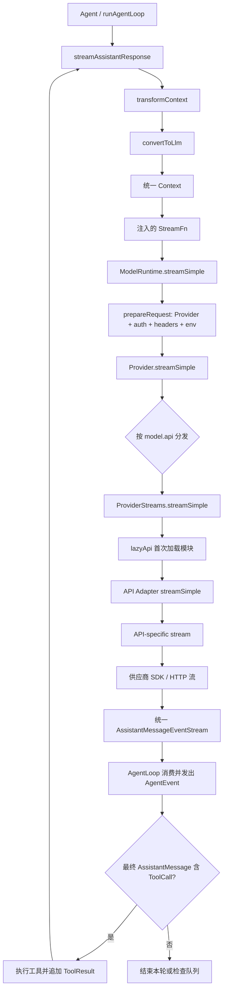

# ProviderStreams、StreamFunction 与 AgentLoop 的统一模型调用链

本文解释 Pi 如何把不同大模型供应商的输入、参数和流式响应收敛成同一套协议，再交给 `AgentLoop` 使用。重点不是逐个阅读所有 Provider，而是建立一条稳定的阅读主线：

```text
AgentContext
  → pi-ai Context
  → Provider / API Adapter
  → 供应商请求与原始流
  → AssistantMessageEventStream
  → AgentLoop / AgentEvent
  → 工具执行或本轮结束
```

最后一部分以当前内置的 Anthropic Provider 和 OpenAI Provider 为例，详细比较 `anthropic-messages` 与 `openai-responses` 两条适配链。

## 1. 先给结论

这套架构的核心不是“定义一个能调用所有 SDK 的万能类”，而是规定两个稳定边界：

1. 请求边界：所有模型都接收统一的 `Model + Context + Options`。
2. 响应边界：所有模型都返回统一的 `AssistantMessageEventStream`。

供应商适配器位于两个边界之间。它负责双向翻译：

```text
统一 Model / Context / Options
  → Anthropic、OpenAI 等供应商 payload

Anthropic、OpenAI 等供应商原始流事件
  → start / text_* / thinking_* / toolcall_* / done / error
```

因此 `AgentLoop` 不需要知道：

- 请求最终由哪个 SDK 或 HTTP 协议发送；
- system prompt 在供应商协议里叫 `system`、`developer`，还是别的字段；
- 工具调用叫 `tool_use`、`function_call`，还是其他名称；
- 推理内容是明文、摘要、加密 item，还是签名块；
- token usage 和停止原因来自哪一种原始事件。

`AgentLoop` 只依赖一个 `StreamFn`：给定模型、统一上下文和简单配置，返回统一事件流。供应商差异到此为止。

## 2. 先区分 Model、Provider 和 API

这是阅读代码时最重要的三个概念。它们不是同义词。

| 概念 | 回答的问题 | 关键字段或类型 |
|---|---|---|
| `Model` | 这次具体调用哪个模型，它有什么能力和限制？ | `Model<TApi>` |
| `Provider` | 谁提供模型、如何认证、有哪些模型、如何发起请求？ | `Provider<TApi>` |
| `Api` / API Adapter | 请求和流式响应遵循哪一种线协议？ | `Api`、`ProviderStreams`、`StreamFunction` |

例如当前内置 OpenAI Provider：

```text
provider = "openai"
api      = "openai-responses"
model    = 某个具体 GPT 模型
```

而一个第三方供应商完全可能复用 `openai-responses` 或 `openai-completions` 协议。反过来，一个 Provider 也可以按不同模型使用多种 API。`createProvider()` 因此既接受单个 `ProviderStreams`，也接受按 `model.api` 建立的映射。

这种拆分解决了一个具体问题：供应商身份不等于协议类型。如果把两者合并成一个枚举，每增加一个 OpenAI-compatible 服务都要复制一套几乎相同的协议转换代码。

## 3. 统一输入是怎样组成的

### 3.1 `Model<TApi>`：路由信息与能力元数据

`Model` 不只是模型名称。它同时提供运行期路由和参数约束：

| 字段 | 作用 |
|---|---|
| `id` | 发送给上游的模型 ID |
| `provider` | 在 `Models` / `ModelRuntime` 中找到 Provider |
| `api` | 在 Provider 内找到具体 API Adapter |
| `baseUrl` | 上游服务地址 |
| `reasoning` | 模型是否支持推理模式 |
| `thinkingLevelMap` | 把 Pi 的统一推理等级映射到模型自己的等级 |
| `input` | 是否接受文本、图片 |
| `contextWindow`、`maxTokens` | 上下文和输出上限 |
| `samplingParams` | 模型级默认采样参数 |
| `cost` | 统一 usage 的费用计算元数据 |
| `compat` | 同一线协议下的模型或服务兼容性开关 |

`TApi` 把模型和 API-specific options 关联起来。例如 `Model<"anthropic-messages">` 可以与 `AnthropicOptions` 建立静态类型关系。

### 3.2 `Context`：供应商无关的对话输入

`Context` 只有三部分：

```ts
interface Context {
  systemPrompt?: string;
  messages: Message[];
  tools?: Tool[];
}
```

其中 `Message` 是：

```text
UserMessage | AssistantMessage | ToolResultMessage
```

统一消息内容进一步收敛为少数几种 block：

- 用户输入：`TextContent | ImageContent`；
- 助手输出：`TextContent | ThinkingContent | ToolCall`；
- 工具结果：`TextContent | ImageContent`。

这不是某家供应商原始消息格式。API Adapter 会再次转换它。例如同一个 `ToolResultMessage`：

- 在 Anthropic 中会成为 `role: "user"` 下的 `tool_result` block；
- 在 OpenAI Responses 中会成为独立的 `function_call_output` item。

### 3.3 `Tool`：只描述模型需要看到的工具契约

`pi-ai` 的 `Tool` 包含名称、描述、TypeBox JSON Schema 和可选 constrained sampling 配置。它不包含本地 `execute()`。

真正可执行的 `AgentTool` 位于 `pi-agent-core`，在 `Tool` 基础上增加：

- `label`；
- `execute()`；
- 参数预处理；
- 串行或并行执行策略。

因此供应商只看到“工具长什么样”，`AgentLoop` 才知道“工具怎样执行”。这避免 API Adapter 依赖文件系统、终端或业务工具实现。

### 3.4 Options 有三层

#### `StreamOptions`

所有 API 都可能使用的公共选项，包括：

- `signal`、`timeoutMs`、`maxRetries`；
- `apiKey`、`headers`、`env`、自定义 `fetch`；
- `temperature`、`maxTokens`、`samplingParams`；
- `transport`、`cacheRetention`、`sessionId`；
- `onPayload`、`onResponse` 生命周期 hook；
- `metadata`。

#### `SimpleStreamOptions`

这是 Agent 使用的供应商无关配置，在 `StreamOptions` 上增加：

- `reasoning`：统一推理等级；
- `thinkingBudgets`：预算型推理模型的统一预算；
- `toolChoice: "auto" | "none"`；
- `deferred`。

#### API-specific options

例如：

- `AnthropicOptions` 有 `thinkingEnabled`、`thinkingBudgetTokens`、`effort`、`thinkingDisplay`；
- `OpenAIResponsesOptions` 有 `reasoningEffort`、`reasoningSummary`、`serviceTier` 和原生 `toolChoice`。

`ApiOptionsMap` 与 `ApiStreamOptions<TApi>` 负责建立：

```text
api 字符串 → 对应的完整 options 类型
```

未知的自定义 API 则回退到 `StreamOptions & Record<string, unknown>`，保留扩展能力。

## 4. `StreamFunction`、`ProviderStreams` 和 `StreamFn` 分别是什么

这三个名称相近，但所在层级不同。

### 4.1 `StreamFunction`：单个 API 实现函数的强类型契约

定义位于 `packages/ai/src/types.ts`：

```ts
type StreamFunction<
  TApi extends Api = Api,
  TOptions extends StreamOptions = StreamOptions,
> = (
  model: Model<TApi>,
  context: Context,
  options?: TOptions,
) => AssistantMessageEventStream;
```

具体 Adapter 用它约束导出的实现：

```text
anthropic-messages.stream
  : StreamFunction<"anthropic-messages", AnthropicOptions>

openai-responses.stream
  : StreamFunction<"openai-responses", OpenAIResponsesOptions>
```

它同时约束了四件事：

1. 模型必须属于对应 API。
2. options 必须是对应 API 的完整参数类型。
3. 函数同步返回一个事件流外壳，网络工作可在外壳内部异步进行。
4. 请求失败应尽量编码为流内 `error` 终止事件，而不是让 AgentLoop 处理供应商异常。

### 4.2 `ProviderStreams`：可注册、可延迟加载的运行期模块形状

`ProviderStreams` 是一个对象接口：

```ts
interface ProviderStreams {
  stream(...): AssistantMessageEventStream;
  streamSimple(...): AssistantMessageEventStream;
  fetchDeferred?(...): AssistantMessageEventStream;
  cancelDeferred?(...): Promise<void>;
}
```

它的用途不是给具体实现提供最精确的 options 类型，而是让以下对象拥有同一种运行期形状：

- 一个真正的 API 实现模块；
- `lazyApi()` 返回的延迟加载代理；
- `createProvider()` 接收的单 API 实现；
- 多 API Provider 映射中的某一项；
- 兼容层注册表中的实现。

因此它故意使用较宽的 `Model<Api>` 和公共 options。这是类型擦除后的分发边界。精确类型在 API 模块的 `StreamFunction` 和 Provider 对外的 `ApiStreamOptions<TApi>` 上恢复。

### 4.3 `stream()` 与 `streamSimple()` 的职责差异

`stream()` 接受供应商/API-specific 参数，适合知道目标协议的调用者。

`streamSimple()` 接受 `SimpleStreamOptions`，负责把统一参数映射成 API-specific 参数，然后调用同模块的 `stream()`：

```text
Agent reasoning = "high"
  → Anthropic: adaptive effort 或 thinking token budget
  → OpenAI: reasoning.effort
```

AgentLoop 使用 `streamSimple()`，因为 Agent 不应携带某家供应商的配置概念。

### 4.4 `StreamFn`：Agent Core 的依赖反转接口

`packages/agent/src/types.ts` 中的 `StreamFn` 与 `streamSimple` 形状基本一致，但允许返回：

```text
AssistantMessageEventStream
或 Promise<AssistantMessageEventStream>
```

允许 Promise 是为了让宿主在真正拿到流之前做异步准备，例如动态认证、代理协商或扩展 hook。`streamAssistantResponse()` 使用 `await streamFunction(...)`，因此两种实现对 AgentLoop 完全一致。

`Agent` 构造时接收 `streamFn`。当前 Coding Agent 在 `sdk.ts` 中注入一个包装函数，最终调用 `ModelRuntime.streamSimple()`。`pi-agent-core` 本身不导入 Provider catalog，也不依赖任何供应商 SDK。

## 5. 当前主调用链

### 5.1 总图



### 5.2 第一步：AgentLoop 在最后边界才生成 `pi-ai Context`

`streamAssistantResponse()` 先处理 Agent 自己的消息模型：

```text
AgentContext.messages
  → transformContext()       可选裁剪、压缩或注入
  → convertToLlm()           过滤 UI-only/custom message
  → pi-ai Context
```

随后调用：

```ts
streamFunction(config.model, llmContext, {
  ...config,
  apiKey: resolvedApiKey,
  signal,
})
```

这里是 Agent Core 与模型运行时的唯一直接接点。

### 5.3 第二步：Coding Agent 的 StreamFn 补充产品级请求配置

`packages/coding-agent/src/core/sdk.ts` 注入的 `streamFn` 会补充：

- timeout 与 retry 设置；
- WebSocket connect timeout；
- attribution headers；
- Extension 的 `before_provider_headers` hook。

然后调用 `ModelRuntime.streamSimple()`。

这些属于 Coding Agent 产品策略，不属于通用 Agent 循环，也不属于某一家 API Adapter。

### 5.4 第三步：`ModelRuntime` 在每次请求时解析 Provider 和认证

`ModelRuntime.prepareRequest()`：

1. 根据 `model.provider` 找到 Provider。
2. 解析本次请求有效的 API key / OAuth / ambient auth。
3. 必要时替换认证返回的 `baseUrl`。
4. 合并认证 header、模型配置 header、请求 header 和 Extension 变换。
5. 合并 provider-scoped env。

认证不是 Agent 启动时一次性冻结，而是在每次 LLM 请求前解析。工具执行可能持续很久，短期 OAuth token 可能在两个 turn 之间过期，因此这个时机是必要的。

`ModelRuntime.streamSimple()` 本身先返回 `lazyStream()` 外壳。异步认证或准备失败会被转换为统一 `error` 事件，使上层仍通过同一事件协议结束。

### 5.5 第四步：Provider 根据 `model.api` 选择 Adapter

`createProvider()` 把模型目录、认证和 `ProviderStreams` 组装成 `Provider`。

如果 Provider 只使用一种协议：

```text
所有模型 → 同一个 ProviderStreams
```

如果 Provider 使用多种协议：

```text
model.api → Partial<Record<Api, ProviderStreams>>
```

找不到对应 API 时，不在分发点随意抛出一个供应商异常，而是通过 `lazyStream()` 形成 stream error。

### 5.6 第五步：`lazyApi()` 延迟载入真正实现

Provider factory 通常持有的是 `.lazy.ts` 模块返回的代理。例如：

```text
openaiProvider()
  → openAIResponsesApi()
  → lazyApi(() => import("./openai-responses.ts"))
```

代理立即满足 `ProviderStreams`，但只有第一次调用时才载入 SDK 较重的实现模块。外层流同步返回，模块加载和内层流创建在后台进行；`forwardStream()` 把内层事件转发到外层。

好处是：

- 未使用的供应商实现不会增加启动路径负担；
- Provider 可以同步构造和注册；
- 动态 import 失败仍表现为统一流错误；
- 调用方不需要感知“流建立前还有异步 setup”。

### 5.7 第六步：API Adapter 完成双向翻译

每个 Adapter 都有相同骨架：

```text
streamSimple
  → 把统一 options 映射为 API-specific options
  → stream
      → 建立 pending AssistantMessage
      → 把 Context / Tool 转为供应商 payload
      → 调用 onPayload
      → 发起带 retry / abort / timeout 的请求
      → 调用 onResponse
      → push(start)
      → 读取原始流并持续修改 partial AssistantMessage
      → push(text/thinking/toolcall 增量事件)
      → 映射 usage 与 stopReason
      → push(done) 或 push(error)
```

`onPayload` 和 `onResponse` 位于已经选定 Adapter 之后，但仍由上层通过公共 options 注入，所以 Extension 不需要嵌入 SDK 实现。

### 5.8 第七步：AgentLoop 把 Provider 事件再映射为 Agent 事件

`streamAssistantResponse()` 对 `AssistantMessageEventStream` 做如下处理：

| Provider 事件 | AgentLoop 行为 |
|---|---|
| `start` | 把 partial assistant 作为 context 尾部占位，发 `message_start` |
| `*_start` / `*_delta` / `*_end` | 替换 context 尾部 partial，发 `message_update` |
| `done` / `error` | 用 `response.result()` 得到最终消息，替换占位，发 `message_end` |

因此无论流里有多少 delta，context 最终只追加一条 `AssistantMessage`。

随后 `runLoop()` 只看统一结果：

- `stopReason` 为 `error` / `aborted`：硬停止；
- `content` 中有 `ToolCall`：执行工具，把 `ToolResultMessage` 加入 context，再请求下一轮；
- 没有 ToolCall：进入 steering / follow-up / 自然结束判断。

### 5.9 `compat.ts` 是什么路径

`packages/ai/src/compat.ts` 保留旧的全局 API，当前文件头已经将它标为临时兼容入口。旧调用者可能直接使用：

```text
compat.streamSimple(model, context, options)
  → 尝试找到内置 Provider
  → 或根据 model.api 查询 apiProviderRegistry
  → Provider/API implementation.streamSimple
  → AssistantMessageEventStream
```

`BUILTIN_APIS` 把每个 API ID 和对应的 lazy `ProviderStreams` 注册到表中，`registerApiProvider()` 还会检查传入模型的 `model.api` 是否与注册项匹配。兼容入口也会补环境变量中的 API key。

这条路径与新的 `Models` / `ModelRuntime` 路径共享相同的 `ProviderStreams` 和 API Adapter，但职责组织不同：

- 新路径以 Provider 为运行单元，Provider 拥有认证、模型目录和一个或多个 API 实现；
- 兼容路径保留按 API ID 查全局注册表和全局 `stream()/complete()` 的旧表面。

阅读新架构时应以 `ModelRuntime → Provider → ProviderStreams` 为主；调试旧调用或扩展兼容行为时，再进入 `compat.ts`。`complete()` / `completeSimple()` 只是调用对应 stream 后等待 `stream.result()` 的便利函数，并没有另一套请求实现。

## 6. 统一事件流协议

### 6.1 `EventStream<T, R>` 同时提供实时事件和最终结果

`EventStream` 有两种消费方式：

```ts
for await (const event of stream) {
  // 实时 UI、日志、partial 状态
}

const result = await stream.result();
// 最终聚合结果
```

内部维护：

- 尚未消费的事件队列；
- 正在等待事件的 iterator waiter；
- 是否已经完成；
- 一个最终结果 Promise；
- 判断终止事件和提取最终结果的两个函数。

### 6.2 `AssistantMessageEventStream` 的终止规则

它把泛型流固定为：

```text
事件类型 = AssistantMessageEvent
最终结果 = AssistantMessage
```

终止事件只有两类：

- `done`：结果取 `event.message`；
- `error`：结果取 `event.error`。

注意：`result()` 在 error 场景也会 resolve 为一个 `AssistantMessage`，而不是 reject。失败由：

```text
stopReason = "error" | "aborted"
errorMessage = 具体错误
```

表达。这使 AgentLoop 可以维持正常的 `message_end → turn_end → agent_end` 生命周期。

### 6.3 12 类统一事件

可以按生命周期分成五组：

| 组 | 事件 | 含义 |
|---|---|---|
| 消息开始 | `start` | 建立整条 partial assistant |
| 文本 block | `text_start`、`text_delta`、`text_end` | 文本块开始、增量、完成 |
| 推理 block | `thinking_start`、`thinking_delta`、`thinking_end` | 推理块开始、增量、完成 |
| 工具 block | `toolcall_start`、`toolcall_delta`、`toolcall_end` | 工具调用开始、参数 JSON 增量、完成 |
| 流终止 | `done`、`error` | 成功或失败终止 |

每个 block 事件带 `contentIndex`，使 UI 和 AgentLoop 可以在一条 AssistantMessage 内更新正确的内容块。`partial` 是截至当前事件的完整消息快照。

### 6.4 为什么不用“只流字符串”

大模型响应已经不再只是文本。一个响应可能交错出现：

```text
thinking → text → tool call → thinking → text
```

只流字符串会丢失：

- block 类型；
- 工具参数边界；
- reasoning 与最终答案的区分；
- 多 block 顺序；
- usage、stop reason、response id；
- 可供下一轮重放的供应商签名。

结构化事件流允许 UI 实时展示，也能在流结束时生成可重放的结构化消息。

### 6.5 两层事件不要混淆

系统中存在两种事件协议：

| 协议 | 生产者 | 消费者 | 目的 |
|---|---|---|---|
| `AssistantMessageEvent` | API Adapter | AgentLoop | 统一一次模型响应 |
| `AgentEvent` | AgentLoop | Agent / Session / UI | 描述整个 Agent、turn、message、工具生命周期 |

`AgentEvent.message_update` 会携带原始的 `assistantMessageEvent`，但它们仍是两层职责。Provider 不会直接发 `turn_end`，AgentLoop 也不会直接解释 `response.output_text.delta`。

## 7. 为什么这样构造

### 7.1 依赖反转：AgentLoop 不依赖供应商

问题：如果 AgentLoop 直接判断 `model.provider` 并调用 SDK，每增加一个供应商都要修改循环，工具循环也难以独立测试。

解决方案：AgentLoop 只依赖 `StreamFn`。真实 ModelRuntime、代理流、Faux Provider 和测试 Mock 都可以注入。

这是必要的架构边界，不是为了形式上的接口抽象。

### 7.2 Provider 与 API 分离：复用协议实现

问题：很多供应商复用 OpenAI 或 Anthropic 协议，但认证、base URL、模型目录不同。

解决方案：Provider 负责身份、认证和模型；API Adapter 负责线协议。一个 Adapter 可以被多个 Provider 复用，一个 Provider 也可按 `model.api` 选择多个 Adapter。

### 7.3 `streamSimple` 与 `stream` 分离：稳定上层，保留底层能力

问题：只提供最小公共参数会丢失供应商高级能力；让 Agent 直接使用所有供应商参数又会造成上层分支爆炸。

解决方案：

- Agent 使用 `streamSimple` 的统一语义；
- 专用调用者使用 `stream` 的完整 API-specific options；
- Adapter 负责从 simple 语义映射到原生语义。

### 7.4 同一对象既能迭代又能取最终结果

问题：UI 需要 delta，AgentLoop 的控制逻辑需要最终完整消息。如果分别维护两个异步通道，很容易出现结束顺序或错误状态不一致。

解决方案：`AssistantMessageEventStream` 同时提供 async iterator 和 `result()`，二者由同一个终止事件驱动。

### 7.5 错误尽量在流内终止

问题：网络错误如果直接 reject，Agent 的 message/turn 生命周期可能只走一半，状态和 UI 难以收尾。

解决方案：适配器或 `lazyStream()` 把失败变成 error AssistantMessage。AgentLoop 可以像处理成功结果一样完成状态归约。

标准 `Models` / `ModelRuntime` 调用链能捕获认证、动态加载和 Provider setup 错误。直接调用底层 API 模块时，调用者仍应遵守实现契约，并注意某些同步参数校验可能在流外抛出；Agent 使用的主路径由外层 `lazyStream()` 兜底。

### 7.6 运行期认证与 lazy setup

问题：OAuth 会过期，Provider SDK 又可能很重。

解决方案：每次请求时解析认证，并在真正调用时动态加载 API 实现。外层仍同步得到事件流对象，保持 API 简单。

### 7.7 统一历史不等于无损混用所有供应商私有状态

`ThinkingContent.thinkingSignature`、`TextContent.textSignature`、`ToolCall.thoughtSignature` 保存供应商重放所需的不透明数据。但这类数据通常只对同一模型有效。

`transformMessages()` 在跨模型时会：

- 丢弃只对原模型有效的 redacted reasoning；
- 把可见 thinking 降级为普通 text；
- 移除不兼容的 thought signature；
- 规范化 tool call ID；
- 为孤立 ToolCall 合成错误 ToolResult，保持对话结构合法；
- 对不支持图片的模型插入占位文本。

这说明“统一消息”提供的是稳定语义，不承诺把一家供应商的所有私有状态原样送给另一家。

## 8. 设计权衡与失败边界

| 决策 | 收益 | 代价或风险 | 当前缓解方式 |
|---|---|---|---|
| 统一事件协议 | Agent/UI/测试不依赖供应商事件 | 每个 Adapter 都要完整、正确地维护 partial | 统一 block 生命周期、终止事件和测试 |
| `ProviderStreams` 宽类型分发 | lazy wrapper 和多 API Provider 容易组合 | 分发边界需要类型收窄或 cast | API 模块和 `Provider.stream` 恢复精确泛型 |
| partial message 原地累积 | delta 处理直接，UI 可得到完整快照 | 消费方不能假设旧 partial 永不变化 | AgentLoop 发事件时浅复制消息外壳，终止时替换最终消息 |
| 流内错误 | 生命周期稳定、错误可持久化 | Adapter 必须清理半成品 scratch 字段 | catch 中删除 `index`、`partialJson` 等临时字段 |
| lazy import | 启动更轻，按需加载 | setup 本身是异步失败点 | `lazyStream()` 转成统一 error event |
| 保留供应商签名 | `store: false` 时仍可多轮推理 | 签名跨模型不兼容，可能很大 | 只对同模型重放，跨模型降级 |
| request hooks | Extension 可观察/修改请求 | 可能改出供应商不接受的 payload，header 可能含敏感信息 | hook 位于明确边界；日志与扩展必须自行避免泄露密钥 |

必须重点关注的失败模式：

1. 原始流未出现供应商终止事件：Adapter 生成 error，不能把半条消息当成功。
2. tool arguments 被 token limit 截断：AgentLoop 不执行，生成错误 ToolResult 让模型重试。
3. abort：Adapter 将最终 `stopReason` 设为 `aborted`，AgentLoop 硬停止。
4. Provider/API 映射缺失：`createProvider()` 通过流错误结束。
5. 认证或 lazy import 失败：`ModelRuntime` / `lazyStream()` 通过流错误结束。
6. 跨模型历史含私有签名或不合法 ToolCall ID：`transformMessages()` 清理或规范化。

## 9. 推荐源码阅读流程

不要从 Anthropic 或 OpenAI 的 SDK 类型开始。按下面顺序阅读，每一步只回答一个问题。

### 第 1 步：先看统一数据模型

文件：`packages/ai/src/types.ts`

顺序：

1. `Api`、`ProviderId`；
2. `Model<TApi>`；
3. `Context`、`Message` 和三种消息；
4. `TextContent`、`ThinkingContent`、`ToolCall`；
5. `StreamOptions`、`SimpleStreamOptions`；
6. `AssistantMessageEvent`；
7. 最后看 `StreamFunction` 和 `ProviderStreams`。

先理解流入和流出的数据，再读分发代码，速度会快很多。

### 第 2 步：看事件流容器

文件：`packages/ai/src/utils/event-stream.ts`

回答：

- `push()` 如何同时服务排队消费者和等待中的消费者？
- `done/error` 如何 resolve `result()`？
- 为什么 `error` 也返回 `AssistantMessage`？

### 第 3 步：看 Agent 的依赖边界

文件：

- `packages/agent/src/types.ts` 的 `StreamFn`；
- `packages/agent/src/agent.ts` 的 `AgentOptions.streamFn`；
- `packages/agent/src/agent-loop.ts` 的 `streamAssistantResponse()`。

这一阶段把 Provider 当黑盒，只跟踪：

```text
AgentMessage[] → Context → StreamFn → AssistantMessageEventStream
```

### 第 4 步：看实际注入点

文件：`packages/coding-agent/src/core/sdk.ts`

找到 `new Agent({ streamFn: ... })`，记录产品层在调用 ModelRuntime 前补了哪些 options。

### 第 5 步：看认证和 Provider 路由

文件：

- `packages/coding-agent/src/core/model-runtime.ts`；
- `packages/ai/src/models.ts`。

重点只看：

```text
ModelRuntime.streamSimple
  → prepareRequest
  → Provider.streamSimple
  → createProvider 内的 dispatch/apiFor
```

### 第 6 步：看 lazy 边界

文件：

- `packages/ai/src/api/lazy.ts`；
- 任意一个 `*.lazy.ts`；
- `packages/ai/src/providers/openai.ts` 或 `anthropic.ts`。

此时应能解释 Provider factory 为什么没有直接导入 SDK 实现。

### 第 7 步：只深入一个 Adapter

按固定的四段去找：

1. `streamSimple()`：统一参数怎样映射；
2. `buildParams()` / message converter：统一输入怎样变成 payload；
3. `stream()`：请求怎样建立；
4. 原始事件处理：怎样 push 统一事件并完成 usage/stopReason。

### 第 8 步：再回到 AgentLoop

最后回看 `streamAssistantResponse()` 和 `runLoop()`，观察最终 `AssistantMessage.content` 中的 `ToolCall` 如何推动下一轮。关于双层循环本身，可继续阅读 [Agent Loop 双层循环架构详解](agent-loop.md)。

### 建议记录的一条 trace

每经过一层，只记录输入和输出的类型：

```text
AgentContext
Context
SimpleStreamOptions
API-specific params
供应商 raw event
AssistantMessageEvent
AssistantMessage
AgentEvent
```

不要一开始记录每个 header 和 SDK 字段。先把类型变化跟通，再补供应商细节。

## 10. 关键类、接口和 type 速查

| 名称 | 所在层 | 一句话含义 |
|---|---|---|
| `Api` | pi-ai | 线协议标识，可扩展字符串 |
| `ProviderId` | pi-ai | 模型供应方标识 |
| `Model<TApi>` | pi-ai | 模型路由、能力、限制、费用和兼容元数据 |
| `Context` | pi-ai | 真正送到 API Adapter 的统一对话输入 |
| `Message` | pi-ai | user / assistant / toolResult 的统一历史消息 |
| `AssistantMessage` | pi-ai | 一次模型输出的最终结构化结果 |
| `Tool` | pi-ai | 提供给模型看的工具 schema |
| `StreamOptions` | pi-ai | 各 API 公共的低层请求参数 |
| `SimpleStreamOptions` | pi-ai | Agent 使用的供应商无关参数 |
| `ApiOptionsMap` | pi-ai | 已知 API 到完整 options 类型的映射 |
| `ApiStreamOptions<TApi>` | pi-ai | 根据 API 条件选择具体 options 类型 |
| `StreamFunction<TApi,TOptions>` | pi-ai API 模块 | 单个 API stream 实现的强类型函数契约 |
| `ProviderStreams` | pi-ai 分发层 | `stream/streamSimple` 等实现组成的运行期对象 |
| `Provider<TApi>` | pi-ai Provider 层 | 认证、模型目录和流行为的完整供应商单元 |
| `Models` | pi-ai runtime | 管理多个 Provider、解析认证并分发请求 |
| `ModelRuntime` | coding-agent | 在 `Models` 上叠加配置、扩展和产品级 header 策略 |
| `EventStream<T,R>` | pi-ai | 同时支持异步事件迭代与最终结果 Promise 的容器 |
| `AssistantMessageEventStream` | pi-ai | 统一模型响应事件流，最终结果是 AssistantMessage |
| `AssistantMessageEvent` | pi-ai | 文本、推理、工具和终止事件协议 |
| `StreamFn` | pi-agent-core | Agent 对模型运行时的唯一调用接口 |
| `AgentContext` | pi-agent-core | 可含产品自定义消息和可执行工具的 Agent 上下文 |
| `AgentEvent` | pi-agent-core | Agent、turn、message、tool 的外层生命周期事件 |

## 11. 如果要接入一个新的大模型供应商

先判断它是否兼容已有 API 协议。

### 情况一：复用已有协议

这是最短路径：

1. 定义 Provider 的认证、base URL 和模型目录。
2. 用 `createProvider()` 组装 Provider。
3. `api` 直接复用已有 `ProviderStreams`，例如 OpenAI Responses/Completions 或 Anthropic Messages Adapter。
4. 用 `Model.compat` 标明该服务与标准协议的差异。
5. 注册 Provider，并用流事件、工具调用、错误和 usage 用例验证。

### 情况二：需要新协议

需要新增一个 API Adapter：

1. 定义 API ID 和可选的 API-specific options。
2. 实现 `streamSimple()` 与强类型 `stream()`。
3. 把统一 Context/Tool 转为供应商 payload。
4. 把原始流完整转换为 `AssistantMessageEventStream`。
5. 增加 lazy wrapper，再由 Provider factory 引用。
6. 为正常文本、thinking、tool call、usage、stop reason、abort 和异常流补测试。

如果加入内置模型目录，应修改模型生成源和生成脚本，不直接编辑 `packages/ai/src/models.generated.ts`。

接入是否合格，最终只看一个标准：AgentLoop 能否在完全不知道新供应商存在的情况下，正确消费它的统一事件流并完成工具循环。

## 12. Anthropic 与 OpenAI 的详细区别

### 12.1 比较范围

当前内置 Provider 的主路径是：

```text
Anthropic Provider
  → api = "anthropic-messages"
  → packages/ai/src/api/anthropic-messages.ts

OpenAI Provider
  → api = "openai-responses"
  → packages/ai/src/api/openai-responses.ts
  → packages/ai/src/api/openai-responses-shared.ts
```

这里比较的是 Anthropic Messages API 与 OpenAI Responses API。`openai-completions.ts` 是另一套用于 OpenAI-compatible Chat Completions 服务的 Adapter，不是当前内置 OpenAI Provider 的默认路径。

### 12.2 相同的外层骨架

两者都执行：

```text
streamSimple
  → buildBaseOptions
  → 映射 reasoning
  → stream
      → 创建 pending AssistantMessage
      → 创建客户端和 payload
      → onPayload
      → retryProviderRequest
      → onResponse
      → start
      → 解析原始流
      → done / error
```

它们都维护同一个 `output: AssistantMessage`，增量到达时原地累积 block，并把这个 output 作为 `partial` 发出。差异集中在中间的请求格式和原始事件解释。

### 12.3 输入消息转换

| 维度 | Anthropic Messages | OpenAI Responses |
|---|---|---|
| system prompt | 顶层 `system` content array | 放进 `input`，推理模型优先用 `developer`，否则 `system` |
| user text | `role: "user"`，字符串或 content block | `role: "user"` + `input_text` |
| user image | Anthropic base64 image source | `input_image` + data URL |
| assistant text 回放 | assistant `text` block | `message` output item，并保留 item id/phase |
| thinking 回放 | `thinking` + signature，或 `redacted_thinking` | 把完整 reasoning item JSON 存入并恢复 |
| tool call 回放 | assistant `tool_use` block | `function_call` 或 `custom_tool_call` item |
| tool result | 作为 `role: "user"` 的 `tool_result` block | `function_call_output` 或 `custom_tool_call_output` item |
| 连续工具结果 | 聚合进同一 user message | 逐个 output item |

两者在转换前都调用 `transformMessages()`，统一处理跨模型 thinking、图片降级、ToolCall ID 和孤立工具调用。

### 12.4 system prompt 与认证身份

Anthropic 把 system prompt 放在请求顶层 `system`。使用 Claude OAuth token 时，还会先插入 Claude Code 身份文本，并添加 Claude Code/OAuth beta headers；工具名也会映射为 Claude Code 的规范大小写。

OpenAI Responses 把 system prompt 转成 input message。对支持 developer role 的 reasoning model 使用 `developer`，否则使用 `system`。OpenAI Provider 没有 Anthropic 这套 Claude Code 身份和工具名映射。

这部分不能在 AgentLoop 统一，因为它不是普通参数命名差异，而是供应商认证产品的协议要求。

### 12.5 推理参数与推理内容回放

#### Anthropic

Anthropic 有两种推理模型形态：

1. adaptive thinking：发送 `thinking: { type: "adaptive", display }`，并用 `output_config.effort` 控制等级；
2. budget-based thinking：发送 `thinking: { type: "enabled", budget_tokens, display }`。

`streamSimple()` 根据 `model.compat.forceAdaptiveThinking` 选择形态。预算型模型还会：

- 根据统一 reasoning level 计算 thinking budget；
- 增大或限制总 `max_tokens`；
- 至少为最终回答预留 1024 token；
- 再按剩余 context window 限制上限。

extended thinking 与 temperature 不兼容，所以启用 thinking 时不发送 temperature。流中 signature delta 会累积到 `thinkingSignature`；redacted thinking 只保留不透明数据以供同模型下一轮重放。

#### OpenAI Responses

OpenAI 把统一等级映射为：

```text
reasoning: {
  effort,
  summary
}
```

并请求 `reasoning.encrypted_content`。最终 `ResponseReasoningItem` 会整体 JSON 序列化到 `thinkingSignature`。这样即使请求使用 `store: false`，下一轮仍能把原 reasoning item 放回 input。

OpenAI 的可见 thinking 可能来自 reasoning summary 或 reasoning text；加密内容是重放数据，两者不是同一个概念。

#### 核心差异

Anthropic 的统一 block 更接近原生 content block：可见 thinking、signature 和 redacted payload 分字段保存。OpenAI Responses 的 reasoning 是独立 output item，适配器把整个 item 序列化保存，以维持 item ID、encrypted content 等关联信息。

### 12.6 Tool schema 与 ToolCall ID

#### Anthropic

工具转为：

```text
name + description + input_schema
```

并根据能力开关增加：

- `strict`；
- `eager_input_streaming`；
- `defer_loading`；
- `cache_control`。

ToolCall ID 必须匹配 Anthropic 允许的字符并不超过 64 个字符，所以跨模型历史会规范化 ID。

#### OpenAI Responses

普通工具转成 function tool；带 grammar constrained sampling 的工具可转成 custom tool。兼容开关决定是否支持 strict、grammar 和 deferred loading。

OpenAI Responses 同时有：

- `call_id`：工具结果关联所需；
- output item `id`：Responses item 身份。

统一 `ToolCall.id` 因此组合成：

```text
call_id|item_id
```

重放时再拆开。跨 Provider 或跨模型时，适配器可能删除不安全的 item id，或生成满足 `fc_` 前缀和 64 字符限制的稳定 hash id，避免 OpenAI 的 reasoning/function-call 配对校验失败。

### 12.7 Deferred tools

Anthropic 使用原生 `defer_loading` 工具，并在 ToolResult 中通过 `tool_reference` 激活延迟工具。由于 Anthropic 不允许普通 tool result 内容和 tool reference 混在同一 block 中，适配器会把普通内容移到 sibling content。

OpenAI Responses 根据能力选择：

- message-anchored `additional_tools`；或
- client-executed `tool_search_call` / `tool_search_output`。

这两套协议语义相近，但线格式完全不同，所以只在统一消息中共享 `addedToolNames`，最终展开由 Adapter 完成。

### 12.8 Prompt cache

| 维度 | Anthropic | OpenAI Responses |
|---|---|---|
| 默认偏好 | short | short |
| 禁用 | 不加 `cache_control` | 不发 cache key；支持时设 explicit mode 关闭隐式缓存 |
| 长缓存 | `cache_control.ttl = "1h"` | `prompt_cache_retention = "24h"` |
| 缓存锚点 | system、最后工具、最后 user/tool-result 内容等 marker | `prompt_cache_key` 和 retention 请求字段 |
| session affinity | 可选 `x-session-affinity` | `session_id` / `x-client-request-id` 或 OpenRouter 的 `x-session-id` |

因此统一层只能表达 `cacheRetention` 与 `sessionId`，不能统一具体 header 和 payload 字段。

### 12.9 原始流解析

#### Anthropic：content block 驱动

Anthropic Adapter 从 HTTP response body 自己解析 SSE，并对 JSON 使用 repair parser。它要求：如果看到了 `message_start`，最终必须看到 `message_stop`。

主要映射：

```text
content_block_start(text)              → text_start
content_block_start(thinking)          → thinking_start
content_block_start(tool_use)          → toolcall_start
content_block_delta(text_delta)        → text_delta
content_block_delta(thinking_delta)    → thinking_delta
content_block_delta(input_json_delta)  → toolcall_delta
content_block_stop                     → 对应 *_end
message_delta                          → usage + stopReason
```

block 通过 Anthropic 的 `event.index` 定位。工具参数使用 `partialJson` scratch buffer，增量到达时做容错解析，block 完成后再最终解析并删除 scratch 字段。

#### OpenAI Responses：output item 驱动

OpenAI 使用 SDK 提供的 `AsyncIterable<ResponseStreamEvent>`。`processResponsesStream()` 用 `output_index → slot` Map 关联 output item 与统一 content block。

主要映射：

```text
response.output_item.added                  → 创建 thinking/text/toolCall block + *_start
response.reasoning_*_text.delta             → thinking_delta
response.output_text.delta                  → text_delta
response.refusal.delta                      → text_delta
response.function_call_arguments.delta      → toolcall_delta
response.custom_tool_call_input.delta       → toolcall_delta
response.output_item.done                   → 对应 *_end，并保存签名/ID
response.completed / response.incomplete    → usage + stopReason
response.failed                             → error
```

OpenAI 的流结构比 Anthropic 多一层 item 生命周期，因此需要 slot Map；Anthropic 的 content block index 可以更直接地映射。

### 12.10 `start`、终止和不完整流

两者都在成功取得 HTTP response 并调用 `onResponse` 后发送统一 `start`，而不是在认证或连接之前发送。这意味着 `start` 表示“供应商请求已经建立并准备产生模型内容”。

两者都会检查：

- abort signal 是否触发；
- 最终 `stopReason` 是否仍为 `pending`；
- 是否看到了供应商要求的终止事件。

Anthropic 缺少 `message_stop` 会报错。OpenAI 缺少 `response.completed`、`response.incomplete` 或 `response.failed` 这类 terminal response event 也会报错。两者都不会把网络静默断流误判为正常完成。

### 12.11 stop reason 映射

| 统一原因 | Anthropic 来源 | OpenAI Responses 来源 |
|---|---|---|
| `stop` | `end_turn`、`stop_sequence`、当前对 `pause_turn` 的处理 | `status = completed` |
| `length` | `max_tokens` | `incomplete + max_output_tokens` |
| `toolUse` | 原生 `tool_use` | completed 后发现统一 content 中存在 ToolCall |
| `error` | refusal、sensitive、未知/异常流 | failed/cancelled、非 token-limit incomplete、异常流 |
| `aborted` | catch 时 signal 已 aborted | catch 时 signal 已 aborted |

值得注意：Anthropic 直接提供 `tool_use` stop reason；OpenAI Responses 的终态通常只是 completed，因此适配器在发现 ToolCall 后把 `stop` 修正为 `toolUse`。

### 12.12 usage 与费用

#### Anthropic

- `message_start` 就可能提供初始 input usage，因此即使中途 abort 也能保留部分输入统计；
- `message_delta` 更新最终 usage；
- `input_tokens`、`cache_read_input_tokens`、`cache_creation_input_tokens` 分开提供；
- `totalTokens` 由各项相加；
- 可记录 `cacheWrite1h` 和 reasoning token；
- 若服务端 fallback 到另一个允许的模型，会切换到 fallback 模型的费用元数据计算。

#### OpenAI Responses

- usage 主要从 terminal response 读取；
- `input_tokens` 已包含 cached/cache-write token，适配器会减去它们得到统一的非缓存 `input`；
- 直接读取 `total_tokens` 和 reasoning token breakdown；
- 可按 `serviceTier` 对费用应用倍率。

统一 `Usage` 的价值在这里最明显：上层永远读取 `input/output/cacheRead/cacheWrite/reasoning/totalTokens/cost`，不需要知道供应商原始统计的包含关系。

### 12.13 错误清理

两者 catch 时都会：

1. 删除 content block 上仅用于解析的 `index`；
2. 删除工具参数的 `partialJson` 等 scratch 字段；
3. 根据 abort signal 设置 `stopReason = aborted | error`；
4. 写入 `errorMessage`；
5. push 统一 `error` 事件并结束流。

OpenAI 还会清理 custom tool input 的临时状态。这样即使失败消息被记录，也不会把内部解析器状态写入会话历史。

### 12.14 一个并排 trace

假设模型先输出少量 thinking，再调用 `read({ path: "a.ts" })`。

#### Anthropic 原始流到统一流

```text
HTTP response + onResponse
  → start
message_start
  → 保存 responseId、初始 usage
content_block_start(thinking)
  → thinking_start
content_block_delta(thinking_delta)
  → thinking_delta
content_block_stop
  → thinking_end
content_block_start(tool_use)
  → toolcall_start
content_block_delta(input_json_delta)
  → toolcall_delta
content_block_stop
  → toolcall_end
message_delta(stop_reason = tool_use)
  → 设置 stopReason = toolUse、更新 usage
message_stop
  → Adapter 完成解析
done(toolUse)
```

#### OpenAI Responses 原始流到统一流

```text
HTTP response + onResponse
  → start
response.created
  → 保存 responseId
response.output_item.added(reasoning)
  → thinking_start
response.reasoning_summary_text.delta
  → thinking_delta
response.output_item.done(reasoning)
  → 保存 reasoning item signature、thinking_end
response.output_item.added(function_call)
  → toolcall_start
response.function_call_arguments.delta
  → toolcall_delta
response.output_item.done(function_call)
  → 保存 call_id|item_id、toolcall_end
response.completed
  → 设置 usage，先映射 stop，再因存在 ToolCall 修正为 toolUse
done(toolUse)
```

从这一刻开始，两条链已经没有区别。AgentLoop 都会从最终 `AssistantMessage.content` 中取出同一个形状的 `ToolCall`，执行 `read`，追加同一个形状的 `ToolResultMessage`，再进入下一轮。

## 13. 最小心智模型

最后可以把整套架构记成八句话：

1. `Model.provider` 找供应商，`Model.api` 找线协议。
2. `Context` 是供应商无关的模型输入，不等于 Agent 的完整产品消息。
3. `StreamFunction` 约束一个具体 API 实现，`ProviderStreams` 让实现可以注册、组合和 lazy load。
4. `streamSimple` 把 Agent 的统一参数映射成 API-specific 参数，`stream` 执行真正请求。
5. `StreamFn` 是 Agent Core 的依赖反转边界。
6. API Adapter 把所有原始流翻译成同一组 `AssistantMessageEvent`。
7. `AssistantMessageEventStream` 同时服务实时展示和最终控制结果。
8. 一旦形成最终 `AssistantMessage`，AgentLoop 不再关心它来自 Anthropic 还是 OpenAI，只关心 stopReason、content 和 ToolCall。
