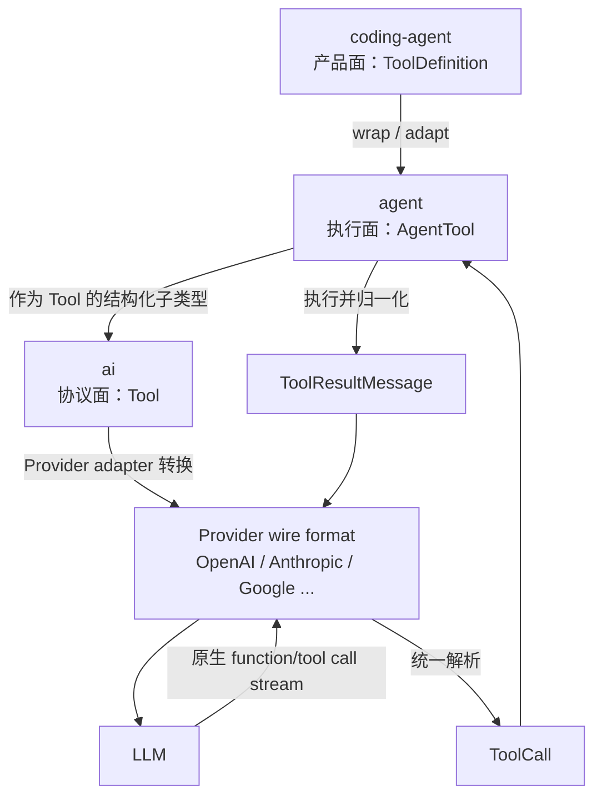

# Tool 分层模型与完整调用生命周期

本文回答两个核心问题：

1. `packages/ai`、`packages/agent`、`packages/coding-agent` 每一层看到的 Tool 分别是什么结构，后一层相对前一层增加了什么。
2. 一次 Tool 从定义、发给模型、接收 ToolCall、执行、生成 ToolResult，到结果进入下一轮模型请求，完整经历哪些步骤。

本文不把 Tool 系统简化成“模型返回 JSON，然后调用 `execute()`”。Pi 的 Tool 是一条跨三层的数据链：

```text
产品定义与注册
  → Runtime 可执行对象
  → 模型协议描述
  → Provider 原生请求
  → 统一 ToolCall
  → 本地准备、校验和策略拦截
  → 副作用执行
  → 统一 ToolResultMessage
  → Provider 原生结果消息
  → 下一轮模型推理
```

## 1. 先建立总的分层心智模型

三层分别解决不同问题：

| 层 | 核心类型 | 主要问题 | 不负责什么 |
|---|---|---|---|
| `packages/ai` | `Tool`、`ToolCall`、`ToolResultMessage`、`Context` | 怎样用统一协议向不同模型描述工具，以及怎样统一模型返回的调用和结果消息 | 不执行本地副作用，不维护 Agent 循环 |
| `packages/agent` | `AgentTool`、`AgentToolResult`、`AgentContext`、Tool hooks/events | 怎样校验、调度、执行工具，并把结果推进下一轮 Agent Loop | 不关心具体 CLI、扩展来源和 TUI 渲染 |
| `packages/coding-agent` | `ToolDefinition`、`RegisteredTool`、`AgentSession` | 怎样提供内置编码工具、扩展注册、启用/过滤、UI、提示词、持久化和产品策略 | 不重新实现 Provider 协议和通用执行循环 |

可以把它们概括成三个平面：



这里有两个必须分开的方向：

- **描述下行**：Coding Agent 定义能力，Agent 保留执行能力，AI 层只把模型需要的描述发送出去。
- **调用上行**：Provider 把厂商事件解析成统一 `ToolCall`，Agent 执行，Coding Agent 在执行前后叠加产品策略和持久化。

## 2. `packages/ai`：模型协议层

### 2.1 `Tool` 只描述“模型可以调用什么”

定义位于 [`packages/ai/src/types.ts`](../../packages/ai/src/types.ts) 的 `Tool`：

```ts
export interface Tool<TParameters extends TSchema = TSchema> {
  name: string;
  description: string;
  parameters: TParameters;
  constrainedSampling?: false | ConstrainedSamplingConfig;
}
```

四个字段分别表示：

- `name`：模型发回 ToolCall 时使用的稳定标识。
- `description`：告诉模型这个工具适合解决什么问题。
- `parameters`：TypeBox schema，同时也是运行时 JSON Schema。
- `constrainedSampling`：请求支持的 Provider 尽量或必须按 JSON Schema/grammar 生成参数。

这里没有 `execute()`，这是有意的。AI 层只负责模型协议：它能把工具描述发给模型，也能识别模型要求调用哪个工具，但它不知道读取文件、执行命令或访问数据库应该怎样实现。

### 2.2 schema 为什么是 TypeBox 对象

以 [`packages/coding-agent/src/core/tools/edit.ts`](../../packages/coding-agent/src/core/tools/edit.ts) 的 `editSchema` 为例：

```ts
const editSchema = Type.Object({
  path: Type.String(...),
  edits: Type.Array(replaceEditSchema, ...),
});

export type EditToolInput = Static<typeof editSchema>;
```

数据方向是：

```text
TypeBox schema（运行时对象）
  ├─ Provider 请求中的 JSON Schema
  ├─ Runtime 本地参数校验
  └─ Static<typeof schema> 推导 TypeScript 类型
```

不是从 TypeScript interface 反射生成 schema。TypeScript 类型编译后会被擦除，因此 schema 必须作为真实运行时对象存在。

### 2.3 AI 层还定义 Tool 的两种消息形态

模型提出调用时，统一成 `ToolCall`：

```ts
export interface ToolCall {
  type: "toolCall";
  id: string;
  name: string;
  arguments: Record<string, any>;
  thoughtSignature?: string;
  namespace?: string;
}
```

本地执行完成后，统一成 `ToolResultMessage`：

```ts
export interface ToolResultMessage<TDetails = any> {
  role: "toolResult";
  toolCallId: string;
  toolName: string;
  content: (TextContent | ImageContent)[];
  details?: TDetails;
  usage?: Usage;
  addedToolNames?: string[];
  isError: boolean;
  timestamp: number;
}
```

它们不是同一个对象的前后状态：

- `ToolCall` 属于 `AssistantMessage.content`，表示模型提出的请求。
- `ToolResultMessage` 是一条独立消息，通过 `toolCallId` 回答某次请求。

最小 transcript 是：

```text
user("读取 package.json")
assistant(content=[ToolCall(id="call_1", name="read", arguments={...})])
toolResult(toolCallId="call_1", content=[...], isError=false)
assistant("package.json 中……")
```

`toolCallId` 是因果配对键。只有 `toolName` 不够，因为同一条 AssistantMessage 可以多次调用同名工具。

### 2.4 `Context.tools` 是 Provider 边界

AI 层的 `Context` 是一次模型请求的统一输入：

```ts
export interface Context {
  systemPrompt?: string;
  messages: Message[];
  tools?: Tool[];
}
```

Provider adapter 只从 `tools` 中取协议字段。例如 OpenAI Responses 在 [`packages/ai/src/api/openai-responses-shared.ts`](../../packages/ai/src/api/openai-responses-shared.ts) 的 `convertResponsesTools()` 中转换为：

```ts
{
  type: "function",
  name: tool.name,
  description: tool.description,
  parameters: getJsonSchemaToolParameters(tool, strict),
  strict,
}
```

Anthropic 则在 [`packages/ai/src/api/anthropic-messages.ts`](../../packages/ai/src/api/anthropic-messages.ts) 的 `convertTools()` 中转换成 `name + description + input_schema`。

所以 `Tool` 是内部统一协议，OpenAI/Anthropic 的 tools 字段才是外部 wire format。业务工具不需要知道厂商差异。

### 2.5 constrained sampling 不是本地校验

[`packages/ai/src/api/constrained-sampling.ts`](../../packages/ai/src/api/constrained-sampling.ts) 可以把 schema 派生成 Provider strict schema，例如：

- object 的属性全部进入 `required`。
- 原可选字段变为 nullable。
- `additionalProperties` 设为 `false`。
- Provider 不支持 strict 时，`prefer` 可以回退，`require` 则报错。

它只是在模型生成阶段降低非法参数概率，不能替代本地校验。模型输出和 Provider 返回仍是进程外输入。

## 3. `packages/agent`：可执行 Runtime 层

### 3.1 `AgentTool extends Tool` 增加了什么

定义位于 [`packages/agent/src/types.ts`](../../packages/agent/src/types.ts) 的 `AgentTool`：

```ts
export interface AgentTool<TParameters extends TSchema, TDetails>
  extends Tool<TParameters> {
  label: string;
  prepareArguments?: (args: unknown) => Static<TParameters>;
  execute(
    toolCallId: string,
    params: Static<TParameters>,
    signal?: AbortSignal,
    onUpdate?: AgentToolUpdateCallback<TDetails>,
  ): Promise<AgentToolResult<TDetails>>;
  executionMode?: "sequential" | "parallel";
}
```

相对 `pi-ai.Tool`，它增加的是运行时语义：

| 新字段 | 解决的问题 |
|---|---|
| `label` | 给宿主/UI 一个可读名称；不属于模型调用协议 |
| `prepareArguments` | 在 schema 校验前兼容旧格式或模型常见偏差 |
| `execute` | 执行真实副作用 |
| `signal` | 协作式取消长任务 |
| `onUpdate` | 产生工具执行中的增量事件 |
| `executionMode` | 控制一批调用串行或并行 |

这里是明确的 TypeScript 继承：`AgentTool` 是 `Tool` 的结构化子类型。因此 `AgentTool[]` 可以交给要求 `Tool[]` 的 Provider 边界。

### 3.2 `AgentToolResult` 还不是最终消息

工具的 `execute()` 返回：

```ts
export interface AgentToolResult<T> {
  content: (TextContent | ImageContent)[];
  details: T;
  usage?: Usage;
  addedToolNames?: string[];
  terminate?: boolean;
}
```

几个字段属于不同消费方：

| 字段 | 主要消费方 | 说明 |
|---|---|---|
| `content` | 模型与通用消息协议 | 下一轮模型实际看到的文本/图片 |
| `details` | UI、日志、Session | 结构化内部详情，不自动转成模型文本 |
| `usage` | 统计与展示 | 工具自身用量，不计入主 LLM 上下文用量 |
| `addedToolNames` | 支持延迟加载的 Provider | 标记从这个结果位置开始可用的新工具 |
| `terminate` | Agent Loop | 运行时停止提示，不写入最终 transcript |

Agent Runtime 会在最后把它转换成 `ToolResultMessage`。这个转换很重要，因为“工具函数的返回值”和“会话协议中的工具结果消息”不是同一层对象。

### 3.3 `AgentContext` 保留可执行工具

```ts
export interface AgentContext {
  systemPrompt: string;
  messages: AgentMessage[];
  tools?: AgentTool<any>[];
}
```

`Agent` 在一次 run 开始时通过 `createContextSnapshot()` 浅复制当前工具数组。这样：

- `Agent.state.tools` 是公开、可替换的活动工具集合。
- 当前 run 使用自己的 `AgentContext.tools` 快照。
- 修改 `Agent.state.tools` 不会突然改变正在执行到一半的当前 turn。

在请求模型前，`streamAssistantResponse()` 构造 AI 层 `Context`：

```ts
const llmContext: Context = {
  systemPrompt: context.systemPrompt,
  messages: llmMessages,
  tools: context.tools,
};
```

这里通常没有创建一批“纯 Tool”新对象，而是把 `AgentTool` 对象作为结构化子类型传入。`execute` 等额外字段仍在 JavaScript 对象上，但 Provider adapter 只读取 `name`、`description`、`parameters`、`constrainedSampling`。

因此更准确的说法是“字段投影”，不是“对象经过三次完整复制”。

### 3.4 Agent 层新增控制面：hooks 和 events

Agent Runtime 在执行前后提供：

- `beforeToolCall`：参数校验后、真实执行前，可阻止调用。
- `afterToolCall`：真实执行结束后、最终结果事件前，可覆盖结果字段。
- `tool_execution_start/update/end`：给 UI 和宿主观察生命周期。

它们属于两种机制：

- hooks 会参与控制和修改结果。
- events 主要广播已经发生或正在发生的状态。

例如 `tool_execution_start` 在 lookup/validation 之前就发出，所以它表示“Runtime 开始处理这次调用”，不等于“副作用已经开始执行”。真正进入副作用的边界是 `tool.execute()`。

## 4. `packages/coding-agent`：产品与扩展层

### 4.1 `ToolDefinition` 不是直接继承，而是产品定义

定义位于 [`packages/coding-agent/src/core/extensions/types.ts`](../../packages/coding-agent/src/core/extensions/types.ts)：

```ts
export interface ToolDefinition<TParams extends TSchema, TDetails, TState> {
  name: string;
  label: string;
  description: string;
  promptSnippet?: string;
  promptGuidelines?: string[];
  parameters: TParams;
  constrainedSampling?: false | ConstrainedSamplingConfig;
  renderShell?: "default" | "self";
  prepareArguments?: (args: unknown) => Static<TParams>;
  executionMode?: ToolExecutionMode;
  execute(..., ctx: ExtensionContext): Promise<AgentToolResult<TDetails>>;
  renderCall?(...): Component;
  renderResult?(...): Component;
}
```

它看起来像 `AgentTool` 的超集，但源码没有写 `extends AgentTool`。原因是两者的执行签名不同：Coding Agent 还要给工具注入 `ExtensionContext`，并保留提示词与 TUI renderer。

相对 Agent 层，它增加：

| 新能力 | 用途 |
|---|---|
| `promptSnippet` | 活动工具可出现在默认 system prompt 的 Available tools 区域 |
| `promptGuidelines` | 工具启用时追加产品级行为规则 |
| `ExtensionContext` | 给扩展工具 cwd、session、UI、model 等产品上下文 |
| `renderShell` | 决定使用标准工具外壳还是工具自行渲染 |
| `renderCall` / `renderResult` | TUI 展示调用参数、预览、diff 和结果 |
| renderer state | 同一 ToolCall 的调用视图和结果视图共享 UI 状态 |

这些字段都不应进入 AI 层，因为模型不需要 TUI 组件，也不应该依赖 SessionManager。

### 4.2 `wrapToolDefinition()` 是明确的层间适配器

[`packages/coding-agent/src/core/tools/tool-definition-wrapper.ts`](../../packages/coding-agent/src/core/tools/tool-definition-wrapper.ts) 把 `ToolDefinition` 投影为 `AgentTool`：

```ts
return {
  name: definition.name,
  label: definition.label,
  description: definition.description,
  parameters: definition.parameters,
  constrainedSampling: definition.constrainedSampling,
  prepareArguments: definition.prepareArguments,
  executionMode: definition.executionMode,
  execute: (id, params, signal, onUpdate, ctx?) =>
    definition.execute(id, params, signal, onUpdate, ctx ?? ctxFactory()),
};
```

这个适配器做两件事：

1. 只保留 Agent Runtime 需要的字段，丢下 prompt/render 元数据。
2. 把 Coding Agent 的 `ExtensionContext` 通过闭包注入执行函数。

因此运行时不是直接拿 `ToolDefinition` 执行，而是拿适配后的 `AgentTool` 执行。原始 definition 仍保存在 Coding Agent 的 registry 中，供 system prompt 和 UI 使用。

### 4.3 `RegisteredTool` 再增加来源信息

Extension 注册的工具还会包装成：

```ts
export interface RegisteredTool {
  definition: ToolDefinition;
  sourceInfo: SourceInfo;
}
```

`sourceInfo` 回答“这个工具来自哪个内置模块、扩展或 SDK”。这是产品治理信息，不属于通用 Agent Runtime。

### 4.4 Coding Agent 如何组装工具目录

`AgentSession._buildRuntime()` 和 `_refreshToolRegistry()` 位于 [`packages/coding-agent/src/core/agent-session.ts`](../../packages/coding-agent/src/core/agent-session.ts)。主要数据流是：

```text
createAllToolDefinitions()                 内置工具
  + ExtensionRunner.getAllRegisteredTools() 扩展工具
  + config.customTools                      SDK 工具
  + baseToolsOverride                       宿主覆盖
        ↓
allowedToolNames / excludedToolNames 过滤
        ↓
_toolDefinitions: name → definition + sourceInfo
        ↓
wrapRegisteredTools()
        ↓
_toolRegistry: name → AgentTool
        ↓
setActiveToolsByName()
        ↓
agent.state.tools + 重建 system prompt
```

这里要区分三个集合：

| 集合 | 内容 |
|---|---|
| `_toolDefinitions` | 所有配置后的产品定义和来源信息 |
| `_toolRegistry` | 所有配置后的可执行 `AgentTool` |
| `agent.state.tools` | 当前活动、下一次 run/turn 会发给模型的工具子集 |

扩展/SDK 工具与内置工具同名时，后写入 registry 的自定义工具会覆盖内置工具。这个能力方便替换实现，但生产宿主需要对来源、名称冲突和覆盖权限做治理。

### 4.5 动态启用为什么在 turn 边界刷新

`setActiveToolsByName()` 会立即改 `agent.state.tools`，但当前 run 已经拿过 context 快照。Coding Agent 通过 `_installAgentNextTurnRefresh()` 在每个 turn 完成后提供新的：

- system prompt
- tools
- model
- thinking level

因此运行中的工具变化从下一次模型请求开始生效，不会在当前工具批次执行中途更换集合。

[`packages/coding-agent/src/core/extensions/wrapper.ts`](../../packages/coding-agent/src/core/extensions/wrapper.ts) 还会观察工具执行前后的活动集合：如果执行过程只新增而没有移除工具，就把新增名称写入 `AgentToolResult.addedToolNames`，让支持延迟加载的 Provider 从这个结果位置开放新工具。

## 5. 一次完整 Tool 调用的 20 个阶段

下面按时间顺序梳理主链。为了看清边界，每一步都标出主要负责层。

### 阶段 1：产品定义 Tool

**负责层：coding-agent**

内置工具或扩展创建 `ToolDefinition`。以 Edit 为例，它同时定义：

- TypeBox schema
- 模型 description
- system prompt snippet/guidelines
- `prepareArguments`
- 真实文件修改逻辑
- 调用和结果 renderer

问题是“一个编码产品中的工具应该怎样工作和展示”。

### 阶段 2：注册、过滤和选择活动工具

**负责层：coding-agent**

`AgentSession` 合并内置、扩展和 SDK 工具，应用 allow/exclude 规则，再把活动工具放进 `agent.state.tools`。

问题是“当前 Session 允许模型看见和调用哪些工具”。

### 阶段 3：适配成 `AgentTool`

**负责层：coding-agent → agent 边界**

`wrapToolDefinition()` 删除产品专属字段，并把 `ExtensionContext` 绑定进 `execute` 闭包。

问题是“怎样把产品定义交给不依赖 Coding Agent 的通用 Runtime”。

### 阶段 4：创建 run 的工具快照

**负责层：agent**

`Agent.createContextSnapshot()` 浅复制 `state.tools`，生成 `AgentContext.tools`。

问题是“怎样让一次运行使用稳定的工具集合，同时允许 turn 边界受控刷新”。

### 阶段 5：转换为模型请求 Context

**负责层：agent → ai 边界**

`streamAssistantResponse()` 把 `AgentContext.tools` 放进 AI 层 `Context.tools`。

额外执行能力仍在对象上，但 AI 层只把协议字段投影给 Provider。

### 阶段 6：Provider 转换工具描述

**负责层：ai**

Provider adapter 转成厂商格式，例如：

- OpenAI：`{ type: "function", name, description, parameters, strict }`
- Anthropic：`{ name, description, input_schema, strict }`
- Google：`functionDeclarations`

system prompt 中的 Available tools 只是辅助说明，Provider 原生 tools 字段才是机器可调用协议。

### 阶段 7：模型生成流式 ToolCall

**负责层：模型 + ai Provider adapter**

以 OpenAI Responses 为例：

1. `response.output_item.added` 创建临时 `StreamingToolCall`。
2. `response.function_call_arguments.delta` 追加 `partialJson`。
3. `parseStreamingJson()` 尽力解析部分参数，产生 `toolcall_delta` 供 UI 展示。
4. `response.output_item.done` 使用最终 arguments 再解析。
5. 删除临时 `partialJson`，产生 `toolcall_end`。

AI 层最终输出统一 `AssistantMessage`，其 `content` 中包含 `ToolCall`。

### 阶段 8：Agent 收敛完整 AssistantMessage

**负责层：agent**

Agent Loop 消费统一 `AssistantMessageEventStream`，维护 `message_start/update/end`，最终拿到完整 `AssistantMessage`。

Tool 不在 `toolcall_delta` 阶段执行。必须等 Provider 给出完整消息和最终参数。

### 阶段 9：提取 ToolCall 与截断保护

**负责层：agent**

Runtime 从 `AssistantMessage.content` 过滤 `type === "toolCall"`。

如果 `stopReason === "length"`，所有 ToolCall 都不会执行。即使容错 JSON parser 恰好构造出能通过 schema 的对象，字符串或数组也可能在语义上已经被截断。Runtime 会为每个调用生成 error ToolResult，让模型下一轮重新发出完整调用。

### 阶段 10：选择串行或并行策略

**负责层：agent**

满足任一条件时，整批串行：

- 全局 `config.toolExecution === "sequential"`
- 当前 batch 任一目标工具声明 `executionMode === "sequential"`

否则使用并行模式。

### 阶段 11：发出 `tool_execution_start`

**负责层：agent，coding-agent 观察**

事件在 lookup 和 validation 之前发出。`Agent` 用它维护 `pendingToolCalls`，`AgentSession` 再转发给 Extension/UI。

因此事件名中的 execution 表示整个 Runtime 处理生命周期，不应被理解为“副作用已发生”。

### 阶段 12：按名称查找目标工具

**负责层：agent**

Runtime 在当前 `AgentContext.tools` 中查找 `toolCall.name`。找不到时不抛断整个 loop，而是立即生成：

```text
isError = true
content = "Tool <name> not found"
```

### 阶段 13：`prepareArguments`

**负责层：agent 调度，具体逻辑由工具提供**

它发生在 schema 校验前，适合：

- 兼容旧 transcript 参数。
- 把模型常见的 stringified JSON 转为对象。
- 把旧顶层字段迁移到新结构。

它不是安全校验。返回值随后必须接受正式 schema 校验。

### 阶段 14：本地参数转换与 schema 校验

**负责层：ai 提供通用 validator，agent 调用**

[`packages/ai/src/utils/validation.ts`](../../packages/ai/src/utils/validation.ts) 的 `validateToolArguments()`：

1. `structuredClone()` 原始 arguments。
2. 删除 optional 且 non-nullable 字段上的 `null`。
3. 使用 TypeBox `Value.Convert()` 做有限类型转换。
4. 对普通 JSON Schema 做兼容转换。
5. 编译或复用 schema validator。
6. 校验失败时生成包含字段路径和原始参数的错误。

execute 收到的参数是“准备、转换并校验后”的对象，不一定逐字段等于 Provider 返回的对象。

### 阶段 15：`beforeToolCall`

**负责层：agent 提供 hook，coding-agent 接入 Extension 策略**

AgentSession 把它映射为 Extension `tool_call` 事件。处理器可以：

- 读取 Tool 名称、ID 和已验证参数。
- 原地修改 `event.input`。
- 返回 `{ block: true, reason, terminate }` 阻止执行。

当前语义中，Extension 修改参数后不会重新校验。这是一个需要明确知道的边界：hook 位于 validation 之后，修改者必须自己保证新参数仍满足 schema 和业务安全要求。

### 阶段 16：检查取消信号

**负责层：agent**

before hook 后如果 `signal.aborted`，Runtime 生成 `Operation aborted` 错误结果，不进入工具执行。

AbortSignal 是协作式取消。进入工具后，工具实现仍需在长操作和关键 await 后主动检查或向下游 API 传递 signal。

### 阶段 17：执行 `AgentTool.execute()`

**负责层：agent 调度；coding-agent/extension 提供实现**

调用参数是：

```ts
tool.execute(toolCallId, validatedArgs, signal, onUpdate)
```

Coding Agent 的 wrapper 会进一步调用：

```ts
definition.execute(toolCallId, params, signal, onUpdate, extensionContext)
```

工具成功时返回 `AgentToolResult`；失败时应抛异常。Runtime 会捕获异常并转换成 error ToolResult。

`onUpdate(partialResult)` 只产生 `tool_execution_update`，用于进度和 UI；partial result 不会直接写入模型 transcript。execute Promise settle 后的迟到 update 会被忽略。

### 阶段 18：`afterToolCall` 与结果最终化

**负责层：agent 提供 hook，coding-agent 接入 Extension 与图片治理**

after hook 可以覆盖：

- `content`
- `details`
- `usage`
- `isError`
- `terminate`

AgentSession 把它映射为 Extension `tool_result`，然后对扩展新增或替换的图片统一执行规范化。

注意：lookup、prepare、validation 或 before hook 阶段产生的 immediate error 不会进入 after hook。`execute()` 抛错则会先被转换成执行结果，再进入 after hook，所以扩展仍有机会规范化执行错误。

### 阶段 19：事件结束并构造 `ToolResultMessage`

**负责层：agent**

Runtime 先发 `tool_execution_end`，再把 `AgentToolResult` 转换为标准消息：

```ts
{
  role: "toolResult",
  toolCallId: toolCall.id,
  toolName: toolCall.name,
  content: result.content ?? [],
  details: result.details,
  usage: result.usage,
  addedToolNames: result.addedToolNames,
  isError,
  timestamp: Date.now(),
}
```

`terminate` 不会进入消息，它只影响当前 Runtime 控制流。

随后发出 `message_start(toolResult)` 和 `message_end(toolResult)`。

### 阶段 20：写入三份状态并驱动下一轮

**负责层：agent + coding-agent + ai**

同一条 ToolResult 最终进入三个不同生命周期的存储：

```text
ToolResultMessage
  ├─ currentContext.messages   当前 run 的下一次模型请求
  ├─ Agent.state.messages      Agent 公开 transcript
  └─ SessionManager JSONL      Coding Agent 持久化会话树
```

然后 Provider adapter 在下一轮把它转为厂商结果格式：

- OpenAI：`function_call_output(call_id, output)`
- Anthropic：`tool_result(tool_use_id, content, is_error)`
- Google：`functionResponse`

模型看到结果后，可以给最终回答，也可以继续发出新的 ToolCall。

## 6. 串行与并行的精确语义

“并行工具调用”并不表示所有步骤都并行。

### 串行模式

```text
A: start → lookup → prepare → validate → before → execute → after → end → message
B: start → lookup → prepare → validate → before → execute → after → end → message
```

一个调用完全结束后才处理下一个。

### 并行模式

```text
阶段一：按 AssistantMessage 源顺序预检
  A: start → lookup → prepare → validate → before
  B: start → lookup → prepare → validate → before
  C: start → lookup → prepare → validate → before

阶段二：允许执行的调用通过 Promise.all 并发
  A.execute ───────────────┐
  B.execute ───────┐       ├─ 各自 after → tool_execution_end
  C.execute ──────────┐    │

阶段三：等待全部完成后，按原始调用顺序产生 ToolResultMessage
  result(A) → result(B) → result(C)
```

这样同时满足：

- lookup、参数修改和策略处理具有确定顺序。
- IO 工具能并发，提高吞吐。
- `tool_execution_end` 能反映真实完成顺序，UI 及时更新。
- transcript 中 ToolResult 顺序稳定，与 AssistantMessage 的 ToolCall 顺序一致。

如果预检阶段就失败或被 block，它会立即得到 error result，不进入并发执行阶段。

## 7. 错误处理矩阵

Pi 的默认原则是：单个工具失败通常变成模型可见的 error ToolResult，让模型有机会修正，而不是让整个 Agent Loop 抛出。

| 失败位置 | 是否执行副作用 | after hook | 最终行为 |
|---|---:|---:|---|
| 模型响应 `stopReason=length` | 否 | 否 | 每个调用得到“参数可能截断”的 error ToolResult |
| Tool 名称不存在 | 否 | 否 | `Tool X not found` |
| `prepareArguments` 抛错 | 否 | 否 | 异常文本变成 error ToolResult |
| schema 校验失败 | 否 | 否 | 格式化校验错误变成 error ToolResult |
| before hook 返回 `block` | 否 | 否 | reason 变成 error ToolResult |
| before hook 抛错 | 否 | 否 | 异常文本变成 error ToolResult |
| preflight 后收到 abort | 否 | 否 | `Operation aborted` |
| `execute()` 抛错 | 已进入 | 是 | 先转成 error result，after hook 仍可处理 |
| after hook 抛错 | 已完成 | 已在 hook 中失败 | hook 错误替换原结果，标记 error |
| Extension `tool_result` handler 抛错 | 已完成 | Coding Agent 记录扩展错误并继续 | 保留当前结果，后续 handler 仍可运行 |

这里有一个工具实现契约：失败应抛异常。如果工具只返回一段“失败文本”而不抛错，Runtime 默认会把它当成成功，除非 after hook 显式设置 `isError`。

### 7.1 为什么错误要回注模型

例如：

```text
assistant: read({ path: "missing.ts" })
toolResult: isError=true, content="File not found: missing.ts"
```

下一轮模型可以改用 `find`、修正路径或向用户解释原因。若 Runtime 在第一次异常时直接终止，Agent 就失去自修复能力。

### 7.2 安全边界

当前核心会把异常字符串写入模型可见 `content`。面向企业系统时，工具或 after hook 应进一步区分：

- 可安全给模型看的简短错误。
- 只给日志/审计看的 stack、内部 URL、SQL、凭据和第三方原始响应。

`details` 不自动发给模型，但会被 Session 持久化，因此仍需按敏感数据处理。

## 8. `terminate` 的真实含义

Tool、blocked before hook 或 after hook 都可以产生 `terminate: true`。

一批调用只有在**每个 finalized result** 都满足 `terminate === true` 时，batch 才被判定为 terminate：

```ts
finalizedCalls.length > 0 &&
finalizedCalls.every(call => call.result.terminate === true)
```

它表示“不再因为这批工具自动发起下一次 LLM 调用”，但不是：

- 取消正在运行的工具。
- 删除 ToolResult。
- 把结果标为错误。
- 无条件终止整个 Agent。

如果仍有 steering 或 follow-up，外层循环仍可能继续。绝对停止属于 `shouldStopAfterTurn` 或 abort 的职责。

## 9. Edit 工具的具体结构与执行追踪

Edit 是观察三层设计的完整例子。

### 9.1 产品层 definition

`createEditToolDefinition()` 同时返回：

- `name/label/description`
- `editSchema`
- `promptSnippet/promptGuidelines`
- `prepareEditArguments`
- `execute`
- `renderCall/renderResult`

### 9.2 适配后 Runtime 看到的对象

`wrapToolDefinition()` 保留：

```text
name / label / description / parameters
constrainedSampling / prepareArguments / executionMode / execute
```

renderer 和 prompt metadata 留在 Coding Agent registry，不进入 AgentTool。

### 9.3 Provider 看到的描述

以 OpenAI 为例，最终只有：

```text
type=function
name=edit
description=...
parameters=<editSchema 派生的 JSON Schema>
strict=<Provider 能力与 constrainedSampling 决定>
```

模型看不到文件系统实现、cwd、mutation queue 或 renderer。

### 9.4 本地执行看到的输入

模型返回的 arguments 依次经过：

```text
parseStreamingJson
  → prepareEditArguments
  → validateToolArguments
  → beforeToolCall / Extension tool_call
  → validateEditInput（业务校验）
```

schema 校验只证明 `path` 是 string、`edits` 是合法数组。`validateEditInput()` 和 execute 内部还要保证业务语义。

### 9.5 副作用执行

Edit execute 还会：

- 把相对路径解析到 cwd。
- 用文件 mutation queue 串行化同一路径写入。
- 检查文件访问。
- 读取并规范化换行符。
- 确认 oldText 唯一、编辑不重叠。
- 写回文件。
- 生成模型可见成功文本和 UI 使用的 diff/patch details。
- 在关键 await 后检查 AbortSignal。

这说明 schema validation 与 domain validation 必须分开：

```text
schema validation：数据结构是否合法
domain validation：这次真实操作是否安全、可执行且有意义
```

## 10. 关键架构决策与代价

### 决策一：协议描述与执行实现分离

**问题**：如果 Provider adapter 直接依赖文件工具或数据库工具，每增加一个厂商或业务工具都会交叉修改。

**具体例子**：Edit 的文件写入逻辑不应知道 Anthropic 使用 `tool_use`，OpenAI 使用 `function_call`。

**方案**：`pi-ai.Tool` 只保留模型协议字段，`AgentTool` 再增加执行能力。

**代价**：同一个“工具”会出现多个相关类型，初读源码时更难追踪，需要明确区分定义、调用和结果对象。

### 决策二：产品定义通过适配器进入通用 Runtime

**问题**：Coding Agent 需要 TUI、Session 和 ExtensionContext，但 agent-core 应保持可复用。

**具体例子**：`renderResult()` 需要 Theme 和 Component，普通 Agent Runtime 不应该依赖 TUI 包。

**方案**：`ToolDefinition → wrapToolDefinition() → AgentTool`。

**代价**：产品层必须同时维护 definition registry 和 runtime registry，名称覆盖与来源治理也变成宿主职责。

### 决策三：错误作为 ToolResult 回注模型

**问题**：模型经常能根据工具错误修正参数；直接终止会丢失自恢复能力。

**具体例子**：read 路径不存在后，模型可以先 find 再 read。

**方案**：lookup、validation、execute 等错误统一成 `isError: true` 的 ToolResultMessage。

**代价**：错误文本会进入模型上下文，必须防止敏感内部信息泄漏，并避免模型无上限重试。

### 决策四：并行执行但稳定提交 transcript

**问题**：IO 工具需要并发性能，但模型上下文需要确定顺序。

**具体例子**：B 比 A 先完成，不代表 ToolResultMessage 应该排在 A 前面。

**方案**：预检顺序化、execute 并发、完成事件按完成顺序、消息按源顺序。

**代价**：实现比单纯 `Promise.all(tool.execute)` 复杂；有资源冲突的写工具仍需声明 sequential 或在工具内部按资源键串行化。

### 决策五：hooks 作为宿主控制面

**问题**：权限、审计、脱敏和扩展拦截不应散落到每个业务工具中。

**具体例子**：统一禁止某类 ToolCall，应在 before hook 处理，而不是修改所有 Tool 实现。

**方案**：Agent 提供 before/after hook，Coding Agent 映射为 Extension `tool_call/tool_result`。

**代价**：hook 可以改变控制流和结果，必须明确执行顺序、异常语义和是否重新校验。当前 before hook 修改参数后不重新校验，是需要调用者承担的风险。

## 11. TypeScript 源码阅读方法

Tool 系统里经常遇到“定义跳得到，具体实现找不到”。建议把搜索分成五类：

### 11.1 找类型形状

```text
interface Tool
interface AgentTool
interface ToolDefinition
interface ToolCall
interface ToolResultMessage
```

这回答“对象长什么样”，不回答“谁创建或调用它”。

### 11.2 找对象创建

```text
createEditToolDefinition
createAllToolDefinitions
wrapToolDefinition
```

搜索 `return { name: ..., execute(...) ... }` 才能找到具体业务实现。

### 11.3 找注册与赋值

```text
registerTool(
agent.state.tools =
_toolRegistry.set(
beforeToolCall =
```

这回答“谁把实现注入系统”。

### 11.4 找真正调用

```text
.execute(
config.beforeToolCall(
config.afterToolCall(
validateToolArguments(
```

这回答“框架在什么条件和顺序下使用它”。

### 11.5 找层间适配

名字通常包含：

```text
wrap / convert / transform / create...From...
```

例如：

- `wrapToolDefinition`：产品定义 → Runtime 工具。
- `convertResponsesTools`：统一 Tool → OpenAI tools。
- `createToolResultMessage`：执行结果 → 统一消息。
- `convertToolResult`：统一结果消息 → Anthropic tool_result。

## 12. 推荐源码阅读顺序

按下面顺序读，能从静态结构一路走到完整闭环：

1. [`packages/ai/src/types.ts`](../../packages/ai/src/types.ts)：`Tool`、`ToolCall`、`ToolResultMessage`、`Context`。
2. [`packages/agent/src/types.ts`](../../packages/agent/src/types.ts)：`AgentTool`、`AgentToolResult`、hooks 和 tool events。
3. [`packages/coding-agent/src/core/extensions/types.ts`](../../packages/coding-agent/src/core/extensions/types.ts)：`ToolDefinition`、`RegisteredTool`、Extension tool events。
4. [`packages/coding-agent/src/core/tools/edit.ts`](../../packages/coding-agent/src/core/tools/edit.ts)：一个完整产品工具。
5. [`packages/coding-agent/src/core/tools/tool-definition-wrapper.ts`](../../packages/coding-agent/src/core/tools/tool-definition-wrapper.ts)：产品层适配 Runtime。
6. [`packages/coding-agent/src/core/agent-session.ts`](../../packages/coding-agent/src/core/agent-session.ts)：注册、活动集合、hooks 和持久化。
7. [`packages/agent/src/agent.ts`](../../packages/agent/src/agent.ts)：工具快照和事件状态归约。
8. [`packages/agent/src/agent-loop.ts`](../../packages/agent/src/agent-loop.ts)：preflight、执行、finalize 和结果消息。
9. [`packages/ai/src/utils/validation.ts`](../../packages/ai/src/utils/validation.ts)：本地参数转换与校验。
10. [`packages/ai/src/api/openai-responses-shared.ts`](../../packages/ai/src/api/openai-responses-shared.ts)：Provider 工具描述、ToolCall 流解析和结果回注。
11. [`packages/coding-agent/src/core/extensions/runner.ts`](../../packages/coding-agent/src/core/extensions/runner.ts)：Extension tool_call/tool_result handler 顺序与异常处理。

## 13. 最终总结

用九句话记住整个设计：

1. `pi-ai.Tool` 是模型可见描述，不负责执行。
2. `AgentTool extends Tool`，增加本地准备、执行、取消、更新和并发语义。
3. `ToolDefinition` 是 Coding Agent 产品定义，通过 adapter 变成 `AgentTool`，不是直接交给 Provider。
4. TypeBox schema 是运行时事实源，TypeScript 参数类型从它推导。
5. Provider adapter 把统一 Tool 转成厂商 tools 字段，并把流式响应解析成统一 ToolCall。
6. Agent Runtime 负责截断保护、lookup、prepare、schema 校验、before hook、execute 和 after hook。
7. 工具返回的 `AgentToolResult` 还要转成 `ToolResultMessage`，通过 call ID 与原调用配对。
8. ToolResult 同时进入当前 run、Agent transcript 和 Coding Agent Session，再被 Provider 转成下一轮模型输入。
9. Coding Agent 相对 Agent 的核心增量是产品治理：来源、注册、活动集合、扩展上下文、hooks、UI、提示词和持久化。
