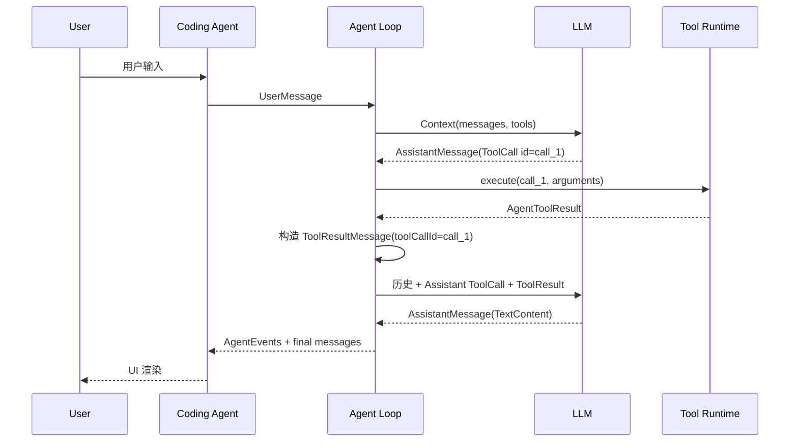

# 从 Coding Agent 到 LLM 的消息架构详解

本文围绕“消息如何传递”解释 Pi 的三层架构：

```text
coding-agent 产品层
    ↓ AgentMessage
agent 通用运行时
    ↓ Message
pi-ai / Provider 适配层
    ↓ 厂商 wire payload
LLM
```

重点不是只记住几个接口，而是理解同一段对话为什么会同时存在多种表示、它们由谁维护，以及什么时候发生转换。

阅读完成后，你应该能够回答：

1. 用户输入如何成为 `UserMessage`。
2. Session、Agent、LLM 请求和 UI 各自保存什么。
3. `AgentMessage` 与 `Message` 为什么不能合并成一个类型。
4. `transformContext` 与 `convertToLlm` 分别改变哪一层。
5. `AssistantMessage` 如何从 Provider 流事件逐步构造出来。
6. ToolCall 与 ToolResult 如何推动下一轮模型请求。
7. 为什么一条消息可以出现在 UI，却不出现在 LLM 上下文中。

## 1. 先给结论：这是一套“多份账本 + 多次投影”的架构

Pi 没有让一个 `messages` 数组承担所有职责。一次对话至少涉及下面六种表示：

| 表示 | 主要类型 | 所有者 | 作用 |
|---|---|---|---|
| 持久化记录 | `SessionEntry` | coding-agent | 保存会话树、分支、模型切换、摘要和消息 |
| 产品运行时消息 | `AgentMessage` | coding-agent / agent | 保存 LLM 消息以及 UI、摘要、命令等扩展消息 |
| 当前 run 工作上下文 | `AgentContext.messages` | agent-loop | 支撑本次 run 的多轮模型调用和工具闭环 |
| LLM 通用消息 | `Message` | pi-ai | Provider 无关的 `user / assistant / toolResult` 协议 |
| 厂商请求对象 | OpenAI/Anthropic/Google SDK 类型 | Provider adapter | 满足具体厂商 API 的 wire 格式 |
| 流式与生命周期事件 | `AssistantMessageEvent`、`AgentEvent` | pi-ai / agent | 驱动增量构造、状态更新、UI 渲染和持久化 |

这里的核心思想是：

> Session 是长期事实记录，AgentMessage 是产品运行时语言，Message 是模型边界语言，Provider payload 是厂商 wire 语言，Event 是变化通知。

它们之间是投影关系，不是同一个对象换了几个名字。

## 2. 总体架构图

```mermaid
flowchart LR
    UI[Interactive / RPC / SDK 输入] --> AS[AgentSession.prompt]
    AS --> AM[AgentMessage 数组]

    SM[(SessionManager JSONL)] -->|恢复| AM
    AM --> AG[Agent.state.messages]
    AG --> LOOP[agent-loop currentContext]

    LOOP --> TC[transformContext<br/>AgentMessage → AgentMessage]
    TC --> CL[convertToLlm<br/>AgentMessage → Message]
    CL --> LC[pi-ai Context<br/>systemPrompt + messages + tools]

    LC --> MR[ModelRuntime / Models]
    MR --> PA[Provider adapter]
    PA --> WP[厂商 wire payload]
    WP --> LLM[LLM]

    LLM --> PS[厂商响应流]
    PS --> AE[AssistantMessageEventStream]
    AE --> LOOP

    LOOP --> GE[AgentEvent]
    GE --> AG
    GE --> AS
    AS --> SM
    AS --> UI
```



正向链路负责“让模型看到正确内容”，反向链路负责“把模型增量输出收敛成可靠消息，并同步给状态、Session 和 UI”。

## 3. 三层职责

### 3.1 coding-agent：产品与会话层

相关源码：

- [`packages/coding-agent/src/core/sdk.ts`](../../packages/coding-agent/src/core/sdk.ts)
- [`packages/coding-agent/src/core/agent-session.ts`](../../packages/coding-agent/src/core/agent-session.ts)
- [`packages/coding-agent/src/core/session-manager.ts`](../../packages/coding-agent/src/core/session-manager.ts)
- [`packages/coding-agent/src/core/messages.ts`](../../packages/coding-agent/src/core/messages.ts)

这一层负责：

- 接收 Interactive、RPC 或 SDK 输入。
- 展开 prompt template 和 skill 命令。
- 允许 Extension 修改输入、system prompt 和上下文。
- 定义 `bashExecution`、`custom`、摘要等产品消息。
- 把 Agent 事件转发给 UI 和 Extension。
- 把最终消息写入 JSONL Session。
- 恢复会话树、分支、压缩摘要和模型设置。

它关心“产品应该怎样工作”，但不实现通用 Agent 循环，也不直接拼每一家厂商的 HTTP 请求。

### 3.2 agent：通用运行时层

相关源码：

- [`packages/agent/src/types.ts`](../../packages/agent/src/types.ts)
- [`packages/agent/src/agent.ts`](../../packages/agent/src/agent.ts)
- [`packages/agent/src/agent-loop.ts`](../../packages/agent/src/agent-loop.ts)

这一层负责：

- 维护 `Agent.state.messages`。
- 管理 steering、follow-up 和 abort。
- 把一次 run 拆成多个 turn。
- 每轮请求一条完整 `AssistantMessage`。
- 执行 ToolCall 并构造 ToolResultMessage。
- 发送 `AgentEvent`。
- 在模型调用边界把 `AgentMessage[]` 转换成 `Message[]`。

它知道 Agent 如何循环，但不知道 UI 怎样画，也不知道 OpenAI 和 Anthropic 的请求字段差异。

### 3.3 pi-ai：统一 LLM 协议与 Provider 适配层

相关源码：

- [`packages/ai/src/types.ts`](../../packages/ai/src/types.ts)
- [`packages/ai/src/models.ts`](../../packages/ai/src/models.ts)
- [`packages/ai/src/api/transform-messages.ts`](../../packages/ai/src/api/transform-messages.ts)
- [`packages/ai/src/utils/event-stream.ts`](../../packages/ai/src/utils/event-stream.ts)
- [`packages/ai/src/api/openai-responses-shared.ts`](../../packages/ai/src/api/openai-responses-shared.ts)

这一层负责：

- 定义 Provider 无关的 `Message`、`Context` 和内容块。
- 根据 model 的 provider/api 选择实现。
- 把统一消息转换成厂商请求格式。
- 把厂商流事件转换成统一 `AssistantMessageEvent`。
- 处理跨模型 thinking、图片、ToolCall ID 和不完整工具链兼容问题。

它关心模型协议，不关心 Session 文件和 TUI。

## 4. 五种容易混淆的“消息相关对象”

### 4.1 `SessionEntry`：持久化记录，不全是对话消息

Session 使用 JSONL 追加写入，每行是一个 entry。Entry 之间通过 `id / parentId` 形成树。

典型 entry 包括：

```text
message
model_change
thinking_level_change
compaction
branch_summary
custom
custom_message
label
session_info
```

因此：

```text
SessionEntry ≠ AgentMessage
```

模型切换、标签、会话名称和 Extension 状态需要持久化，但它们不是对话消息。

`SessionManager.buildSessionContext()` 会先选出当前 leaf 所在分支，再考虑 compaction，最后把选中的 entry 投影成 `AgentMessage[]`。

主要转换规则：

| SessionEntry | 运行时结果 |
|---|---|
| `message` | 取出其中保存的 `AgentMessage` |
| `custom_message` | 转成 `CustomMessage` |
| `branch_summary` | 转成 `BranchSummaryMessage` |
| `compaction` | 转成 `CompactionSummaryMessage` |
| `custom` | 不进入消息上下文 |
| model/thinking/label/session_info | 用于设置或 UI，不变成消息 |

Session 的职责是保存事实和树结构；“本次模型请求看到什么”由后续投影决定。

### 4.2 `AgentMessage`：可扩展的产品运行时消息

Agent Core 定义：

```ts
type AgentMessage =
  | Message
  | CustomAgentMessages[keyof CustomAgentMessages];
```

其中 `Message` 是三种 LLM 标准消息，`CustomAgentMessages` 可以由宿主通过 declaration merging 扩展。

Coding Agent 当前增加：

```text
bashExecution
custom
branchSummary
compactionSummary
```

所以 Agent transcript 可以同时表达：

- 用户真正输入的内容。
- 模型输出和工具结果。
- 用户手动执行的命令。
- Extension 注入的上下文。
- 长对话压缩摘要。
- 分支返回摘要。
- 只供 UI 或本地逻辑使用的信息。

### 4.3 `Message`：LLM 边界的封闭联合类型

Pi AI 层只接受：

```ts
type Message =
  | UserMessage
  | AssistantMessage
  | ToolResultMessage;
```

这三种类型构成 Provider 无关的对话协议：

- `UserMessage`：文本或图片输入。
- `AssistantMessage`：文本、thinking 和 ToolCall。
- `ToolResultMessage`：与 ToolCall ID 配对的文本或图片结果。

`systemPrompt` 和 `tools` 也会发给模型，但它们是 `Context` 的独立字段，不属于 `Message`。

### 4.4 Provider wire message：真正发送给厂商的对象

统一 `Message` 还不是最终网络格式。Provider adapter 会再次转换。

以 OpenAI Responses 为例：

| Pi 通用结构 | OpenAI Responses 表示 |
|---|---|
| system prompt | `system` 或 `developer` input item |
| User text | `input_text` |
| User image | `input_image` data URL |
| Assistant text | `message` + `output_text` |
| Thinking signature | `reasoning` item |
| ToolCall | `function_call` |
| ToolResultMessage | `function_call_output` |
| Tool definition | `tools[]` function schema |

Anthropic 和 Google 会映射成各自不同的 content block。Agent Loop 不需要知道这些差异。

### 4.5 Event：消息变化的通知，不是 transcript 消息

系统中有两组关键事件。

`AssistantMessageEvent` 描述一条 AssistantMessage 的生成过程：

```text
start
text_start / text_delta / text_end
thinking_start / thinking_delta / thinking_end
toolcall_start / toolcall_delta / toolcall_end
done / error
```

`AgentEvent` 描述 Agent 的运行生命周期：

```text
agent_start / agent_end
turn_start / turn_end
message_start / message_update / message_end
tool_execution_start / update / end
```

事件可以携带消息快照，但事件本身不会加入 transcript。例如 `text_delta` 不是一条新消息，`turn_end` 也不是一条消息。

## 5. 正向链路：用户输入如何到达 LLM

下面按照真实调用顺序追踪一次普通 Interactive 输入。

### 阶段 1：UI 把文本交给 `AgentSession.prompt()`

`AgentSession.prompt(text, options)` 先处理产品层能力：

1. Extension command。
2. input extension hook。
3. skill command 与 prompt template 展开。
4. streaming 时选择 steering 或 follow-up。
5. 模型与认证检查。
6. 必要的上下文压缩。
7. 创建 `UserMessage`。
8. 注入 Extension 的 `CustomMessage`。
9. 更新本轮 system prompt。

用户文本最终被包装成：

```ts
{
  role: "user",
  content: [
    { type: "text", text: expandedText },
    // 可选 ImageContent
  ],
  timestamp: Date.now(),
}
```

Coding Agent 传给 `Agent.prompt()` 的通常已经是 `AgentMessage[]`，不是裸字符串。

### 阶段 2：`Agent.prompt()` 建立本次 run

`Agent` 拒绝并发启动第二个 run。运行中新增输入必须进入 steering 或 follow-up 队列。

新 run 启动时：

```text
已有 Agent.state.messages
    + 本次 prompt messages
    = agent-loop 的 currentContext.messages
```

同时建立：

```text
newMessages = 本次 run 新产生的增量消息
```

这两份数组用途不同：

- `currentContext.messages` 是本次 run 的工作账本。
- `newMessages` 是最后随 `agent_end` 返回的增量账本。

### 阶段 3：prompt 通过事件进入公开 Agent 状态

对于每条 prompt，Agent Loop 发送：

```text
message_start(prompt)
message_end(prompt)
```

`Agent.processEvents()` 在 `message_end` 时把最终消息追加到 `Agent.state.messages`。

Coding Agent 的 `AgentSession` 订阅同一个事件：

- 先交给 Extension。
- 再通知 UI/RPC listeners。
- 最后将标准消息写入 SessionManager。

因此消息不是由 UI、Agent 和 Session 各自猜测生成，而是以 `message_end` 作为最终提交点。

### 阶段 4：生成本次模型请求视图

在每次 LLM 调用前，`streamAssistantResponse()` 执行：

```text
currentContext.messages
    ↓ transformContext，可选
AgentMessage[]
    ↓ convertToLlm，必需
Message[]
```

#### `transformContext`

签名是：

```ts
AgentMessage[] → AgentMessage[]
```

它处理“本轮应该使用哪些 Agent 消息”，适合：

- Extension 注入或修改上下文。
- 裁剪旧消息。
- 运行时上下文治理。

Coding Agent 将它接到 Extension `context` hook。

返回值只形成这次请求的临时视图，不会自动覆盖 `Agent.state.messages` 或 Session。

#### `convertToLlm`

签名是：

```ts
AgentMessage[] → Message[]
```

它处理“这些 Agent 消息怎样表达给 LLM”，负责：

- 标准三种消息原样保留。
- `bashExecution` 转为 UserMessage，或按 `excludeFromContext` 过滤。
- `custom` 转为 UserMessage。
- branch/compaction summary 包装成 UserMessage。
- 过滤模型不应该看到的产品消息。

Coding Agent 还在其外层加入图片屏蔽逻辑，把禁用的图片替换成文本占位符。

### 阶段 5：组装统一 `Context`

转换后 Agent Loop 组装：

```ts
const llmContext: Context = {
  systemPrompt: context.systemPrompt,
  messages: llmMessages,
  tools: context.tools,
};
```

这里形成了 Agent 与 pi-ai 的正式边界。

### 阶段 6：ModelRuntime 选择 Provider/API

Coding Agent 注入的 `streamFn` 调用 `modelRuntime.streamSimple()`。

ModelRuntime/Models 负责：

- 找到 `model.provider` 对应的 Provider。
- 解析 API key、headers、base URL 和环境配置。
- 根据 `model.api` 选择 `ProviderStreams` 实现。
- 调用对应的 `streamSimple(model, context, options)`。

Agent Core 因此保持 Provider 无关。测试时也可以注入假 `StreamFn`，完全绕过网络。

### 阶段 7：Provider adapter 规范化并生成 wire payload

Provider adapter 通常还会先调用 `transformMessages()`，处理：

- 不支持图片的模型：图片替换为占位文本。
- 跨模型 replay：thinking block 降级或移除签名。
- 跨 Provider ToolCall ID 规范化。
- 跳过 error/aborted AssistantMessage。
- 为孤立 ToolCall 补 synthetic error ToolResult。

然后 adapter 将 `Context` 转成厂商 SDK 参数并发送请求。

到这里，用户消息才真正到达远端 LLM。

## 6. 反向链路：LLM 输出如何回到 UI 和 Session

### 阶段 1：Provider 创建 pending AssistantMessage

一次流式请求开始时，Provider adapter 先创建空壳：

```ts
{
  role: "assistant",
  content: [],
  api,
  provider,
  model,
  usage: emptyUsage,
  stopReason: "pending",
  timestamp: Date.now(),
}
```

这条对象会随着厂商事件逐步增加 text、thinking、ToolCall、usage 和 stopReason。

### 阶段 2：厂商事件变成统一 Assistant 事件

例如 OpenAI 的 `response.output_text.delta` 被转换成：

```ts
{
  type: "text_delta",
  contentIndex,
  delta,
  partial: output,
}
```

函数调用参数增量会转换成 `toolcall_delta`；终态响应会转换成 `done` 或 `error`。

所有 Provider 都必须输出同一种 `AssistantMessageEventStream`，因此 Agent Loop 不需要理解厂商原始事件。

### 阶段 3：Agent Loop 维护 partial 与 final

`streamAssistantResponse()` 的处理规则：

```text
start
  → 把 partial 放进 currentContext 占位
  → emit message_start

*_delta / *_end
  → 替换 currentContext 最后一条 partial
  → emit message_update

done / error
  → 用 finalMessage 替换 partial
  → emit message_end
```

因此 currentContext 中始终只有当前 AssistantMessage 的一个位置，不会每个 token 追加一条消息。

### 阶段 4：`Agent` 归约运行状态

`Agent.processEvents()` 使用事件维护：

- `streamingMessage`：当前 partial，只用于实时状态。
- `state.messages`：只在 `message_end` 时追加 final message。
- `pendingToolCalls`：由 tool execution start/end 更新。
- `errorMessage`：由 turn_end 的 Assistant 错误更新。

这个边界保证 partial 不会污染正式 transcript。

### 阶段 5：`AgentSession` 转发和持久化

同一事件接着进入 Coding Agent：

1. Extension 可以观察事件。
2. `message_end` Extension 还可以返回同 role 的替换消息。
3. UI/RPC listener 收到事件。
4. 标准消息写入 SessionManager。

Assistant 的最终 usage、stopReason、provider、model 和错误信息都随 final message 保存。

JSON/RPC 输出为了减少数据量，会从 `message_update` 去掉重复的累计 partial；消费者使用：

```text
message_start 提供初始对象
message_update.delta 逐步拼接
message_end 提供权威最终对象
```

## 7. 工具调用形成的消息闭环

工具场景不是一次请求，而是多个 Assistant turn 组成的闭环：



关键点：

1. `ToolCall` 是 `AssistantMessage.content` 的内容块，不是顶层消息。
2. Tool Runtime 返回 `AgentToolResult`，它也不是 transcript 消息。
3. Agent Loop 将执行结果转换成 `ToolResultMessage`。
4. `ToolCall.id === ToolResultMessage.toolCallId` 建立因果关系。
5. ToolResult 被加入 currentContext 后，下一轮 LLM 才能看到执行结果。
6. UI 的 tool execution progress event 不会进入 LLM 上下文。

同一条 ToolResult 最终进入三份长期不同的状态：

```text
currentContext.messages  当前 run 下一轮立即使用
Agent.state.messages     公开运行时 transcript
SessionManager JSONL     跨进程持久化
```

## 8. “只给 UI，不给 LLM”是怎样实现的

这套架构没有把“是否显示”和“是否进入模型”混成一个布尔值。不同机制控制不同投影。

### 8.1 `bashExecution.excludeFromContext`

`!!command` 仍会：

- 执行命令。
- 创建 BashExecutionMessage。
- 保存到 Agent state 和 Session。
- 在 UI 中显示。

但 `convertToLlm()` 遇到：

```ts
message.role === "bashExecution" && message.excludeFromContext
```

会返回 `undefined`，随后过滤掉整条消息。LLM 既看不到命令，也看不到输出。

这是“保留事实，过滤请求投影”，不是从历史中删除消息。

### 8.2 `CustomMessage.display`

`CustomMessage.display` 控制 UI 是否显示，但不控制 LLM：

- `display: true`：显示，并转换成 UserMessage 发给 LLM。
- `display: false`：UI 隐藏，但仍转换成 UserMessage 发给 LLM。

这与 `excludeFromContext` 是两条独立轴。

### 8.3 Session `custom` 与 `custom_message`

- `custom` entry：保存 Extension 状态，不进入 AgentMessage，不发给 LLM。
- `custom_message` entry：恢复成 CustomMessage，随后通常转换成 UserMessage。

### 8.4 `details`

`details` 通常用于 UI、日志或 Extension，不会由 `convertToLlm()` 放进消息 content。

但是“不发给 LLM”不等于“不敏感”：它仍可能被写进 Session 文件，因此不能把未脱敏凭据随意放进 `details`。

### 可见性矩阵

| 数据 | UI | Agent state | Session | LLM |
|---|---:|---:|---:|---:|
| 普通 UserMessage | 是 | 是 | 是 | 是 |
| Assistant final | 是 | 是 | 是 | 下一轮 replay 时是 |
| ToolResultMessage | 是 | 是 | 是 | 是 |
| 普通 `!command` BashExecution | 是 | 是 | 是 | 是，转换为 user 文本 |
| `!!command` BashExecution | 是，dim 样式 | 是 | 是 | 否 |
| CustomMessage `display=true` | 是 | 是 | 是 | 是 |
| CustomMessage `display=false` | 否 | 是 | 是 | 是 |
| Session `custom` entry | 由扩展决定 | 否 | 是 | 否 |
| `message_update` delta | 是 | partial 状态 | 否 | 否 |

## 9. 一条普通消息的完整 trace

假设用户输入：

```text
解释 packages/agent/src/types.ts
```

### 9.1 产品层

```ts
AgentSession.prompt(text)
```

经过 Extension、skill/template 后生成：

```ts
UserMessage {
  role: "user",
  content: [{ type: "text", text: "解释 ..." }],
  timestamp,
}
```

### 9.2 Agent 层

```text
Agent.prompt([userMessage])
  → runAgentLoop
  → message_start(user)
  → message_end(user)
  → streamAssistantResponse
```

### 9.3 请求投影

```text
AgentMessage[]
  → transformContext
  → convertToLlm
  → Message[]
```

因为它本来就是 UserMessage，所以通常原样保留。

### 9.4 pi-ai 与 Provider

```ts
Context {
  systemPrompt,
  messages: [userMessage],
  tools,
}
```

ModelRuntime 选择 Provider。Provider adapter 将 UserMessage 转成厂商 input item，发送网络请求。

### 9.5 响应与提交

```text
Provider text delta
  → AssistantMessageEvent.text_delta
  → AgentEvent.message_update
  → UI 增量显示

Provider terminal response
  → AssistantMessageEvent.done
  → AgentEvent.message_end
  → Agent.state.messages 追加
  → SessionManager.appendMessage
```

此时正式 transcript 为：

```text
UserMessage
AssistantMessage
```

## 10. 多份消息数组的所有权和生命周期

### 10.1 `SessionManager.entries`

- 生命周期：跨进程、跨重启。
- 数据：会话树的完整事实记录。
- 特点：追加写入，不等价于线性 LLM context。

### 10.2 `Agent.state.messages`

- 生命周期：当前 AgentSession。
- 数据：当前公开 transcript，包含扩展 AgentMessage。
- 更新：最终 `message_end` 时逐条追加；恢复会话时整体赋值。

### 10.3 `currentContext.messages`

- 生命周期：单次 run。
- 数据：已有历史、本次 prompt、Assistant 和 ToolResult。
- 更新：Agent Loop 内部立即更新，以便下一 turn 使用。

### 10.4 `newMessages`

- 生命周期：单次 run。
- 数据：本次 run 新增消息。
- 用途：`agent_end` 和低层 loop 返回值。

### 10.5 `messages` 局部临时视图

这是经过 `transformContext` 后的数组，只服务当前一次 Provider 请求。

### 10.6 `llmMessages`

这是经过 `convertToLlm` 后的三角色标准消息，只服务当前一次 Provider 请求。

### 10.7 Provider payload

这是最短生命周期的 wire 对象。它可能包含 system/developer message、tool schemas、缓存参数和厂商专用字段，但不应反向成为 Session 的事实源。

## 11. 关键不变量

阅读或修改消息代码时，应保持以下不变量。

### 不变量 1：模型边界只接受三种顶层消息

```text
user / assistant / toolResult
```

任何自定义 AgentMessage 都必须转换或过滤。

### 不变量 2：事件不是消息

不要把 delta、turn_end 或 tool progress 直接追加进 transcript。

### 不变量 3：partial 不能成为多条历史

流式 Assistant 只占一个位置，最终由 final message 替换。

### 不变量 4：ToolCall 与 ToolResult 必须配对

Provider replay 通常要求每个 ToolCall 后存在对应 ToolResult。pi-ai 会为孤立调用补错误结果，但这只是兼容保护，不应成为正常控制流。

### 不变量 5：`message_end` 是正式提交点

Agent state、Session 持久化和最终 UI 状态都应以 final message 为准。

### 不变量 6：请求投影不能意外改写历史

`transformContext` 与 `convertToLlm` 默认只生成本轮请求视图。裁剪 LLM 输入不等于删除 Session 历史。

### 不变量 7：Provider 元数据不是都要发回模型

`usage`、`timestamp`、`diagnostics`、`details` 等主要服务运行时、计费、调试和 UI。Provider adapter 决定哪些字段需要 replay。

## 12. 关键架构决策与代价

### 决策一：可扩展 AgentMessage，封闭 LLM Message

**问题**：产品需要 UI、命令、摘要和 Extension 消息，但模型 API 只接受有限角色。

**例子**：`bashExecution` 对 UI 有独立样式，对 LLM 却必须表现为普通用户文本。

**方案**：Agent 内部使用可扩展联合类型，模型边界统一收敛到三种 Message。

**代价**：需要维护 `convertToLlm`，新增自定义消息时必须明确转换、过滤和持久化规则。

### 决策二：上下文转换使用投影，不直接删除历史

**问题**：UI 和审计需要完整历史，但每次 LLM 请求不应该发送全部内容。

**例子**：`!!git status` 应在 UI 中保留，但不应影响模型判断。

**方案**：保留 AgentMessage，在请求边界过滤。

**代价**：系统里会同时存在“完整 transcript”和“本轮 request view”，调试时必须确认自己观察的是哪一份。

### 决策三：流式事件与最终消息并存

**问题**：UI 需要实时响应，Session 需要稳定的最终对象。

**例子**：每个 token 都写 Session 会产生大量重复和无法恢复的半成品。

**方案**：delta 驱动 UI，`message_end` 提交 final message。

**代价**：事件消费者需要正确处理 start/update/end，不能把每个快照当成独立消息。

### 决策四：SessionEntry 与 AgentMessage 分离

**问题**：分支、压缩、模型切换和 Extension 状态都需要持久化，但不应该伪装成用户消息。

**方案**：Session 保存更丰富的 entry tree，恢复时投影成运行时消息。

**代价**：Session 文件不能简单地按行取出 `message` 就直接发送给模型，必须通过 `buildSessionContext()`。

### 决策五：Provider adapter 再做一次规范化

**问题**：同一历史可能跨模型、跨 Provider replay，而 thinking 签名、图片和 ToolCall ID 有厂商约束。

**方案**：统一 Message 到达 Provider 后再根据目标模型执行兼容转换。

**代价**：`convertToLlm()` 的输出仍不等于最终 wire payload；排查请求差异还需要进入具体 Provider adapter。

## 13. 常见误解与排查方法

### 13.1 “Agent state 里有，模型为什么没看到？”

依次检查：

```text
transformContext
convertToLlm
blockImages
Provider transformMessages
Provider payload hook
```

最常见原因是自定义消息被过滤，或 `excludeFromContext` 为 true。

### 13.2 “UI 没显示，所以模型也没看到？”

不一定。`CustomMessage.display=false` 就是 UI 隐藏但 LLM 可见。

### 13.3 “message_update 已经有完整文本，为什么 Session 里还没有？”

因为 update 是流式状态，Session 等待 `message_end` 的权威 final message。

### 13.4 “为什么 Session entries 比 messages 多？”

因为 entries 还包含模型切换、thinking 设置、label、compaction 和 Extension 状态。

### 13.5 “为什么切换模型后 thinking 或 ToolCall 变了？”

Provider `transformMessages()` 会移除不兼容签名、把 thinking 降级为文本，并规范化 ToolCall ID。

### 13.6 “为什么一条工具错误没有终止 Agent？”

工具错误通常会被编码成 `ToolResultMessage(isError=true)` 回注模型，让模型自我修正。只有 Assistant `error/aborted`、显式 stop hook 或 abort 才承担 run 终止语义。

## 14. 推荐源码阅读顺序

按下面顺序读，可以从类型一路跟到网络和 UI：

1. [`packages/ai/src/types.ts`](../../packages/ai/src/types.ts)：三种 Message、内容块、Context 和 Assistant 事件。
2. [`packages/agent/src/types.ts`](../../packages/agent/src/types.ts)：AgentMessage、AgentContext 和 AgentEvent。
3. [`packages/coding-agent/src/core/messages.ts`](../../packages/coding-agent/src/core/messages.ts)：产品消息扩展与 `convertToLlm`。
4. [`packages/coding-agent/src/core/session-manager.ts`](../../packages/coding-agent/src/core/session-manager.ts)：SessionEntry 到 AgentMessage。
5. [`packages/coding-agent/src/core/sdk.ts`](../../packages/coding-agent/src/core/sdk.ts)：Agent 构造和两个转换函数的注入。
6. [`packages/coding-agent/src/core/agent-session.ts`](../../packages/coding-agent/src/core/agent-session.ts)：输入创建、事件转发和持久化。
7. [`packages/agent/src/agent.ts`](../../packages/agent/src/agent.ts)：公开状态和事件归约。
8. [`packages/agent/src/agent-loop.ts`](../../packages/agent/src/agent-loop.ts)：请求视图、流式响应与 ToolResult 回注。
9. [`packages/ai/src/models.ts`](../../packages/ai/src/models.ts)：Provider/API 分发和认证。
10. [`packages/ai/src/api/transform-messages.ts`](../../packages/ai/src/api/transform-messages.ts)：跨模型兼容转换。
11. [`packages/ai/src/api/openai-responses-shared.ts`](../../packages/ai/src/api/openai-responses-shared.ts)：一个具体 Provider 的双向消息转换。
12. [`packages/coding-agent/src/modes/interactive/interactive-mode.ts`](../../packages/coding-agent/src/modes/interactive/interactive-mode.ts)：UI 如何消费 AgentSessionEvent。

## 15. 最终总结

用十二句话记住整套消息架构：

1. SessionEntry 是持久化事实，不等于 LLM 消息。
2. `buildSessionContext()` 把当前会话分支投影成 AgentMessage。
3. AgentMessage 是可扩展的产品运行时语言。
4. Message 是封闭的模型边界语言，只有 user、assistant 和 toolResult。
5. system prompt 和 tools 属于 Context，不属于 Message。
6. `transformContext` 决定本轮使用哪些 Agent 消息。
7. `convertToLlm` 决定这些 Agent 消息如何表达给模型。
8. Provider adapter 再把统一 Message 转成厂商 wire payload。
9. Provider 把厂商响应流统一成 AssistantMessageEventStream。
10. Agent 使用 partial 服务 UI，只在 message_end 提交 final transcript。
11. ToolCall 在 AssistantMessage 内，ToolResultMessage 负责把执行结果回注下一轮。
12. “UI 可见”“运行时保留”“Session 持久化”“LLM 可见”是四个独立维度。
