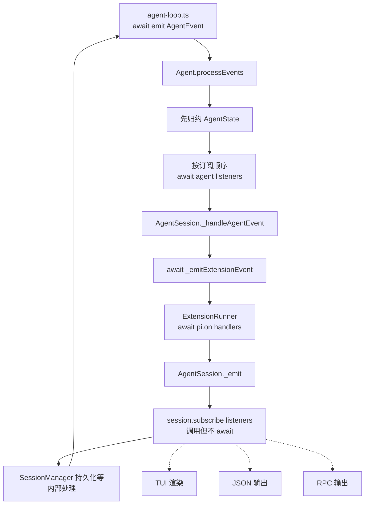

# Agent Event 流转与扩展管道详解

本文解释 Pi 中同一批运行事件为什么会经过三套看起来相似、实际职责不同的接口：`agent.subscribe()`、`session.subscribe()` 和扩展里的 `pi.on()`。

阅读完成后，你应该能够回答下面几个问题：

1. `agent-loop.ts` 发出的事件如何到达 Agent 状态、Session、扩展和 UI。
2. 为什么底层 Agent 会等待 `pi.on()`，却不会等待 `session.subscribe()` 返回的 Promise。
3. 哪些扩展事件只能观察，哪些能够修改消息、上下文、请求或工具结果。
4. 慢监听器、异常监听器和并行工具会怎样影响事件顺序。
5. 实现 UI、日志、持久化、策略拦截或扩展功能时应该选择哪条管道。

本文聚焦架构和执行语义。每个扩展事件的完整字段说明仍以 [`packages/coding-agent/docs/extensions.md`](../../packages/coding-agent/docs/extensions.md) 为准。Agent 循环、工具系统和消息类型的细节分别见：

- [Agent Loop 双层循环架构](1.agent-loop.md)
- [Tool 分层模型与完整调用生命周期](3.tool-system-layers-and-lifecycle.md)
- [从 Coding Agent 到 LLM 的消息架构](4.message-architecture-from-coding-agent-to-llm.md)

## 1. 先给结论

三套接口不是重复实现，而是三个不同的控制面：

| 接口 | 所在层 | 是否等待异步处理 | 主要用途 | 能否改变主流程 |
|---|---|---:|---|---:|
| `agent.subscribe()` | Agent Core | 是 | 状态同步、严格顺序、背压 | 间接可以，异常会影响运行 |
| `session.subscribe()` | Coding Agent Session | 否，返回值被忽略 | TUI、JSON、RPC、轻量观察 | 设计上不应改变 |
| `pi.on()` | Extension Runner | 通常是 | 扩展观察、变换、拦截和策略 | 取决于事件类型 |

可以先记住一条主链：

```text
agent-loop await emit(AgentEvent)
  → Agent.processEvents() 更新 AgentState
  → await Agent 的 listener
  → AgentSession._handleAgentEvent()
      → await pi.on 对应的扩展 handler
      → 调用 session.subscribe listener，但不 await
      → 持久化 message_end 等内部状态
  → agent-loop 才继续下一步
```

因此，`pi.on()` 是 Agent 执行路径中的受控扩展管道；`session.subscribe()` 是 Session 向外围消费者发出的快速广播。

## 2. 三层事件模型

### 2.1 `AgentEvent`：内核生命周期协议

`AgentEvent` 定义在 [`packages/agent/src/types.ts`](../../packages/agent/src/types.ts)，只描述 Agent 一次运行中的核心事实：

```text
Agent 生命周期       agent_start / agent_end
Turn 生命周期        turn_start / turn_end
Message 生命周期     message_start / message_update / message_end
Tool 生命周期        tool_execution_start / update / end
```

它不关心 Session 文件、自动压缩、模型选择或 TUI。它的任务是让 `agent-loop.ts` 与有状态的 `Agent` 外壳之间有一套稳定协议。

### 2.2 `AgentSessionEvent`：宿主广播协议

`AgentSessionEvent` 定义在 [`packages/coding-agent/src/core/agent-session.ts`](../../packages/coding-agent/src/core/agent-session.ts)。它包含大部分 `AgentEvent`，并增加 Coding Agent 需要的宿主事件，例如：

```text
agent_settled
queue_update
compaction_start / compaction_end
entry_appended
session_info_changed
thinking_level_changed
auto_retry_start / auto_retry_end
bash_execution_start / update / end
```

此外，它给 `agent_end` 增加了 `willRetry`。这让 UI 或 RPC 客户端能够区分“一个底层 run 已结束”和“整个高层任务不会再自动继续”。

### 2.3 `ExtensionEvent`：可编程扩展协议

`ExtensionEvent` 定义在 [`packages/coding-agent/src/core/extensions/types.ts`](../../packages/coding-agent/src/core/extensions/types.ts)。它覆盖的范围比前两者更大：

- Agent、Turn、Message 和 Tool 生命周期。
- Session 启动、切换、分叉、压缩和关闭。
- LLM context 与 Provider 请求边界。
- 用户输入、用户 shell 命令、模型选择和思考等级。
- 工具执行前的 `tool_call` 与执行后的 `tool_result`。

`pi.on()` 订阅的是这套协议。它不仅提供通知，还为特定事件定义返回值，从而支持变换、取消、拦截或替换。

### 2.4 三者不是一一对应

同名事件可能来自同一事实，但语义不完全相同。例如 `agent_end`：

- `AgentEvent.agent_end`：低层 run 不再产生事件。
- `AgentSessionEvent.agent_end`：在原数据上增加 `willRetry`。
- `pi.on("agent_end")`：扩展在 Session 内部处理阶段收到，并且 handler 会被等待。

另一些事件只存在于某一层：

- `tool_call` 只属于扩展拦截点，不是 `AgentEvent`。
- `queue_update` 只属于 Session 对外广播，不是扩展 Agent 生命周期事件。
- `context` 属于每次 LLM 请求前的扩展变换点，不是 UI 事件。

## 3. 源码地图

| 文件 | 在事件链中的职责 |
|---|---|
| [`packages/agent/src/agent-loop.ts`](../../packages/agent/src/agent-loop.ts) | 在控制流关键点 `await emit(...)` |
| [`packages/agent/src/agent.ts`](../../packages/agent/src/agent.ts) | 归约 `AgentState`，再按顺序等待底层 listener |
| [`packages/agent/src/types.ts`](../../packages/agent/src/types.ts) | 定义 `AgentEvent` 和 Agent 状态契约 |
| [`packages/coding-agent/src/core/agent-session.ts`](../../packages/coding-agent/src/core/agent-session.ts) | 连接 Agent、扩展、持久化和 Session 广播 |
| [`packages/coding-agent/src/core/extensions/loader.ts`](../../packages/coding-agent/src/core/extensions/loader.ts) | 创建 `pi` API，把 `pi.on()` handler 注册进扩展对象 |
| [`packages/coding-agent/src/core/extensions/runner.ts`](../../packages/coding-agent/src/core/extensions/runner.ts) | 按规则执行 handler、合并结果并隔离错误 |
| [`packages/coding-agent/src/core/extensions/types.ts`](../../packages/coding-agent/src/core/extensions/types.ts) | 定义事件、返回值和 `ExtensionContext` |
| [`packages/coding-agent/src/core/sdk.ts`](../../packages/coding-agent/src/core/sdk.ts) | 把 context/provider 扩展点接入 Agent 与 Provider |

## 4. 全链路总览



这张图只表示从 `AgentEvent` 桥接出来的主链。`input`、`before_agent_start`、`context`、Provider hooks、`tool_call` 和 `tool_result` 还有各自的插入点，后文会分别展开。

## 5. 第一段：`agent-loop` 为什么等待事件

`agent-loop.ts` 在关键边界使用：

```ts
await emit({ type: "message_end", message: finalMessage });
```

`AgentEventSink` 同时允许同步和异步实现，但调用方统一 `await`。这意味着事件不是纯日志：事件处理完成本身就是循环状态机的一部分。

例如 assistant 消息结束后，循环不会立刻执行消息中的 ToolCall，而是先等待 `message_end` 整条处理链完成。这样上层有机会：

1. 把最终消息写入 Agent 状态。
2. 让扩展检查或替换消息。
3. 把最终版本写入 Session 文件。
4. 再进入工具准备阶段。

这类等待称为事件背压：消费者完成之前，生产者不会越过当前边界。

## 6. 第二段：`Agent.processEvents()` 先更新状态，再通知

`Agent` 是 `agent-loop` 外面的有状态外壳。它的 `processEvents()` 先根据事件更新公开状态：

| 事件 | 状态变化 |
|---|---|
| `message_start` | 设置 `streamingMessage` |
| `message_update` | 替换 `streamingMessage` |
| `message_end` | 清除 streaming，并把最终消息加入 `state.messages` |
| `tool_execution_start` | 加入 `pendingToolCalls` |
| `tool_execution_end` | 移除 `pendingToolCalls` |
| `turn_end` | 更新最近一次错误信息 |
| `agent_end` | 清除 streaming 状态 |

归约完状态后，它按订阅顺序执行：

```ts
for (const listener of this.listeners) {
  await listener(event, signal);
}
```

因此 `agent.subscribe()` 有三个重要保证：

1. listener 看到的是已经更新后的 `AgentState`。
2. 多个 listener 串行执行，后一项不会超过前一项。
3. listener 返回的 Promise 会阻止 Agent 进入下一个事件边界。

`agent_end` 是最后一个 loop 事件，但不表示 Agent 已立即空闲。它仍会等待全部 `agent_end` listener，然后 `finishRun()` 才清理 `activeRun` 并把 `isStreaming` 设为 `false`。

## 7. 第三段：`AgentSession` 如何桥接扩展和外围监听器

`AgentSession` 在构造函数中始终注册一个底层 listener：

```ts
this._unsubscribeAgent = this.agent.subscribe(this._handleAgentEvent);
```

因为底层 `Agent` 会等待这个异步 listener，所以 `_handleAgentEvent()` 内部被 `await` 的工作都会成为 Agent 运行路径的一部分。

对于一个普通 `AgentEvent`，处理顺序是：

```text
1. 必要时更新 steering / follow-up 队列展示状态
2. await _emitExtensionEvent(event)
3. _emit(...) 通知 session.subscribe()
4. message_end 时写入 SessionManager
5. turn_end 时刷新待插入的 custom message
6. _handleAgentEvent 返回，底层 Agent 才继续
```

这里有一个容易忽略的顺序：`session.subscribe()` 在 SessionManager 持久化之前收到当前 `message_end`。因此普通 Session listener 不应依赖“当前这条消息此刻已经写入 SessionManager”。需要严格依赖持久化状态的逻辑应放在更合适的内部/扩展边界，或等待后续安全点。

工具调用是一个特殊但有保证的例子：`tool_call` 发生在 assistant 的 `message_end` 整条链已经返回之后，所以此时 assistant 工具调用消息已经持久化。仓库中的回归测试专门验证了这个顺序。

## 8. `session.subscribe()`：快速广播管道

### 8.1 注册和取消订阅

`AgentSession` 用数组保存监听器：

```ts
private _eventListeners: AgentSessionEventListener[] = [];
```

调用 `subscribe()` 会把 listener 追加到数组，并返回一个只移除该 listener 的函数：

```ts
const unsubscribe = session.subscribe(listener);
unsubscribe();
```

多个 listener 按注册顺序被调用。接口本身不提供优先级，也没有返回值合并语义。

### 8.2 为什么不等待异步 listener

关键类型和实现分别是：

```ts
type AgentSessionEventListener = (event: AgentSessionEvent) => void;

private _emit(event: AgentSessionEvent): void {
  for (const listener of this._eventListeners) {
    listener(event);
  }
}
```

`_emit()` 没有读取返回值，也没有 `await`。如果传入 async 函数：

```ts
session.subscribe(async (event) => {
  await renderOrWrite(event);
});
```

JavaScript 的实际轨迹是：

```text
调用 listener(event)
  → listener 执行到第一个 await
  → 立即返回 Promise
  → _emit 丢弃 Promise
  → AgentSession 继续内部处理
  → Agent 不等待 renderOrWrite 完成
```

TypeScript 允许返回值函数赋给 `void` 回调位置，所以这种写法能够通过类型检查，但不会改变 `_emit()` 的等待语义。

### 8.3 “不等待”不等于“不阻塞”

同步代码仍在当前调用栈执行：

```ts
session.subscribe(() => {
  expensiveSynchronousWork();
});
```

如果 `expensiveSynchronousWork()` 占用 500 ms，Agent 仍会停 500 ms。只有返回 Promise 后继续执行的异步部分不会被等待。

### 8.4 错误边界

`_emit()` 没有为 Session listener 设置 try/catch：

- 同步 throw 会穿过 `_emit()`，使 `_handleAgentEvent()` reject；底层 Agent 正在等待它，因此运行可能被打断。
- async listener 后续 reject 时，Promise 已被丢弃，可能形成未处理的 Promise rejection。

因此异步工作应显式接住错误：

```ts
session.subscribe((event) => {
  void handleEvent(event).catch((error) => {
    reportListenerError(error);
  });
});
```

### 8.5 典型用途

`session.subscribe()` 适合：

- 根据 `message_update` 增量刷新 TUI。
- 把 `AgentSessionEvent` 序列化成 JSON 或 RPC 消息。
- 更新状态栏、工具组件和排队消息提示。
- 收集非关键遥测。

它不适合：

- 必须在下一事件前完成的持久化。
- 需要修改上下文、消息、工具参数或工具结果的逻辑。
- 依赖返回值决定是否取消操作的策略。
- 不能容忍并发或事件完成顺序变化的异步副作用。

### 8.6 JSON/RPC 如何单独实现背压

JSON 和 RPC 模式使用 `session.subscribe()` 快速发出事件，但 stdout 可能因为管道消费者过慢而产生背压。实现没有把异步等待塞回 Session listener，而是额外直接订阅底层 Agent：

```ts
session.subscribe((event) => {
  output(toJsonEvent(event));
});

session.agent.subscribe(async () => {
  await waitForRawStdoutBackpressure();
});
```

第一条管道负责事件内容，第二条管道只负责在每个底层事件边界等待输出缓冲区恢复。这清楚体现了两套订阅接口的职责分工。

## 9. `pi.on()` 的注册阶段

扩展默认导出一个 factory：

```ts
export default function (pi: ExtensionAPI) {
  pi.on("turn_end", async (event, ctx) => {
    // extension logic
  });
}
```

Loader 创建扩展对象时，其中包含：

```ts
handlers: new Map<string, HandlerFn[]>()
```

`pi.on()` 本身只做注册：

```ts
on(event, handler) {
  const list = extension.handlers.get(event) ?? [];
  list.push(handler);
  extension.handlers.set(event, list);
}
```

因此：

1. `pi.on()` 不会在注册时运行 handler。
2. 同一扩展可以为同一事件注册多个 handler。
3. 同一扩展内的顺序就是 `pi.on()` 的调用顺序。
4. 扩展之间的顺序是扩展加载顺序。
5. `pi.on()` 返回 `void`，没有单独取消某个 handler 的 API；handler 生命周期跟随当前 Extension Runner。

扩展 factory 可以是异步函数。Loader 会等待 factory 完成后再 commit 注册结果。factory 失败时，该扩展的注册和加载期副作用会被丢弃，不会留下半激活扩展。

## 10. `ExtensionRunner`：`pi.on()` 的执行器

Runner 的通用执行形态是两层顺序循环：

```ts
for (const extension of extensions) {
  for (const handler of extension.handlers.get(event.type) ?? []) {
    await handler(event, ctx);
  }
}
```

这带来确定的顺序：

```text
Extension A / Handler 1
Extension A / Handler 2
Extension B / Handler 1
Extension C / Handler 1
```

默认不是 `Promise.all()`。前一个 handler 的异步工作完成后才运行下一个，所以后续 handler 可以读取前面已经完成的变更。

### 10.1 `ExtensionContext` 是运行时视图

每次 dispatch 时，Runner 通过 `createContext()` 创建 `ctx`。其中许多属性是 getter 或转发函数，例如：

- 当前模型和 thinking level。
- 当前 `AbortSignal`。
- SessionManager 的只读视图。
- UI 能力和运行模式。
- 当前是否 idle、是否有排队消息。
- `abort()`、`compact()` 和 `shutdown()`。

这些值在访问时解析，而不是扩展加载时拍下静态快照。因此同一个 handler 在不同事件中能够看到当前 Session 和模型状态。

### 10.2 reload 和 Session 替换后的失效保护

扩展 reload、new session、fork 或 switch session 后，旧 Runner 会被标记为 stale。旧 `pi`、旧事件 `ctx` 或旧 command context 再访问运行时能力时会抛出明确错误。

这项保护防止异步任务捕获旧 Session 后，在新 Session 中继续写消息、改工具或操作 UI。需要跨 Session 替换继续工作的代码，应使用替换 API 提供的 `withSession`，并使用回调传入的新 context。

## 11. `pi.on()` 不是一种处理语义

`ExtensionRunner` 为不同事件实现不同的组合规则。理解 `pi.on()` 时，按行为分类比按事件名背诵更有效。

### 11.1 只观察：返回值忽略

典型事件：

```text
session_start / session_shutdown
agent_start / agent_end / agent_settled
turn_start / turn_end
message_start / message_update
tool_execution_start / update / end
model_select / thinking_level_select
after_provider_response
```

这些 handler 可以执行异步副作用，Runner 会等待它们，但返回值没有业务含义。

### 11.2 链式变换：后一个看到前一个结果

| 事件 | 变换对象 | 合并规则 |
|---|---|---|
| `context` | 发送给下一次 LLM 调用的消息视图 | 后一个 handler 接收前一个返回的 messages |
| `message_end` | 最终消息 | 逐个替换；必须保持原 message role |
| `tool_result` | 工具结果 | 对 content/details/isError/usage 做字段级覆盖 |
| `before_provider_request` | Provider payload | 非 `undefined` 返回值成为下一 handler 的 payload |
| `before_agent_start` | system prompt 与注入消息 | system prompt 串行替换；消息按顺序收集 |
| `input` | 用户输入文本和图片 | transform 后继续；handled 时短路 |

链式变换依赖串行 `await`。如果改成并行执行，多个 handler 就无法稳定地在前一结果上继续加工。

### 11.3 原地修改：共享同一对象

`before_provider_headers` 直接修改 `event.headers`：

```ts
pi.on("before_provider_headers", (event) => {
  event.headers["x-session-id"] = "...";
});
```

`tool_call` 允许修改已经通过 schema 校验的 `event.input`。后续 handler 和真实工具执行都会看到修改后的参数，但修改后不会再次执行 schema 校验。因此扩展必须自己保证修改结果仍然满足工具契约。

### 11.4 短路控制：第一个决定可能结束遍历

| 事件 | 短路条件 |
|---|---|
| `input` | 返回 `{ action: "handled" }` |
| `tool_call` | 返回 `{ block: true }` |
| `user_bash` | 第一个返回 operations 或 result |
| `project_trust` | 第一个非 `undecided` 决定 |
| session-before 系列 | 返回 `{ cancel: true }` |

并非所有返回值都会立即短路。例如 `tool_result` 的部分 patch 会继续交给后续 handler；`before_agent_start` 会收集所有 handler 的注入消息。

## 12. 事件分类总表

| 分类 | 代表事件 | 主要能力 | 常见用途 |
|---|---|---|---|
| 启动与资源 | `project_trust`, `resources_discover` | 决策、追加资源路径 | 信任确认、动态技能/主题 |
| Session 生命周期 | `session_start`, `session_shutdown`, `session_info_changed` | 观察 | 初始化、清理、外部状态同步 |
| Session 前置控制 | `session_before_switch/fork/compact/tree` | 取消或提供替代结果 | 防止切换、定制压缩/分支摘要 |
| Agent 生命周期 | `before_agent_start`, `agent_start/end/settled` | 注入、观察 | 临时系统提示、运行状态 |
| Turn/Message | `turn_*`, `message_*` | 观察或替换最终消息 | 统计、UI、规范化最终消息 |
| LLM context | `context` | 链式替换请求消息视图 | 裁剪、注入、过滤 UI-only 消息 |
| Provider | `before_provider_headers/request`, `after_provider_response` | 修改请求或观察响应 | 追踪头、调试序列化、限流统计 |
| Tool | `tool_call`, `tool_result`, `tool_execution_*` | 拦截、修改、观察 | 安全策略、结果加工、进度 UI |
| 用户入口 | `input`, `user_bash` | transform、handled、替换执行后端 | 输入宏、远程 shell |
| 模型设置 | `model_select`, `thinking_level_select` | 观察 | 更新状态栏、模型特定初始化 |

完整字段和示例应查阅 Extensions API 文档。本表只表达这些事件在架构上的控制强度。

## 13. `message_end`：最终消息如何被扩展替换

`message_end` 是理解事件顺序最好的例子。

### 13.1 原始顺序

```text
agent-loop 得到 finalMessage
  → await emit(message_end)
  → Agent.processEvents 把 message 对象加入 state.messages
  → AgentSession._handleAgentEvent
  → await ExtensionRunner.emitMessageEnd
```

看起来消息已经加入 Agent state，扩展才有机会替换。为了不让状态、事件和持久化产生三个版本，AgentSession 不会简单创建一个互不相关的新对象，而是把 replacement 的字段写回原 message 对象。

### 13.2 替换约束

- replacement 必须保持原来的 `role`。
- 多个 handler 串行执行，后一个看到前一个替换后的消息。
- 未返回 replacement 的 handler 保持当前版本。
- handler 异常被报告为 extension error，后续 handler 仍可继续。

### 13.3 最终一致性

替换完成后：

1. `Agent.state.messages` 中原来保存的同一对象已经反映新字段。
2. 后续 `turn_end` 和 `agent_end` 使用修改后的消息。
3. `session.subscribe()` 收到修改后的当前事件。
4. `SessionManager.appendMessage()` 持久化修改后的消息。

这就是为什么 `message_end` handler 必须被等待：如果它被当作 fire-and-forget，持久化和下一阶段可能先看到旧消息。

## 14. 工具调用中的两套事件不要混淆

一次工具执行同时有两种扩展观察面：

### 控制事件

```text
tool_call    执行前，可修改参数或 block
tool_result  执行后，可修改结果
```

它们是 `pi.on()` 特有的控制点。

### 生命周期事件

```text
tool_execution_start
tool_execution_update
tool_execution_end
```

它们来自 `AgentEvent`，主要用于观察和 UI 展示。

### 14.1 完整顺序

```mermaid
sequenceDiagram
    participant Loop as agent-loop
    participant Agent as Agent
    participant Session as AgentSession
    participant Runner as ExtensionRunner
    participant Tool as Tool

    Loop->>Agent: message_end(assistant toolCall)
    Agent->>Agent: 写入 state.messages
    Agent->>Session: await listener
    Session->>Runner: await pi.on(message_end)
    Session->>Session: 广播并持久化 assistant
    Session-->>Loop: message_end 已完全处理

    Loop->>Agent: tool_execution_start
    Agent->>Session: await listener
    Session->>Runner: await pi.on(tool_execution_start)
    Session-->>Loop: start 已处理

    Loop->>Session: beforeToolCall
    Session->>Runner: await pi.on(tool_call)
    alt block 或 handler 失败
        Runner-->>Loop: 生成错误工具结果，不执行 Tool
    else allowed
        Loop->>Tool: execute(validated/mutated args)
        Tool-->>Loop: result
        Loop->>Session: afterToolCall
        Session->>Runner: await pi.on(tool_result)
        Runner-->>Loop: 最终结果 patch
    end

    Loop->>Agent: tool_execution_end
    Agent->>Session: await listener
    Session->>Runner: await pi.on(tool_execution_end)
    Loop->>Agent: message_start/end(toolResult)
```

### 14.2 `tool_call` 为什么在 `tool_execution_start` 之后

`tool_execution_start` 表示 Agent 已开始处理这次调用，不保证真实工具函数已经运行。之后才进行工具查找、参数准备、schema 校验和 `beforeToolCall`。

所以扩展可以看到：

```text
tool_execution_start
  → tool_call
  → 实际 execute 或 block
```

如果 `tool_call` block，仍会形成错误 ToolResult，并继续发出 `tool_execution_end` 和工具结果消息，保证事件和对话上下文闭环。

### 14.3 `tool_call` 异常是 fail-closed

大多数扩展事件捕获单个 handler 异常、报告 `extension_error`，然后继续其他 handler。`tool_call` 更保守：handler 异常会向上抛到 Agent 的 `beforeToolCall`，工具准备阶段捕获后生成错误工具结果，真实工具不执行。

这叫 fail-closed：当执行前安全策略自身失败时，默认不放行有副作用的工具。

### 14.4 `tool_result` 在生命周期结束事件之前修改结果

真实工具返回后，Agent 的 `afterToolCall` 会调用 `pi.on("tool_result")`。所有 patch 合并并完成图片规范化后，才发送：

```text
tool_execution_end(final result)
message_start(toolResult)
message_end(toolResult)
```

因此 UI、Session 历史和下一轮 LLM 上下文看到的是扩展加工后的最终结果。

### 14.5 并行工具的顺序

默认并行模式中：

- `tool_execution_start` 与 `tool_call` 预检按 assistant 源顺序执行。
- 多个真实工具可以并行执行。
- `tool_result` 与 `tool_execution_end` 可能按完成顺序交错。
- 最终 ToolResultMessage 仍按 assistant 中 ToolCall 的源顺序写入上下文。

不要用“上一个 `tool_execution_end` 一定对应源码中的上一个 ToolCall”作为并行模式假设，应使用 `toolCallId` 关联事件。

## 15. `context` 与 Provider 事件在哪里插入

并非所有 `pi.on()` 都由 `_handleAgentEvent()` 桥接。

每次请求 LLM 前，Agent 的 `transformContext` 调用：

```text
AgentMessage[]
  → ExtensionRunner.emitContext()
  → convertToLlm()
  → Provider payload
```

`context` handler 得到消息数组的深拷贝，适合为本次请求裁剪或注入内容，不会直接改写正式 transcript。

Provider 边界由 SDK 和 ModelRuntime 接入：

```text
序列化 Provider payload
  → before_provider_request：可链式替换 payload
  → 组装 headers
  → before_provider_headers：原地修改 headers
  → 发出 HTTP 请求
  → after_provider_response：消费 body 前观察状态和响应头
  → 解析流式响应
```

这些 handler 同样被等待，因为请求必须使用它们处理后的最终 payload 和 headers。

## 16. 普通流式回复的完整时序

假设用户输入一句话，模型直接返回文本，不调用工具：

```mermaid
sequenceDiagram
    participant UI as TUI/RPC
    participant Session as AgentSession
    participant Runner as ExtensionRunner
    participant Agent as Agent
    participant Loop as agent-loop
    participant Provider as Provider

    UI->>Session: prompt(text)
    Session->>Runner: await input / before_agent_start
    Session->>Agent: prompt(messages)

    Agent->>Loop: start run
    Loop->>Agent: agent_start
    Agent->>Session: await _handleAgentEvent
    Session->>Runner: await pi.on(agent_start)
    Session-->>UI: session.subscribe(agent_start)

    Loop->>Agent: turn_start + user message events
    Agent->>Session: 每个事件均等待桥接

    Loop->>Runner: context
    Runner-->>Loop: transformed messages
    Loop->>Provider: request
    Provider-->>Loop: start + text_delta* + done

    Loop->>Agent: message_start(assistant)
    Loop->>Agent: message_update*
    Agent-->>UI: 每次经 Session 快速广播
    Loop->>Agent: message_end(assistant)
    Session->>Runner: await pi.on(message_end)
    Session->>Session: 持久化最终消息

    Loop->>Agent: turn_end
    Session->>Runner: await pi.on(turn_end)
    Loop->>Agent: agent_end
    Session->>Runner: await pi.on(agent_end)

    Session->>Session: 检查 retry / compaction / queued continuation
    Session->>Runner: await pi.on(agent_settled)
    Session-->>UI: session.subscribe(agent_settled)
```

`message_update` 频率可能很高。生命周期扩展 handler 会被逐个等待，因此不应在每个 delta 中执行高延迟网络操作。UI 的 Session listener 虽然不被等待，但也应保持同步部分轻量，避免阻塞当前 JavaScript 调用栈。

## 17. `agent_end` 与 `agent_settled`

`agent_end` 只表示一个底层 Agent run 结束。随后 `AgentSession` 仍可能：

1. 对可重试错误执行自动重试。
2. 对上下文溢出执行压缩后继续。
3. 处理由 `agent_end` handler 新加入的 steering 或 follow-up。

高层 `_runAgentPrompt()` 会在这些情况中调用 `agent.continue()`，形成新的 `agent_start ... agent_end`。

只有这些自动续转全部结束，finally 阶段才发送 `agent_settled`。因此：

| 需求 | 应监听 |
|---|---|
| 统计每次低层 run | `agent_end` |
| 清理一次 run 的临时状态 | `agent_end`，但考虑 `willRetry` |
| 显示“整个任务已完全完成” | `agent_settled` |
| 等待 Session 真正 idle | `session.waitForIdle()` |

扩展的 `agent_settled` handler 会被等待。随后 Session 才广播 `agent_settled` 并解析 idle wait；如果 Session listener 自己启动了异步工作，该工作仍不属于 idle 等待范围。

## 18. 等待关系与错误传播矩阵

| 位置 | handler 返回 Promise | 同步 throw | Promise reject |
|---|---|---|---|
| `agent.subscribe()` | Agent 等待 | 传播到 Agent 生命周期兜底 | 传播到 Agent 生命周期兜底 |
| `session.subscribe()` | 被忽略 | 穿过 `_emit()`，可能打断桥接 | 可能成为未处理 rejection |
| 普通 `pi.on()` | Runner 串行等待 | 通常报告 extension error 后继续 | 通常报告 extension error 后继续 |
| `pi.on("tool_call")` | 串行等待 | 转成错误工具结果，工具不执行 | 转成错误工具结果，工具不执行 |

“通常”是因为扩展事件使用不同专用 emit 方法。关键结论不是假设所有 `pi.on()` 错误都相同，而是查看对应事件的组合规则。

## 19. 如何选择接口

### 使用 `agent.subscribe()`

当工作满足以下任一条件：

- 下一 Agent 事件必须等当前工作完成。
- 要实现资源背压。
- 要在最接近 Agent Core 的位置观察状态。
- 正在实现 Coding Agent 自身的内部桥接，而不是普通扩展。

代价是慢 listener 会直接拖慢模型流、工具执行和整个 run。

### 使用 `session.subscribe()`

当工作是外围消费：

- TUI 渲染。
- JSON/RPC 序列化。
- 非关键日志和遥测。
- Session 特有事件展示。

listener 应同步、短小，或显式启动带错误处理的后台任务。不要依赖它的异步完成顺序。

### 使用 `pi.on()`

当功能属于可加载扩展，并且需要：

- 在明确边界执行异步逻辑。
- 修改 system prompt、context、Provider 请求、消息或工具结果。
- 检查和阻止工具调用。
- 拦截输入、shell 或 Session 操作。
- 使用稳定的 `ExtensionContext` 能力。

`pi.on()` 是业务扩展的首选，而不是直接访问 AgentSession 内部字段。

## 20. 推荐写法

### 20.1 轻量 UI 观察

```ts
const unsubscribe = session.subscribe((event) => {
  if (event.type === "message_update") {
    updateStreamingView(event.message);
  }
});
```

### 20.2 Session listener 启动异步副作用

```ts
session.subscribe((event) => {
  void sendTelemetry(event).catch(reportTelemetryError);
});
```

这里明确接受“不阻塞 Agent，也不保证与下一事件串行”的语义。

### 20.3 必须完成后才能继续的扩展逻辑

```ts
pi.on("before_agent_start", async (event) => {
  const extra = await loadRequiredContext();
  return {
    systemPrompt: `${event.systemPrompt}\n\n${extra}`,
  };
});
```

### 20.4 工具安全策略

```ts
pi.on("tool_call", async (event) => {
  const decision = await checkPolicy(event.toolName, event.input);
  if (!decision.allowed) {
    return { block: true, reason: decision.reason };
  }
});
```

由于 Runner 和 Agent 会等待它，工具不会在策略结果出来之前执行。

## 21. 常见误解

### 误解一：`session.subscribe(async ...)` 会让 Session 等待

不会。async 函数返回 Promise，但 `_emit()` 丢弃返回值。

### 误解二：`pi.on()` 只是另一个 EventEmitter

不是。它有顺序执行、上下文、返回值协议、变换链、短路和错误隔离。

### 误解三：所有扩展 handler 都只观察

不是。`context`、`message_end`、`tool_call`、`tool_result`、`input` 等都能改变后续行为。

### 误解四：`tool_execution_start` 表示工具函数已经开始

不一定。它在预检之前发出，之后 `tool_call` 仍可以 block。

### 误解五：`agent_end` 表示整个用户任务彻底结束

不一定。自动重试、压缩恢复和排队消息可能再启动 run。彻底稳定看 `agent_settled`。

### 误解六：Session listener 完全不会拖慢 Agent

只有异步 Promise 不被等待。listener 在第一个 await 前的同步代码仍在 Agent 的调用链上执行。

### 误解七：扩展错误一定会被忽略

普通事件通常隔离并报告错误，但 `tool_call` 采用 fail-closed；Session listener 的错误也不在 Extension Runner 的保护范围内。

## 22. 推荐调试顺序

调试事件顺序时，按层打断点，不要先进入 Provider 或 UI 细节：

1. `agent-loop.ts` 的 `await emit(...)`：确认事件事实何时产生。
2. `Agent.processEvents()`：确认 AgentState 何时变化。
3. `AgentSession._handleAgentEvent()`：确认扩展、广播和持久化顺序。
4. `AgentSession._emitExtensionEvent()`：确认 AgentEvent 如何转成 ExtensionEvent。
5. `ExtensionRunner.emit*()`：确认该事件的组合与错误规则。
6. `AgentSession._emit()`：确认 Session listener 只被调用、不被等待。
7. TUI/RPC 消费者：确认外围如何解释事件。

建议日志至少记录：

```text
事件 type
turnIndex（如果有）
message.role（如果有）
toolCallId（如果有）
进入/退出时间
handler 所属 extensionPath
```

并行工具必须使用 `toolCallId` 关联，不要只依据日志相邻关系。

## 23. 最小心智模型

最后可以把整个系统压缩成八句话：

1. `agent-loop` 是事件生产者，并在关键边界等待事件处理完成。
2. `Agent` 先更新公开状态，再等待底层 listener。
3. `AgentSession` 是 Agent Core 与扩展、持久化、UI 之间的桥。
4. `session.subscribe()` 是不等待 Promise 的外围广播。
5. `pi.on()` 先注册进 `Extension.handlers`，运行时由 `ExtensionRunner` 串行调度。
6. `pi.on()` 的返回值是否有效，取决于具体事件的组合规则。
7. `message_end`、`tool_call` 和 `tool_result` 被等待，是为了让下一阶段只看到一致的最终数据。
8. `agent_end` 结束一个 run，`agent_settled` 才表示高层自动续转已经全部停止。

只要能沿着下面这条链解释一次工具调用，就已经掌握了 Pi Event 架构的核心：

```text
assistant message_end
  → AgentState
  → pi.on(message_end)
  → Session 广播与持久化
  → tool_execution_start
  → pi.on(tool_call)
  → execute
  → pi.on(tool_result)
  → tool_execution_end
  → ToolResultMessage
  → 下一 Turn
```
