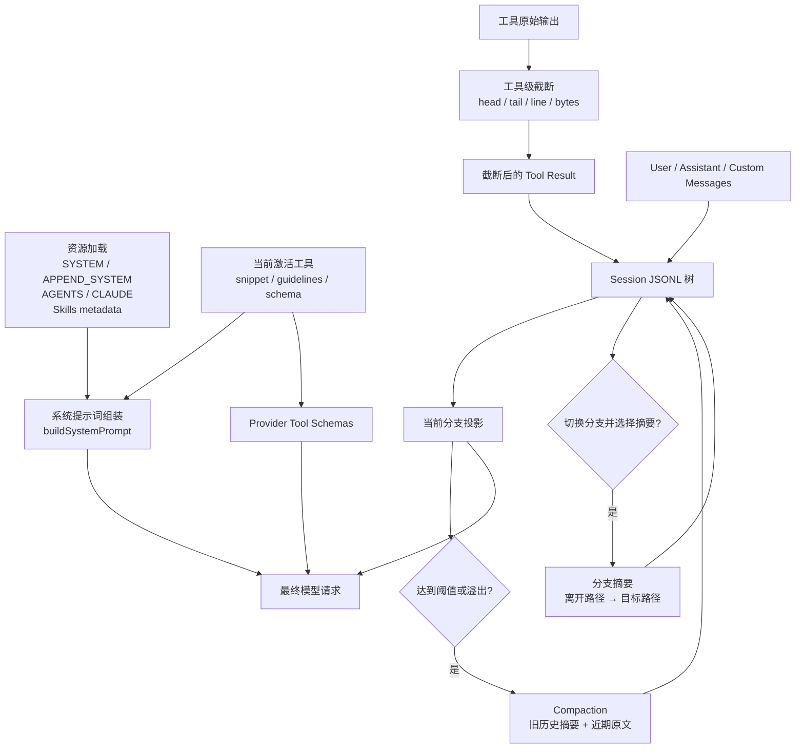
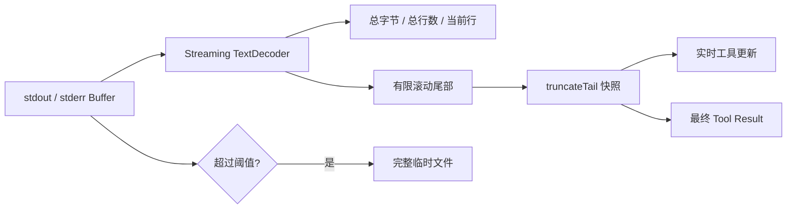
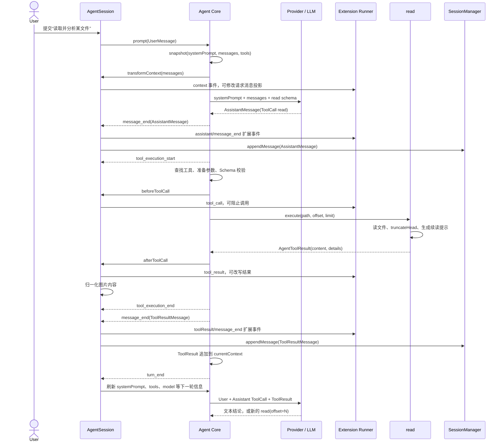
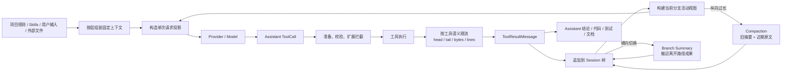

# 上下文工程：四类控制机制、工具端到端链路与设计精华

本文系统解释 Pi Coding Agent 如何控制、组织和压缩发送给大模型的上下文，首先覆盖四个机制：

1. 工具输出截断。
2. 系统提示词组装。
3. Compaction。
4. 分支摘要。

阅读完成后，你应该能够回答下面几个问题：

1. 一次模型请求中的上下文由哪些部分组成，分别由谁维护。
2. 为什么 `read` 保留开头、`bash` 保留结尾，以及截断后如何恢复完整信息。
3. `SYSTEM.md`、`APPEND_SYSTEM.md`、`AGENTS.md`、工具提示和 Skills 按什么顺序进入系统提示词。
4. Compaction 在什么时机触发，如何选择切割点，为什么不能从 `toolResult` 开始保留。
5. 分支摘要与 Compaction 有什么本质区别，为什么分支摘要默认不携带原始 Tool Result。
6. 哪些信息会永久保存在 Session JSONL 中，哪些只是当前请求视图，哪些内容一旦截断就不会进入会话历史。
7. 这套设计在哪些场景下会失真、溢出或失效，应如何排查和缓解。
8. 一次 `read` 调用怎样从用户消息流经 ToolCall、参数校验、扩展、截断、ToolResult、Session 持久化并进入下一轮模型请求。
9. 同一份工具证据在活动上下文、Compaction 和分支摘要中分别如何保留、压缩或舍弃。
10. Pi Agent 的上下文工程设计中，哪些原则可以复用到其他 Agent 系统。

本文聚焦架构、数据生命周期和设计取舍，不逐行解释实现。Agent Loop、工具系统、消息投影和扩展事件的基础知识可先参考：

- [Agent Loop 双层循环架构](1.agent-loop.md)
- [Tool 分层模型与完整调用生命周期](3.tool-system-layers-and-lifecycle.md)
- [从 Coding Agent 到 LLM 的消息架构](4.message-architecture-from-coding-agent-to-llm.md)
- [Agent Event 流转与扩展管道](5.agent-event-flow-and-extension-pipeline.md)

## 1. 先给结论

这四个机制不是四套孤立功能，而是分别控制上下文的四种增长来源：

| 机制 | 控制对象 | 主要维度 | 核心策略 |
|---|---|---|---|
| 工具输出截断 | 单次 `toolResult` | 单次增量 | 按工具语义保留开头或结尾 |
| 系统提示词组装 | 每轮固定上下文 | 固定成本 | 分层发现、按顺序拼装、按需披露 Skills |
| Compaction | 当前分支的长期消息历史 | 纵向时间 | 旧消息摘要化，近期消息保留原文 |
| 分支摘要 | 离开分支上的工作成果 | 横向分叉 | 总结旧路径并挂到目标路径 |

可以把一次请求近似理解为：

```text
模型请求占用
≈ 系统提示词
  + 当前激活工具 Schema
  + 当前分支消息视图
  + 本轮预留输出
```

其中：

- 工具截断限制新的 Tool Result 如何进入“当前分支消息视图”。
- Compaction 负责缩短已经积累起来的消息视图。
- 分支摘要负责把另一条树路径上的语义成果注入当前路径。
- 系统提示词和工具 Schema 不会被 Compaction 压缩，它们是每轮重复承担的固定成本。

最重要的一条边界是：

> Session 是长期事实树；Agent Messages 是当前运行状态；发送给模型的是由系统提示词、工具集合和当前分支消息共同构成的临时请求视图。

## 2. 总体架构

### 2.1 四层上下文控制面



### 2.2 一次长期任务中的完整演化

```text
启动
  → 发现系统提示词资源和工具
  → 组装固定上下文

执行
  → 工具产生输出
  → 输出按工具语义截断
  → 截断后的 Tool Result 写入 Session

增长
  → 当前分支消息持续累积
  → 超过安全阈值
  → 旧消息变成 Compaction Summary

分叉
  → 用户回到会话树中的旧节点
  → 可选地总结正在离开的分支
  → Branch Summary 挂到目标节点

继续增长
  → Branch Summary 也成为普通上下文消息
  → 将来可能再次被 Compaction 摘要
```

最终形成多级信息折叠：

```text
原始工具输出
  ↓ 确定性截断
Tool Result
  ↓ Compaction
当前分支语义检查点
  ↓ Tree Navigation
跨分支语义摘要
  ↓ 后续 Compaction
更高层长期检查点
```

## 3. 源码地图

| 文件 | 主要职责 |
|---|---|
| [`packages/coding-agent/src/core/tools/truncate.ts`](../../packages/coding-agent/src/core/tools/truncate.ts) | 通用 head、tail、单行截断和统计信息 |
| [`packages/coding-agent/src/core/tools/output-accumulator.ts`](../../packages/coding-agent/src/core/tools/output-accumulator.ts) | 流式命令输出、有限尾部内存和完整临时文件 |
| [`packages/coding-agent/src/core/tools/read.ts`](../../packages/coding-agent/src/core/tools/read.ts) | 文件读取、分页提示和 head 截断 |
| [`packages/coding-agent/src/core/tools/bash.ts`](../../packages/coding-agent/src/core/tools/bash.ts) | 命令执行、实时快照、tail 截断和完整输出路径 |
| [`packages/coding-agent/src/core/tools/grep.ts`](../../packages/coding-agent/src/core/tools/grep.ts) | 匹配数、单行长度和总字节三层限制 |
| [`packages/coding-agent/src/core/system-prompt.ts`](../../packages/coding-agent/src/core/system-prompt.ts) | 最终系统提示词结构和拼装顺序 |
| [`packages/coding-agent/src/core/resource-loader.ts`](../../packages/coding-agent/src/core/resource-loader.ts) | SYSTEM、APPEND_SYSTEM、AGENTS、CLAUDE 和 Skills 资源发现 |
| [`packages/coding-agent/src/core/skills.ts`](../../packages/coding-agent/src/core/skills.ts) | Skill 发现、校验和元数据提示格式 |
| [`packages/coding-agent/src/core/compaction/compaction.ts`](../../packages/coding-agent/src/core/compaction/compaction.ts) | Token 估算、阈值判断、切割点、摘要生成和 Split Turn |
| [`packages/coding-agent/src/core/compaction/utils.ts`](../../packages/coding-agent/src/core/compaction/utils.ts) | 摘要序列化、Tool Result 二次截断和文件操作跟踪 |
| [`packages/coding-agent/src/core/compaction/branch-summarization.ts`](../../packages/coding-agent/src/core/compaction/branch-summarization.ts) | 公共祖先、离开路径收集、分支摘要预算和生成 |
| [`packages/coding-agent/src/core/session-manager.ts`](../../packages/coding-agent/src/core/session-manager.ts) | Session 树、CompactionEntry、BranchSummaryEntry 和活动上下文重建 |
| [`packages/coding-agent/src/core/agent-session.ts`](../../packages/coding-agent/src/core/agent-session.ts) | 系统提示刷新、Compaction 调度、溢出恢复和树导航 |
| [`packages/coding-agent/src/core/settings-manager.ts`](../../packages/coding-agent/src/core/settings-manager.ts) | Compaction 和 Branch Summary 配置 |
| [`packages/coding-agent/docs/compaction.md`](../../packages/coding-agent/docs/compaction.md) | 面向使用者的压缩与分支摘要说明 |
| [`packages/agent/src/agent.ts`](../../packages/agent/src/agent.ts) | Agent 状态、上下文快照、事件归约和 Prompt 入口 |
| [`packages/agent/src/agent-loop.ts`](../../packages/agent/src/agent-loop.ts) | Provider 请求、ToolCall 调度、工具结果封装和下一轮回注 |
| [`packages/ai/src/utils/validation.ts`](../../packages/ai/src/utils/validation.ts) | 工具参数转换、TypeBox 校验和错误格式化 |
| [`packages/coding-agent/src/core/tools/tool-definition-wrapper.ts`](../../packages/coding-agent/src/core/tools/tool-definition-wrapper.ts) | Coding Agent ToolDefinition 到 AgentTool 的上下文适配 |
| [`packages/coding-agent/src/core/messages.ts`](../../packages/coding-agent/src/core/messages.ts) | AgentMessage 到统一 LLM Message 的转换 |
| [`packages/coding-agent/src/core/sdk.ts`](../../packages/coding-agent/src/core/sdk.ts) | Agent 装配、请求上下文扩展和 Provider stream 接线 |

推荐先关注下面这些方法：

```text
工具截断
  truncateHead()
  truncateTail()
  truncateLine()
  OutputAccumulator.snapshot()

系统提示词
  loadProjectContextFiles()
  formatSkillsForPrompt()
  buildSystemPrompt()
  AgentSession._rebuildSystemPrompt()

Compaction
  shouldCompact()
  estimateContextTokens()
  findCutPoint()
  prepareCompaction()
  compact()
  buildContextEntries()

分支摘要
  collectEntriesForBranchSummary()
  prepareBranchEntries()
  generateBranchSummary()
  AgentSession.navigateTree()
  SessionManager.branchWithSummary()

单次工具端到端链路
  Agent.prompt()
  Agent.createContextSnapshot()
  streamAssistantResponse()
  executeToolCalls()
  prepareToolCall()
  validateToolArguments()
  executePreparedToolCall()
  finalizeExecutedToolCall()
  createToolResultMessage()
  AgentSession._installAgentToolHooks()
  AgentSession._handleAgentEvent()
```

## 4. 第一层：工具输出截断

### 4.1 问题：单次工具调用可能击穿上下文

文件、搜索和命令输出具有明显的长尾分布：大多数结果很小，但少数结果可以达到数 MB。若全部进入 Tool Result，会产生四类问题：

1. 一次工具调用就可能接近模型窗口。
2. 后续请求重复携带同一大段输出，持续增加成本。
3. 大量日志或重复行会稀释模型注意力。
4. 流式命令输出如果全部保存在内存，还会产生宿主内存压力。

项目没有使用统一的“截取前 N token”，而是根据工具语义选择保留方向：

```text
read / grep / find / ls  → 保留开头
bash / powershell       → 保留结尾
```

原因很直接：

- 文件开头通常包含声明、导入、配置和整体结构。
- 搜索结果的开头通常已经足以判断是否需要细化条件。
- 命令输出末尾通常包含错误、测试汇总和退出前状态。

### 4.2 双限制：行数和 UTF-8 字节数

`truncate.ts` 的默认限制是：

```ts
DEFAULT_MAX_LINES = 2000
DEFAULT_MAX_BYTES = 50 * 1024
GREP_MAX_LINE_LENGTH = 500
```

行数和字节数是独立上限，先达到哪个就按哪个停止。这里故意不用 token：

- 不依赖具体模型 tokenizer。
- 不需要异步加载 tokenizer 或维护 Provider 差异。
- UTF-8 字节数容易精确计算和测试。
- 同一套工具可以服务不同模型。

代价是 50 KiB 与实际 token 数没有固定对应关系。英文代码、中文、JSON、路径、Base64 的 token/byte 比例都不同，因此该限制只能控制数量级，不能替代最终上下文预算判断。

### 4.3 `truncateHead()`：只返回完整前缀行

`truncateHead()` 的处理顺序是：

1. 统计原始 UTF-8 字节和逻辑行数。
2. 如果两个上限都未达到，原样返回。
3. 从第一行向后累计。
4. 下一完整行放不下时停止。
5. 返回内容以及总行数、总字节数、输出行数和截断原因。

正常情况下它不会返回半行。半行代码、半行 JSON 或半行搜索结果往往不具备稳定语义。

如果第一行本身超过字节限制，它返回空内容并设置：

```ts
firstLineExceedsLimit = true
```

`read` 随后给出按行和按字节读取的 Bash 建议。这样不会让模型误以为自己看到了完整首行。

### 4.4 `truncateTail()`：为命令输出保留结尾

`truncateTail()` 从最后一行向前累计，同样优先保留完整行。

唯一允许部分行的情况是：最后一行本身超过 `maxBytes`。如果仍坚持完整行，命令结果会变成空文本。因此实现保留最后一行的尾部，并设置：

```ts
lastLinePartial = true
```

`truncateStringToBytesFromEnd()` 会跳过 UTF-8 continuation bytes，保证起点位于合法字符边界。它解决的是字节安全，不保证语义完整。

### 4.5 结构化截断元数据

工具不只获得截断后的文本，还会得到 `TruncationResult`：

```ts
interface TruncationResult {
  content: string;
  truncated: boolean;
  truncatedBy: "lines" | "bytes" | null;
  totalLines: number;
  totalBytes: number;
  outputLines: number;
  outputBytes: number;
  lastLinePartial: boolean;
  firstLineExceedsLimit: boolean;
  maxLines: number;
  maxBytes: number;
}
```

这些字段使调用方可以生成可执行的恢复提示：

```text
read  → Use offset=2001 to continue
grep  → refine pattern or increase limit
find  → refine glob or increase limit
bash  → Full output: <temp path>
```

这是一项重要架构决策：截断不是静默丢弃，而是“有限结果 + 恢复坐标”。

### 4.6 不同工具的限制组合

| 工具 | 保留方向 | 业务上限 | 通用大小上限 | 恢复方式 |
|---|---|---|---|---|
| `read` | 开头 | 2000 行 | 50 KiB | `offset` / `limit` |
| `grep` | 开头 | 默认 100 matches；单行 500 chars | 50 KiB | 增大 `limit` 或收窄模式 |
| `find` | 开头 | 默认 1000 results | 50 KiB | 增大 `limit` 或收窄 glob |
| `ls` | 开头 | 默认 500 entries | 50 KiB | 增大 `limit` |
| `bash` | 结尾 | 2000 行 | 50 KiB | 完整输出临时文件 |
| `powershell` | 结尾 | 复用 Shell Tool 策略 | 50 KiB | 完整输出临时文件 |

`grep` 是多级治理最明显的例子：

```text
匹配数量上限
  → 单个匹配行字符上限
  → 最终拼接结果字节上限
```

`find` 和 `ls` 已经有记录数量上限，因此调用 `truncateHead()` 时把行数上限设为极大值，只使用总字节限制。

### 4.7 Bash 的流式内存与完整输出

内建 Shell Tool 使用 `OutputAccumulator`：



流式 `TextDecoder` 能正确处理一个多字节字符横跨两个 Buffer 的情况。滚动尾部限制内存增长；一旦输出超过阈值，之前缓存的原始块会写入临时文件，后续数据继续写入该文件。

最终形成两个视图：

```text
模型看到：最后 2000 行或 50 KiB
用户可回查：临时文件中的完整输出
```

临时文件不是 Session 的组成部分，也不是长期存储。如果完整日志是任务产物，应显式写到工作区文件。

### 4.8 UI 折叠不等于上下文截断

工具组件还会根据终端宽度和 expanded 状态只渲染少量行。这只改变用户界面：

```text
UI preview        → 只影响显示
TruncationResult  → 改变模型实际收到的 Tool Result
```

排查“模型为什么没看到某行”时，应先确认是 UI 折叠还是 Tool Result 真正被截断。

### 4.9 截断发生在持久化之前

工具执行完成后，截断后的文本成为 `toolResult` 并进入 Agent/Session 消息链。因此 Session JSONL 一般保存的是截断后的结果，而不是原始工具输出。

这意味着：

- Session 的“完整历史”是完整的消息历史，不等于完整的外部命令字节流。
- Bash 临时文件可以补充完整输出，但生命周期独立于 Session。
- `read` 的恢复依赖再次调用 `read(offset=...)`，而不是从 Session 中找回未保存内容。

## 5. 第二层：系统提示词组装

### 5.1 问题：固定上下文需要可组合、可覆盖、可发现

Coding Agent 的系统提示词同时服务多个来源：

- Pi 默认行为。
- 当前激活工具。
- 用户的全局偏好。
- 项目的开发规范。
- 当前目录的局部规范。
- Skills 目录。
- 扩展逐轮注入的规则。

如果所有来源共享一个不可拆分字符串，会产生三个问题：

1. 工具变化后无法同步更新能力说明。
2. 全局、项目和目录规则没有清晰来源。
3. 扩展只能粗暴替换全部提示词。

因此项目把系统提示词分成“资源发现”和“最终组装”两步：

```text
ResourceLoader
  → 发现内容和来源
  → AgentSession 汇总当前工具贡献
  → buildSystemPrompt() 生成基础提示词
  → before_agent_start 可做逐轮覆盖
```

### 5.2 默认组装顺序

没有自定义 `SYSTEM.md` 时，`buildSystemPrompt()` 按下面顺序生成：

```text
1. Pi 默认身份
2. Available tools
3. Guidelines
4. Pi 文档位置与阅读规则
5. APPEND_SYSTEM
6. project_context：AGENTS / CLAUDE 文件
7. available_skills：Skill 元数据
8. Current working directory
```

默认提示词会始终加入：

- 回答保持简洁。
- 处理文件时清楚展示路径。

如果只存在 Bash/PowerShell 而没有独立 `grep/find/ls`，还会加入使用 Shell 完成文件检索的规则。

### 5.3 工具如何贡献提示词

一个 Tool Definition 可以提供：

```ts
promptSnippet?: string
promptGuidelines?: string[]
```

`promptSnippet` 进入 `Available tools`；`promptGuidelines` 作为扁平 bullet 加入 Guidelines。AgentSession 只收集当前激活工具的贡献，并做空白归一化和去重。

这里必须区分两个通道：

```text
Tool Schema       → 告诉 Provider 模型可以怎样调用工具
promptSnippet     → 用自然语言告诉模型工具大致用途
promptGuidelines  → 告诉模型何时或怎样使用工具
```

自定义工具即使没有 `promptSnippet`，仍可能通过 Tool Schema 可调用；它只是不会出现在默认提示词的可见工具列表中。

当扩展改变激活工具集合时，`AgentSession.setActiveToolsByName()` 会同时替换工具集合并重建基础系统提示词，避免“提示词说有工具，但 Provider 没收到 Schema”或相反的漂移。

### 5.4 `SYSTEM.md`：替换默认基础，不替换所有附加层

系统提示词来源优先级大致为：

```text
显式 --system-prompt / SDK source
  → 受信任项目 .pi/SYSTEM.md
  → 全局 ~/.pi/agent/SYSTEM.md
  → Pi 默认提示词
```

项目 `.pi/SYSTEM.md` 只有在项目被信任时才自动加载。

当存在 custom prompt 时，`buildSystemPrompt()` 不再生成默认身份、默认工具列表、默认 Guidelines 和 Pi 文档说明，但仍然继续追加：

```text
custom SYSTEM
  → APPEND_SYSTEM
  → AGENTS / CLAUDE
  → Skills metadata
  → current working directory
```

因此 `SYSTEM.md` 的准确语义是“替换默认基础提示词”，不是“独占整个最终系统提示词”。

### 5.5 `APPEND_SYSTEM.md`：在基础提示词后追加

追加来源优先级与 SYSTEM 类似：

```text
显式 appendSystemPrompt sources
  → 受信任项目 .pi/APPEND_SYSTEM.md
  → 全局 ~/.pi/agent/APPEND_SYSTEM.md
```

它适合表达不值得重写整个默认提示词的组织级补充规则。多个显式 append sources 会以空行连接。

### 5.6 `AGENTS.md` / `CLAUDE.md`：按目录层叠

`loadProjectContextFiles()` 首先加载全局 Agent 目录中的上下文文件，然后从当前工作目录向文件系统根遍历，最终以“父目录在前、子目录在后”的顺序追加。

每个目录只选择一个文件，同目录优先级是：

```text
AGENTS.override.md
  → AGENTS.md
  → AGENTS.MD
  → CLAUDE.md
  → CLAUDE.MD
```

`AGENTS.override.md` 只覆盖同目录候选文件，不会取消全局或祖先目录的上下文。最终提示词把每个文件包装为：

```xml
<project_context>
  <project_instructions path=".../AGENTS.md">
    ...full content...
  </project_instructions>
</project_context>
```

代码没有实现一个结构化冲突解析器。更具体目录规则能否覆盖父目录规则，依赖：

- 父目录在前、子目录在后的顺序。
- 每块内容带有精确 path。
- 模型对“更具体指令优先”的理解。

ResourceLoader 还处理嵌套 Git worktree 的 shadow 场景，避免同一个逻辑仓库范围的上下文文件被主工作区和嵌套 worktree 重复加载。

### 5.7 Skills：只常驻目录，不常驻正文

`formatSkillsForPrompt()` 只输出可由模型调用的 Skill 元数据：

```xml
<available_skills>
  <skill>
    <name>...</name>
    <description>...</description>
    <location>.../SKILL.md</location>
  </skill>
</available_skills>
```

完整 `SKILL.md` 不会常驻系统提示词。模型发现任务匹配后，再用 `read` 加载正文和必要引用。这是渐进式披露：

```text
常驻：name + description + location
按需：完整 SKILL.md
进一步按需：references / scripts / assets
```

只有 `read` 工具处于激活状态时，Skills 目录才会进入系统提示词，因为没有 read 时模型无法按约定读取 Skill。`disableModelInvocation=true` 的 Skill 也会从目录中隐藏，只允许显式 `/skill:name` 调用。

`/skill:name` 和 Prompt Template 不属于系统提示词。它们在用户提交时展开为 user message，因此只影响该次请求及后续消息历史。

### 5.8 逐轮覆盖：`before_agent_start`

基础系统提示词由 `_rebuildSystemPrompt()` 维护。每次发送用户请求前，AgentSession 触发 `before_agent_start`，扩展可以：

- 查看当前基础提示词。
- 查看结构化 `BuildSystemPromptOptions`。
- 注入 Custom Message。
- 为当前轮提供新的 system prompt。

多个扩展按加载顺序执行，后续 handler 能看到前面已经修改过的 system prompt。若当前轮没有扩展返回覆盖值，AgentSession 会恢复 `_baseSystemPrompt`，防止上一轮临时规则泄漏到下一轮。

`prepareNextTurnWithContext` 还会在 Agent Loop 的下一 turn 边界刷新系统提示词、工具、模型和 Thinking Level，保证同一个 run 内的动态工具变化在下一次模型请求生效。

### 5.9 固定上下文不会被 Compaction 压缩

这是整个系统最重要的容量边界之一：

- AGENTS、SYSTEM、APPEND_SYSTEM 的完整文本每轮重复发送。
- 当前工具 Schema 每轮重复发送。
- Compaction 只重建 Session messages，不会改写这些固定部分。

因此一个很大的 `AGENTS.md` 会形成永久上下文税：

```text
可用于会话历史的空间
= contextWindow
 - system prompt
 - tool schemas
 - reserved output
```

如果固定上下文本身已接近窗口，继续降低 `keepRecentTokens` 只能压缩消息，无法从根本上解决问题。

## 6. 第三层：Compaction

### 6.1 问题：单次截断不能阻止长期增长

工具截断限制每次增量，但一个长期 Agent 任务仍会不断产生：

```text
User
Assistant
ToolCall
ToolResult
Assistant
User
...
```

Compaction 的目标是把当前分支较早的消息转换成语义检查点，同时保留近期原始消息，以平衡容量和细节。

默认设置由 `SettingsManager.getCompactionSettings()` 提供：

```json
{
  "enabled": true,
  "reserveTokens": 16384,
  "keepRecentTokens": 20000
}
```

### 6.2 三种入口

Compaction 有三个入口：

| 入口 | 触发条件 | 是否继续被中断的任务 |
|---|---|---:|
| 手动 | `/compact [instructions]`、RPC、SDK | 否 |
| 阈值 | `contextTokens > contextWindow - reserveTokens` | 否 |
| Overflow 恢复 | Provider context overflow 或可恢复 length stop | 最多重试一次 |

自动检查既发生在 Agent run 结束后，也发生在发送下一条用户请求之前。后者能捕获被中止响应、零 usage 或异常 Provider 状态留下的高上下文。

### 6.3 Context Token 的真实值与估算值

优先使用最近有效 AssistantMessage 的 Provider usage：

```text
usage.totalTokens
或 input + output + cacheRead + cacheWrite
```

如果消息是 error、usage 为零，或最近 usage 后还有新消息，则对消息做近似估算：

```text
estimated tokens ≈ characters / 4
```

图片按固定字符量估算。该估算用于调度和切割，不追求与每个模型 tokenizer 完全一致。

这里存在两个相关但不同的数字：

- 触发判断尽量采用 Provider usage。
- `keepRecentTokens` 切割使用消息字符估算。

所以 20k recent tokens 是目标规模，不是严格上限。

### 6.4 切割点：从最新消息向前累计

`findCutPoint()` 从当前分支尾部向前遍历消息，累计估算 token，达到 `keepRecentTokens` 后选择最近的合法切割点。

合法切割点包括：

- User Message。
- Assistant Message。
- BashExecution Message。
- Custom Message。
- Branch Summary。
- Compaction Summary。

不允许从 `toolResult` 开始保留。原因是 LLM 消息协议要求 Tool Result 与之前的 Assistant ToolCall 配对。若活动上下文从一个孤立 Tool Result 开始，Provider 可能拒绝请求，模型也无法知道该结果对应哪个工具调用。

### 6.5 普通切割与活动上下文

普通切割可以表示为：

```text
旧消息区                              近期保留区
User → Assistant → ToolResult | User → Assistant → ToolResult
                              ↑
                      firstKeptEntryId
```

旧消息区生成摘要，近期保留区继续以原始消息存在。SessionManager 随后把活动上下文重建为：

```text
最新 Compaction Summary
  + firstKeptEntryId 开始的旧路径条目
  + CompactionEntry 之后产生的新条目
```

原始旧条目仍保存在 JSONL 树中，只是不再属于当前模型请求视图。

### 6.6 Split Turn：一个回合就超过近期预算

一个用户回合可能包含很多 Assistant ToolCall 和 ToolResult。如果单个回合已经超过 `keepRecentTokens`，切割点会落在 Assistant Message，而不是下一个 User Message。

项目将其分成两段：

```text
turn prefix：当前回合早期，准备摘要
turn suffix：当前回合近期，保留原文
```

此时生成两类摘要：

1. 之前完整历史的结构化摘要。
2. 当前超大回合前缀的专用摘要。

前缀摘要包含：

```markdown
## Original Request
## Early Progress
## Context for Suffix
```

然后与历史摘要合并，让模型理解为什么留下来的 suffix 已经处于某个中间执行状态。

### 6.7 摘要输入序列化

`serializeConversation()` 把消息转换为单个文本块：

```text
[User]: ...
[Assistant thinking]: ...
[Assistant]: ...
[Assistant tool calls]: read(path=...)
[Tool result]: ...
```

再包装为：

```xml
<conversation>
  ...serialized messages...
</conversation>
```

这样摘要模型看到的是“需要总结的资料”，而不是一段需要继续参与的原生对话。

Compaction 会保留 Tool Result，但每个 Tool Result 在序列化时最多保留 2000 个 JavaScript 字符：

```text
工具级截断：最多 50 KiB / 2000 lines
  ↓
Compaction 输入：每个 Tool Result 最多 2000 chars
  ↓
语义摘要
```

这是双重治理：第一层保护正常会话，第二层保护摘要请求。

### 6.8 摘要格式和增量更新

初次摘要使用固定结构：

```markdown
## Goal
## Constraints & Preferences
## Progress
### Done
### In Progress
### Blocked
## Key Decisions
## Next Steps
## Critical Context
```

重复 Compaction 时，previous summary 会放入 `<previous-summary>`，并要求模型：

- 保留旧摘要中的有效信息。
- 加入新完成的工作和决策。
- 把完成项从 In Progress 移到 Done。
- 更新 Next Steps。
- 保留精确路径、函数名和错误消息。

因此重复 Compaction 是“滚动更新检查点”，不是每次从空白重新总结全部历史。

### 6.9 为什么下一次从旧 `firstKeptEntryId` 开始

第一次 Compaction 保留的近期消息并不在第一次摘要中。如果第二次简单从上一个 CompactionEntry 后开始，那么这些“第一次保留、第二次准备丢弃”的消息可能从未进入任何摘要。

因此下一次 `prepareCompaction()` 优先从上一次 `firstKeptEntryId` 开始新的摘要范围：

```text
第一次：摘要 A | 保留 B
第二次：更新摘要时重新包含 B | 保留 C
```

这保证上一轮幸存的原始消息在被淘汰前至少有机会进入下一版摘要。

### 6.10 摘要调用边界

Compaction 使用专用 Summarization System Prompt，并设置：

- `toolChoice: "none"`，禁止工具调用。
- `cacheRetention: "none"`，避免一次性摘要污染 Prompt Cache。
- 新 routing session ID。
- 与普通请求一致的临时错误重试策略。
- AbortSignal 支持取消。

普通摘要最大输出约为：

```text
min(0.8 × reserveTokens, model.maxTokens)
```

Split Turn 前缀摘要约为：

```text
min(0.5 × reserveTokens, model.maxTokens)
```

如果摘要响应是 `stopReason: "length"`，实现会拒绝持久化，因为部分摘要不能安全地成为下一阶段检查点。摘要返回 ToolCall 也被视为错误。

### 6.11 Overflow 恢复

当 Provider 报告上下文溢出或出现可恢复 length stop 时：

1. 最后的失败/截断 AssistantMessage 已在 Session 中持久化。
2. AgentSession 从当前运行状态移除该消息。
3. 执行 Compaction。
4. 重建消息状态后再次确保失败 AssistantMessage 不位于尾部。
5. 调用 `agent.continue()` 恢复被中断的任务。

恢复最多进行一次。第二次仍失败时，系统报告明确错误，避免无限 compact-and-retry。

如果响应已经成功完成但 usage 表明上下文超过窗口，则只 Compaction，不重试已经完成的响应。

### 6.12 文件操作跟踪

Compaction 从 Assistant ToolCall 中提取：

```text
read(path)
write(path)
edit(path)
```

摘要末尾追加：

```xml
<read-files>
...
</read-files>

<modified-files>
...
</modified-files>
```

这些列表会从上一次 Pi 生成的 Compaction details 中继续累积。

它不是完整文件审计：

- 无法识别 Bash 内部读写的文件。
- 不理解任意自定义工具的路径语义。
- 只识别约定工具名和 `path` 参数。
- 默认实现不会把扩展自定义 details 当作内建结构解析。

### 6.13 持久化数据结构

Compaction 写入：

```ts
interface CompactionEntry {
  type: "compaction";
  summary: string;
  firstKeptEntryId: string;
  tokensBefore: number;
  usage?: Usage;
  details?: unknown;
  fromHook?: boolean;
}
```

`tokensBefore` 用于记录压缩前规模和 UI 展示；`usage` 计入 Session 成本统计；`details` 为默认文件列表或扩展自定义状态。

## 7. 第四层：分支摘要

### 7.1 问题：Session 是树，不是线性数组

用户可以通过 `/tree` 返回旧节点并从那里继续：

```text
        B → C → D   old leaf
      /
A ───
      \
        E → F       target
```

若直接把 leaf 从 D 移到 F，B/C/D 上的探索成果不在目标路径中。分支摘要负责把“正在离开的路径”压缩后附加到目标位置。

它不自动由上下文阈值触发，而是在树导航时由用户选择或 SDK 指定 `summarize: true`。

### 7.2 找到最深公共祖先

`collectEntriesForBranchSummary()`：

1. 获取 old leaf 的完整路径。
2. 获取 target 的完整路径。
3. 从 target 路径尾部向前找到最深公共祖先。
4. 从 old leaf 反向收集到公共祖先，但不包含公共祖先。
5. 反转为时间顺序。

例如公共祖先是 A，则待摘要范围是 B/C/D。A 已经存在于目标路径，不需要重复摘要。

### 7.3 不在 Compaction 边界停止

离开路径中可能已经包含 CompactionEntry。收集过程不会在该边界停止，而是把 Compaction Summary 转换为上下文消息继续纳入分支摘要。

这使摘要可以递归折叠：

```text
原始历史
  → Compaction Summary
  → Branch Summary
  → 将来再次 Compaction
```

### 7.4 输入预算：优先最近分支内容

分支摘要预算是：

```text
tokenBudget = model.contextWindow - branchSummary.reserveTokens
```

默认 reserve 也是 16384。`prepareBranchEntries()` 从 newest 向 oldest 加入消息，超过预算后停止，最终再恢复时间顺序。

如果遇到现有 Compaction Summary 或 Branch Summary，并且当前使用量低于预算的 90%，实现会尽量把重要摘要纳入，即使它可能让估算值稍微超过预算。

这体现了分支摘要的优先级：

```text
最近原始进展 + 已有语义检查点
  > 很久以前的原始细节
```

### 7.5 与 Compaction 的关键差异：跳过 Tool Result

分支摘要在 `getMessageFromEntry()` 中直接跳过：

```ts
if (entry.message.role === "toolResult") return undefined;
```

因此分支摘要输入包括：

- User Message。
- Assistant 文本和 ToolCall。
- Custom Message。
- Branch Summary。
- Compaction Summary。

但不包括原始 Tool Result。

设计假设是：Assistant 后续文本应该已经把关键工具发现转化为结论，原始 Tool Result 体积大、重复多，迁移到另一分支时价值较低。

代价是：如果 Assistant 调用工具后没有总结结果，重要事实可能不会进入分支摘要。长期任务中，关键工具发现不应只停留在 Tool Result，最好由 Assistant 形成阶段结论或写入项目文档。

### 7.6 摘要格式和输出预算

默认分支摘要格式是：

```markdown
## Goal
## Constraints & Preferences
## Progress
### Done
### In Progress
### Blocked
## Key Decisions
## Next Steps
```

并加上前缀：

```text
The user explored a different conversation branch before returning here.
Summary of that exploration:
```

前缀用于告诉下一模型：这些内容来自另一条已离开的探索路径，不是当前路径自然连续发生的原始对话。

分支摘要固定使用：

```ts
maxTokens: 2048
```

它比 Compaction 摘要预算小，因为目标是携带另一分支的关键成果，而不是维护整个长期任务的完整检查点。

分支摘要复用 `completeSummarization()`，因此同样：

- 使用专用摘要 System Prompt。
- 禁止工具调用。
- 不写 Prompt Cache。
- 支持 AbortSignal。
- 使用配置的临时错误重试。
- 拒绝 length-limited 部分摘要。

### 7.7 摘要挂在目标位置，不挂在旧分支

生成摘要后，`SessionManager.branchWithSummary()`：

1. 记录离开前的旧 leaf 为 `fromId`。
2. 把当前 leaf 切换到 target/newLeaf。
3. 以 target/newLeaf 为 parent 创建 BranchSummaryEntry。
4. 将新摘要条目设为当前 leaf。

结果是：

```text
旧分支：A → B → C → D
目标路径：A → E → F → BranchSummary(B,C,D)
```

旧分支没有被修改或删除；摘要是目标路径上的新节点。

### 7.8 导航到 User Message 的特殊语义

如果 target 本身是一条 User Message，导航目标不是该消息，而是它的父节点：

```text
target user message
  → 文本放回编辑器
  → leaf 切到 target.parentId
  → Branch Summary 挂到 parentId
  → 用户编辑后重新提交
```

这样用户可以改写旧请求，同时新请求仍能看到离开分支的摘要。

### 7.9 持久化结构

分支摘要写入：

```ts
interface BranchSummaryEntry {
  type: "branch_summary";
  fromId: string;
  summary: string;
  details?: unknown;
  usage?: Usage;
  fromHook?: boolean;
}
```

`parentId` 来自 SessionEntryBase，指向目标位置；`fromId` 指向离开前的 old leaf。两者共同表达“摘要来自哪里、被带到哪里”。

文件列表会从嵌套的 Pi 生成 Branch Summary details 中继续累积，但仍只可靠识别 read/write/edit 的显式 `path`。

## 8. Compaction 与分支摘要对比

| 维度 | Compaction | 分支摘要 |
|---|---|---|
| 主要目的 | 缩短当前分支长期历史 | 携带被放弃分支的成果 |
| 空间方向 | 当前分支纵向 | Session 树横向 |
| 触发 | 阈值、Overflow、手动 `/compact` | `/tree` 导航时可选 |
| 输入范围 | 当前活动分支的较旧前缀 | old leaf 到公共祖先之间的路径 |
| 原文保留 | 最近约 `keepRecentTokens` | 目标路径原文保持不变 |
| Tool Result | 保留，但每条摘要前最多 2000 chars | 默认完全跳过 |
| 超大单回合 | Split Turn 双摘要 | 无专用 Split Turn |
| 输出预算 | 约 `0.8 × reserveTokens` | 固定 2048 tokens |
| 结果位置 | 当前分支末尾 | 目标导航位置 |
| Entry | `CompactionEntry` | `BranchSummaryEntry` |
| 任务恢复 | Overflow 时最多 retry 一次 | 不继续旧分支任务 |
| 原始历史 | 保留在 JSONL 树中 | 旧分支完整保留 |

二者共享：

- `SUMMARIZATION_SYSTEM_PROMPT`。
- `serializeConversation()`。
- `completeSummarization()`。
- 禁止 ToolCall。
- 一次性 routing session。
- `cacheRetention: none`。
- 文件操作列表格式。
- Extension 自定义入口。

## 9. 四层机制的交互边界

### 9.1 系统提示词不进入 SessionEntry

系统提示词保存在 Agent 状态和构建参数中，不作为普通 Session Message 持久化。Session 切换或资源 reload 后会重新发现资源并重建提示词。

因此：

- Compaction 不会总结 AGENTS/SYSTEM。
- Branch Summary 不会携带系统提示词。
- 会话文件本身不能完整还原某次请求使用的所有系统资源，除非外部资源未变化或有独立记录。

### 9.2 Tool Result 先截断，再进入所有后续机制

顺序固定为：

```text
raw output
  → tool-level truncation
  → toolResult message
  → session persistence
  → compaction / branch projection
```

Compaction 和 Branch Summary 无法恢复工具级截断前的文本。

### 9.3 Compaction Summary 可以被分支摘要消费

离开路径中的 CompactionEntry 会被转成 Compaction Summary Message，作为分支摘要输入。这样已经压缩过的旧历史仍能迁移到另一分支。

### 9.4 Branch Summary 可以被后续 Compaction 消费

BranchSummaryEntry 会转成上下文消息并位于目标分支上。随着目标分支增长，它会进入下一次 Compaction 的待摘要范围。

### 9.5 Extension context 是临时请求投影

除四个核心机制外，扩展的 `context` 事件还能在每次 LLM 请求前变换消息视图。它不必修改 Session 历史，因此属于请求级投影，而不是持久化压缩。

`before_agent_start` 修改 system prompt，`context` 修改 messages，两者分别作用于最终请求的两个主要部分。

## 10. 关键架构决策与权衡

### 决策一：工具截断使用字节和行数，不使用 tokenizer

**问题**：不同模型 tokenizer 不同，工具层不应绑定某个 Provider。

**选择**：统一采用 UTF-8 字节数和完整行。

**收益**：实现简单、确定、跨模型、可在流式输出中低成本计算。

**代价**：无法精确控制 token；不同语言内容的实际上下文成本不同。

### 决策二：根据工具语义选择保留方向

**问题**：统一保留开头会丢命令最终错误，统一保留结尾会丢文件声明和搜索入口。

**选择**：文件/搜索保留 head，命令输出保留 tail。

**收益**：相同容量下保留更可能有用的信息。

**代价**：启发式不总正确；某些命令错误位于开头，某些文件关键实现位于末尾。

### 决策三：截断结果必须包含恢复坐标

**问题**：静默截断让模型无法判断缺失范围，也无法自主继续。

**选择**：返回 TruncationResult，并在文本中附加 offset、limit 或 full-output path。

**收益**：Agent 可以闭环获取剩余内容。

**代价**：提示文本本身略微超过名义大小上限；调用方必须正确消费元数据。

### 决策四：系统提示词使用分层拼装，不把所有内容写死

**问题**：工具、项目规则和扩展都需要独立演化。

**选择**：ResourceLoader 发现资源，AgentSession 汇总动态工具，`buildSystemPrompt()` 统一排序，扩展逐轮覆盖。

**收益**：来源清晰、支持 reload、支持动态工具和项目定制。

**代价**：最终优先级由加载顺序和模型理解共同决定，不是形式化策略引擎。

### 决策五：Skills 采用渐进式披露

**问题**：完整加载所有 Skill 会长期占用大量系统上下文。

**选择**：系统提示词只列 metadata，匹配后再读正文。

**收益**：固定上下文较小，可安装大量低频 Skill。

**代价**：需要额外 read 回合；模型可能漏掉应该加载的 Skill。

### 决策六：Compaction 是“摘要 + 近期原文”混合模型

**问题**：全量原文不可持续；全量摘要又会丢失当前执行细节。

**选择**：旧历史摘要化，最近约 20k token 保留原文。

**收益**：长期目标和近期工具状态兼顾。

**代价**：切割点和 token 都是近似；长期反复摘要存在语义漂移。

### 决策七：Session 采用追加式树，不删除被压缩历史

**问题**：若 Compaction 直接覆盖历史，摘要错误将不可恢复，分支也无法回看。

**选择**：追加 CompactionEntry/BranchSummaryEntry，通过活动上下文投影隐藏旧条目。

**收益**：历史可审计、可导航、可重新分支。

**代价**：Session 文件持续增长；“磁盘历史大小”和“模型上下文大小”不再一致。

### 决策八：分支摘要跳过 Tool Result

**问题**：离开分支的原始工具输出可能非常大，且目标分支通常只需要结论。

**选择**：保留 Assistant ToolCall 和文本，跳过 Tool Result。

**收益**：分支迁移成本稳定，摘要更聚焦行为和结论。

**代价**：Assistant 未显式总结的工具事实可能丢失。

### 决策九：部分摘要不能成为检查点

**问题**：`stopReason: length` 返回的摘要可能缺少 Next Steps 或关键上下文。

**选择**：拒绝持久化 length-limited summary。

**收益**：避免用不完整检查点替换完整历史视图。

**代价**：摘要失败时上下文压力仍存在，需要换模型、调预算或人工处理。

## 11. 非功能要求分析

### 11.1 性能

| 目标 | 当前设计 |
|---|---|
| 工具截断低开销 | 线性扫描文本，使用 Buffer byteLength 和简单行遍历 |
| 流式命令内存有界 | OutputAccumulator 只保留有限滚动尾部 |
| 不为每个工具结果加载 tokenizer | 使用模型无关的字节/字符估算 |
| 摘要调用不阻塞普通请求缓存 | 独立 session ID，禁用 cache retention |

Compaction 和 Branch Summary 需要额外 LLM 调用，因此延迟由模型和网络决定。它们不是纯本地操作。

### 11.2 可扩展性

上下文规模主要沿三个方向增长：

```text
单次输出规模   → 工具截断控制
当前分支长度   → Compaction 控制
分支数量       → Session 树持久化，活动路径投影控制
```

Session JSONL 大小仍会随完整历史和分支数量增长，但模型请求只投影当前路径及摘要。

### 11.3 可靠性

可靠性措施包括：

- UTF-8 流式解码和字符边界保护。
- 不从孤立 Tool Result 切割。
- 原始 Session 条目不因 Compaction 删除。
- 摘要 length stop 不持久化。
- Overflow 恢复最多一次，避免无限循环。
- 摘要调用支持取消和临时错误重试。
- 重复 Compaction 重新纳入上次保留区，降低信息断层风险。

### 11.4 可维护性

四类职责被拆在不同模块：

```text
tools/truncate.ts            确定性局部限制
system-prompt.ts             固定上下文结构
compaction/compaction.ts     当前分支语义压缩
branch-summarization.ts      树路径迁移
session-manager.ts           持久化与活动投影
agent-session.ts             调度与生命周期
```

这种拆分让纯算法可测试，I/O 和 Session 写入由外层负责。代价是理解完整链路时必须跨多个文件。

### 11.5 安全与信任

- 项目 `.pi/SYSTEM.md` 和 `.pi/APPEND_SYSTEM.md` 只有项目受信任后自动加载。
- AGENTS/CLAUDE 属于项目上下文文件，启动早期即可加载，用于表达项目规则。
- 系统提示词选项可能包含完整项目规则内容，扩展不应把它们写入公开日志或命令补全元数据。
- 摘要请求包含历史对话、思考内容、工具参数和部分工具结果，应视为与主模型请求同等级的敏感数据。

### 11.6 成本

成本来源包括：

- 每轮重复发送系统提示词和工具 Schema。
- 保留近期原始消息。
- Compaction 额外 LLM 调用。
- Tree Navigation 时可选的 Branch Summary 调用。
- 摘要 usage 也写入 Session 成本统计。

减少长期成本最有效的手段通常不是频繁 Compaction，而是先减少固定系统提示词、过多激活工具和无价值工具输出。

## 12. 失败模式与缓解策略

| 失败模式 | 影响 | 当前防护 | 建议缓解 |
|---|---|---|---|
| 单行超大文件 | `read` 无法返回完整首行 | `firstLineExceedsLimit` + Bash 建议 | 用按字节读取或专用解析器 |
| Bash 单行超大 | 只能看到该行尾部 | UTF-8 安全 partial tail + 临时文件 | 从完整文件按范围读取 |
| 固定系统提示词过大 | Compaction 后仍溢出 | 无自动截断 | 精简 AGENTS/SYSTEM，减少激活工具 |
| Token 估算偏差 | 过早或过晚 Compaction | reserveTokens 安全区 | 提高 reserve，使用更大窗口模型 |
| 摘要模型 length stop | 无法持久化检查点 | 明确拒绝部分摘要 | 提高模型输出上限或精简输入 |
| 摘要模型临时错误 | 自动压缩失败 | retry policy + failed event | 重试、手动 compact、切换模型 |
| Overflow 压缩后再次溢出 | 任务无法继续 | 只重试一次并报错 | 减少固定上下文或切换大窗口模型 |
| 多次摘要语义漂移 | 早期约束或细节逐渐丢失 | 结构化模板 + previous summary | 把关键事实写入项目文档 |
| 分支摘要缺少工具事实 | 目标分支不知道实际结果 | 保留 Assistant 文本和 ToolCall | 在 Assistant 阶段结论中显式记录发现 |
| Bash 临时文件消失 | 无法回查完整输出 | Tool Result 保存路径 | 重要输出写入工作区持久文件 |
| 扩展提供非法切割点 | ToolCall/ToolResult 协议损坏 | 默认实现保证合法 | 扩展验证 firstKeptEntryId 和消息配对 |
| Context 文件规则冲突 | 模型行为不稳定 | 路径包装和父→子顺序 | 减少重复规则，显式写覆盖关系 |

## 13. 扩展点

### 13.1 系统提示词

| 扩展点 | 能力 |
|---|---|
| `resources_discover` | 增加 Skill、Prompt、Theme 等资源路径 |
| Tool `promptSnippet` | 加入 Available tools |
| Tool `promptGuidelines` | 加入默认 Guidelines |
| `before_agent_start` | 注入消息或逐轮替换 system prompt |
| `ctx.getSystemPromptOptions()` | 读取系统提示词的结构化来源 |

### 13.2 请求消息视图

`context` 事件可以在每次模型请求前变换 messages，而不改写 Session 历史。适合：

- 过滤 UI-only 消息。
- 插入临时上下文。
- 自定义请求级裁剪。
- 调试最终发送给模型的消息视图。

### 13.3 工具结果

`tool_result` 可以修改工具结果的 content、details、isError 和 usage。自定义扩展若扩充工具输出，应自行考虑截断和上下文成本；内建通用截断不会自动应用到所有第三方工具。

### 13.4 Compaction

| 事件 | 能力 |
|---|---|
| `session_before_compact` | 取消或提供自定义 CompactionResult |
| `session_compact` | 观察成功结果 |
| `session_compact_failed` | 观察取消、错误和 retry 语义 |

自定义结果必须维护：

- 合法 `firstKeptEntryId`。
- 正确 `tokensBefore`。
- 可选但准确的 usage。
- 与自定义 details 对应的版本或解析策略。

### 13.5 分支摘要

`session_before_tree` 可以：

- 取消导航。
- 提供自定义摘要。
- 替换默认摘要指令。
- 修改 label。
- 保存自定义 details。

`session_tree` 用于观察最终 new leaf 和 Summary Entry。

## 14. 排查上下文问题的推荐顺序

### 14.1 “模型为什么没看到工具输出？”

按下面顺序检查：

1. UI 是否只是折叠，展开后内容是否存在。
2. Tool Result 是否有 `[Truncated: ...]` 或 `Full output` 提示。
3. Session JSONL 中保存的 Tool Result 是否已经截断。
4. 当前上下文是否经过 Compaction，工具结果是否只存在于摘要。
5. 当前是否通过分支摘要进入目标路径；分支摘要默认不包含 Tool Result。
6. `context` 扩展是否进一步过滤了消息。

### 14.2 “刚 Compaction 为什么仍然溢出？”

检查：

1. SYSTEM/APPEND_SYSTEM/AGENTS 是否过大。
2. 当前激活工具数量和 Schema 是否过大。
3. `keepRecentTokens` 是否相对模型窗口过大。
4. 最近单个回合是否仍然巨大。
5. Provider usage 和模型 `contextWindow` 配置是否准确。
6. 自定义 Compaction 是否返回了错误切割点或过长摘要。

### 14.3 “切换分支后丢了重要结论？”

检查：

1. Tree Navigation 是否选择了 summarize。
2. 离开路径与目标路径的公共祖先是否符合预期。
3. 重要事实是否只存在于 Tool Result。
4. Assistant 是否在工具调用后形成了文本结论。
5. 分支是否太长，较旧消息是否因 token budget 未进入摘要。
6. 扩展是否替换了默认 Branch Summary。

### 14.4 “项目规则为什么没有生效？”

检查：

1. 文件名是否属于候选集合。
2. 同目录是否存在优先级更高的 `AGENTS.override.md`。
3. `--no-context-files` 是否禁用了发现。
4. `.pi/SYSTEM.md` 所在项目是否已受信任。
5. 当前 cwd 是否位于预期目录层级。
6. 激活工具中是否有 `read`，从而允许 Skills metadata 进入提示词。
7. `before_agent_start` 是否覆盖了基础 system prompt。

## 15. 常见误解

### 误解一：50 KiB 就等于固定数量 token

错误。它是 UTF-8 字节限制，与模型 tokenizer 没有固定比例。

### 误解二：Session 有完整历史，所以一定能找回工具原始输出

错误。Session 完整保存消息树，但 Tool Result 在进入 Session 前已经可能被截断。

### 误解三：Compaction 会缩小所有上下文

错误。它只缩小消息历史，不缩小 system prompt 和 Tool Schema。

### 误解四：`SYSTEM.md` 会取代 AGENTS 和 Skills

错误。它只替换默认基础提示词，AGENTS、Skills metadata 和 cwd 仍会追加。

### 误解五：`AGENTS.override.md` 会取消所有父目录规则

错误。它只覆盖同目录的其他候选上下文文件。

### 误解六：分支摘要与 Compaction 只是触发方式不同

错误。它们的输入范围、Tool Result 策略、输出预算和结果挂载位置都不同。

### 误解七：Compaction Summary 替换了磁盘中的旧消息

错误。它是追加的新树节点；旧条目只是在活动上下文投影中被隐藏。

### 误解八：UI 只显示五行，所以模型也只收到五行

错误。UI preview 和上下文截断是两条不同链路。

## 16. 推荐源码阅读顺序

### 第一步：先理解 Session 树和消息投影

阅读：

1. [`session-manager.ts`](../../packages/coding-agent/src/core/session-manager.ts) 中的 Entry 类型。
2. `buildSessionPath()`。
3. `buildContextEntries()`。
4. `buildSessionContext()`。

目标是先区分“磁盘树”和“当前模型消息视图”。

### 第二步：阅读工具截断纯函数

阅读：

1. `splitLinesForCounting()`。
2. `truncateHead()`。
3. `truncateTail()`。
4. `truncateStringToBytesFromEnd()`。
5. `truncateLine()`。

然后对照 `read.ts` 和 `bash.ts` 看不同保留方向。

### 第三步：阅读系统提示词来源和顺序

阅读：

1. `resource-loader.ts::loadProjectContextFiles()`。
2. `discoverSystemPromptFile()`。
3. `discoverAppendSystemPromptFile()`。
4. `skills.ts::formatSkillsForPrompt()`。
5. `system-prompt.ts::buildSystemPrompt()`。
6. `agent-session.ts::_rebuildSystemPrompt()`。

### 第四步：阅读 Compaction 纯算法

阅读：

1. `estimateTokens()` 和 `estimateContextTokens()`。
2. `shouldCompact()`。
3. `findCutPoint()`。
4. `prepareCompaction()`。
5. `generateSummaryWithUsage()`。
6. `compact()`。

### 第五步：回到 AgentSession 看调度

阅读：

1. `AgentSession.compact()`。
2. `_checkCompaction()`。
3. `_runAutoCompaction()`。
4. Overflow retry 分支。

### 第六步：阅读分支摘要

阅读：

1. `collectEntriesForBranchSummary()`。
2. `prepareBranchEntries()`。
3. `generateBranchSummary()`。
4. `AgentSession.navigateTree()`。
5. `SessionManager.branchWithSummary()`。

## 17. 最小心智模型

如果只保留一套最小模型，可以记住下面五句话：

1. 系统提示词和工具 Schema 是每轮固定成本，不会被 Compaction 压缩。
2. 工具原始输出在进入 Session 前就可能被截断，Session 的完整历史不等于完整外部输出。
3. Compaction 纵向压缩当前分支：旧历史变摘要，近期消息保留原文。
4. 分支摘要横向迁移旧分支成果：摘要挂到目标路径，并默认跳过 Tool Result。
5. Session JSONL 保存完整树结构，模型每次只看到由系统提示词、当前工具和活动分支投影组成的临时视图。

把它压缩成一条链就是：

```text
固定规则按层组装
  + 单次工具输出先限流
  + 当前分支过长就做 Compaction
  + 切换树路径时可生成 Branch Summary
  = Pi 的上下文工程主干
```

## 18. 一次 `read` 工具调用的完整上下文处理流程

前面四个机制解释了“各部分分别做什么”。本节把它们放回同一条时间线，追踪一次普通文本文件读取如何从用户输入演化为下一轮模型上下文。

这里选择 `read` 作为样例，因为它同时涉及：

- 工具能力如何出现在 System Prompt 和 Tool Schema 中。
- Provider 如何返回 ToolCall。
- Agent Core 如何校验、调度并生成 ToolResult。
- Coding Agent 如何通过扩展事件拦截工具调用和结果。
- 大文件怎样在写入 Session 之前执行 head 截断。
- 模型如何根据 `offset` 继续读取。
- 同一 ToolResult 后续如何被 Compaction 压缩，以及为什么不会进入分支摘要的原始输入。

### 18.1 先区分六种数据形态

一次工具调用没有一个贯穿始终的“上下文对象”。同一份信息会依次经过六种形态：

| 阶段 | 主要数据形态 | 作用 | 是否长期保存 |
|---|---|---|---|
| 请求准备 | `AgentContext` | 携带 system prompt、活动消息和激活工具 | 否，运行时快照 |
| Provider 请求 | `Context` + Provider payload | 变成具体模型 API 接受的消息与工具协议 | 否 |
| 模型返回 | `AssistantMessage` 中的 `ToolCall` | 表达“模型希望调用哪个工具、使用什么参数” | 是，作为 Assistant Message 保存 |
| 工具内部返回 | `AgentToolResult` | 工具实现返回的内容、details、usage、terminate | 否，随后封装 |
| 会话消息 | `ToolResultMessage` | 通过 `toolCallId` 与 ToolCall 建立协议配对 | 是，作为 Session Message 保存 |
| 下一轮请求 | 转换后的 LLM `Message[]` | 将 ToolCall 与 ToolResult 相邻地再次发给模型 | 否，是活动历史的投影 |

这一区分很重要：

> 工具返回值不是直接追加到一段 prompt 字符串中；它先成为结构化 ToolResultMessage，再进入 Session 树和下一轮请求视图。

### 18.2 总体时序



这个时序中有两个常被忽略的事实：

1. Assistant ToolCall 和 ToolResult 是两条独立消息，各自在 `message_end` 时持久化。
2. ToolResult 的 `message_end` 发生后，Agent Loop 才把它追加到本轮 `currentContext.messages`，供下一轮请求使用。

### 18.3 阶段 A：请求前先形成活动上下文快照

入口位于 [`agent.ts::Agent.prompt()`](../../packages/agent/src/agent.ts)。字符串输入先被规范化为 `UserMessage`：

```text
role: user
content: [{ type: text, text: 用户输入 }]
timestamp: ...
```

随后 `Agent.createContextSnapshot()` 从当前运行状态复制三部分：

```text
AgentContext
├─ systemPrompt
├─ messages[]
└─ tools[]
```

这里使用顶层数组副本，使本轮循环可以演化自己的 `currentContext`，同时避免外部直接替换数组造成迭代中的结构混乱。

进入 [`agent-loop.ts::streamAssistantResponse()`](../../packages/agent/src/agent-loop.ts) 后，请求准备分成两步：

1. `transformContext(messages)`：处理 AgentMessage 层的临时请求视图。
2. `convertToLlm(messages)`：转换为 `@earendil-works/pi-ai` 接受的消息类型。

Coding Agent 在 [`sdk.ts`](../../packages/coding-agent/src/core/sdk.ts) 中为这两步提供实现：

- `transformContext` 调用扩展 Runner 的 `emitContext()`，扩展可以只为当前请求过滤、插入或调整消息。
- `convertToLlmWithBlockImages` 先处理受阻图片，再调用 [`messages.ts::convertToLlm()`](../../packages/coding-agent/src/core/messages.ts)。
- 普通 `user`、`assistant`、`toolResult` 消息保持结构化语义；`compactionSummary`、`branchSummary` 等应用层消息在这里适配成 LLM 可见消息。

最终提交给 Provider 的统一上下文是：

```text
Context
├─ systemPrompt: 本轮重新组装后的固定规则
├─ messages: 当前活动分支的请求投影
└─ tools: 激活工具定义和参数 Schema
```

Provider 适配器再把统一结构翻译为各家 API 的具体 wire format。模型厂商协议的差异因此被限制在 Provider 边界，而不会泄漏进 `read` 或 SessionManager。

### 18.4 `read` 同时占用两类固定上下文

在模型真正决定调用 `read` 之前，它已经通过两条渠道知道该工具：

1. **System Prompt 中的自然语言能力说明**：`readToolSystemPromptContribution` 贡献 snippet 和 guidelines，由 `buildSystemPrompt()` 组装。
2. **请求中的 Tool Schema**：[`read.ts::createReadToolDefinition()`](../../packages/coding-agent/src/core/tools/read.ts) 提供 `name`、`description`、`parameters` 等结构化定义。

两者解决的问题不同：

- 自然语言提示说明“什么时候用、如何续读、有哪些行为约束”。
- Tool Schema 约束“调用名是什么、允许哪些字段、字段类型是什么”。

因此，删掉 System Prompt 中的工具说明不等于禁用工具；删掉激活工具定义则会使模型无法通过正常工具协议调用它。

### 18.5 阶段 B：Provider 返回的是 Assistant ToolCall，不是工具结果

模型可能返回如下统一消息。下面只是结构示意，不代表某个 Provider 的原始 JSON：

```ts
{
  role: "assistant",
  content: [
    {
      type: "toolCall",
      id: "call_read_01",
      name: "read",
      arguments: {
        path: "packages/coding-agent/src/core/agent-session.ts"
      }
    }
  ],
  stopReason: "toolUse",
  // provider、model、usage、timestamp 等字段省略
}
```

[`agent-loop.ts::streamAssistantResponse()`](../../packages/agent/src/agent-loop.ts) 对流式返回执行以下处理：

1. 收到 `start` 时，把部分 Assistant Message 作为占位消息放进 `context.messages`。
2. 收到 text、thinking 或 toolcall delta 时，原地替换最后一条部分消息，并发出 `message_update`。
3. 收到 `done` 或 `error` 时，用最终 Assistant Message 替换占位消息，并发出 `message_end`。

Agent Core 的 [`Agent.processEvents()`](../../packages/agent/src/agent.ts) 在 `message_end` 时把最终消息加入 Agent 的状态消息数组。与此同时，Coding Agent 的 [`AgentSession._handleAgentEvent()`](../../packages/coding-agent/src/core/agent-session.ts) 按下面的顺序处理同一个事件：

1. 先交给扩展事件管道。
2. 再通知 UI 或 SDK 监听器。
3. 最后通过 `SessionManager.appendMessage()` 持久化。

所以 ToolCall 在工具执行开始前已经成为 Session 中的一条 Assistant Message。即使随后工具失败，也能恢复出“模型试图做什么”。

### 18.6 阶段 C：ToolCall 的准备、校验与扩展拦截

[`agent-loop.ts::executeToolCalls()`](../../packages/agent/src/agent-loop.ts) 先从 Assistant Message 中提取所有 `toolCall` 内容块，再选择串行或并行策略。

单次 `read` 调用的准备过程由 `prepareToolCall()` 完成：

```text
根据 name 查找激活工具
  → prepareToolCallArguments()
  → validateToolArguments()
  → beforeToolCall()
  → 得到 PreparedToolCall
```

各步骤的意义如下：

1. **工具查找**：只允许调用本轮 `currentContext.tools` 中存在的工具。找不到时直接生成错误 ToolResult，不进入工具实现。
2. **参数准备**：给工具机会规范化模型生成的调用结构。
3. **Schema 校验**：[`validation.ts::validateToolArguments()`](../../packages/ai/src/utils/validation.ts) 克隆参数、清理可选 `null`、执行类型转换，再用 TypeBox 编译器验证。
4. **调用前扩展**：Coding Agent 的 `_installAgentToolHooks()` 把它映射为 `tool_call` 事件。扩展可以放行或以原因阻止执行。

校验错误、未知工具、扩展阻止和 Abort 都不会让 Agent Loop 崩溃；它们会被规范化成带 `isError: true` 的 ToolResult，从而使模型能够看到失败并修正下一步行动。

一个需要特别注意的顺序是：

> 参数先通过 Schema 校验，再进入 `tool_call` 扩展。扩展接触的是已校验对象；如果扩展原地修改它，Core 不会再做第二次 Schema 校验。

这使扩展具备很强的控制力，也意味着扩展作者必须自行维护修改后的参数不变量。

### 18.7 多 ToolCall 时为什么“准备有序、执行可并行、结果仍有序”

虽然本例只有一个 `read`，但上下文一致性取决于批量调用的顺序设计：

- 若全局 `toolExecution` 是 `sequential`，或本批任意工具声明 `executionMode: "sequential"`，整批串行执行。
- 默认并行模式下，各调用的查找、校验和 `beforeToolCall` 按 ToolCall 顺序执行。
- 真正的 `tool.execute()` 可以并行运行。
- `tool_execution_end` 可以按实际完成时间出现，但最终 ToolResult Message 按原 ToolCall 顺序发出。

这样兼顾了三个目标：

1. 扩展拦截顺序可预测。
2. 独立 I/O 工具可以并发，降低延迟。
3. 下一轮模型看到的 ToolCall/ToolResult 配对顺序稳定。

### 18.8 阶段 D：`read.execute()` 内部读取并执行 head 截断

`read` 的核心实现位于 [`read.ts::createReadToolDefinition()`](../../packages/coding-agent/src/core/tools/read.ts)。对于文本文件，它按以下顺序处理：

```text
解析并校验路径
  → 检查可访问性
  → 读取完整文件 Buffer
  → UTF-8 解码并按换行拆分
  → 将 1-based offset 转为数组下标
  → 若用户给出 limit，先截取指定行数
  → truncateHead() 应用 2000 行 / 50 KiB 双限制
  → 生成正文、结构化 details 和可执行的续读提示
```

这里要区分两个限制：

- `limit` 是模型或用户主动请求的读取范围。
- `truncateHead()` 是工具的强制安全边界，即使没有传 `limit` 也会生效。

如果触发强制截断，返回内容会包含类似提示：

```text
[Showing lines 1-742 of 3380 (50.0KB limit). Use offset=743 to continue.]
```

示例中的 `742` 只是用于说明；真实结束行由文件的 UTF-8 字节分布和行长决定。

除了文本提示，工具还返回 `details: { truncation }`，其中记录是否截断、由行数还是字节触发、原始行数/字节数、输出行数/字节数等。前者让模型知道如何恢复，后者让 UI 和扩展不必解析自然语言。

若当前第一行本身就超过 50 KiB，`truncateHead()` 无法返回一个完整行前缀。`read` 不会静默切断这行，而是返回使用 `sed` 和 `head -c` 的降级建议。这是“保持完整行”语义与“必须限制字节数”发生冲突时的显式失败策略。

### 18.9 阶段 E：结果扩展、封装与第二次持久化

`read.execute()` 返回的是内部 `AgentToolResult`：

```ts
{
  content: [{ type: "text", text: "...已截断正文和续读提示..." }],
  details: { truncation: { /* 结构化元数据 */ } }
}
```

它随后进入 [`agent-loop.ts::finalizeExecutedToolCall()`](../../packages/agent/src/agent-loop.ts)：

1. 调用 `afterToolCall()`。
2. Coding Agent 将它映射为 `tool_result` 扩展事件。
3. 扩展可以替换 `content`、`details`、`usage` 或 `isError`。
4. 扩展之后统一执行图片内容归一化，使扩展新注入的图片也遵守大小和兼容性策略。
5. Core 发出 `tool_execution_end`。

然后 `createToolResultMessage()` 把内部返回值封装为会话消息：

```ts
{
  role: "toolResult",
  toolCallId: "call_read_01",
  toolName: "read",
  content: [{ type: "text", text: "..." }],
  details: { truncation: { /* ... */ } },
  isError: false,
  timestamp: 1234567890
}
```

`toolCallId` 是关键协议字段。它告诉 Provider 和模型：“这条结果对应前一条 Assistant Message 中的哪次调用”。工具名只说明类型，不能替代调用 ID，因为一条 Assistant Message 可能连续调用多次 `read`。

ToolResult Message 随后依次触发 `message_start` 和 `message_end`。`message_end` 再次走过扩展、监听器和 SessionManager，因此这是本次工具调用的第二次消息持久化。

最终 Session 路径上形成相邻的两条事实：

```text
AssistantMessage
└─ ToolCall(id=call_read_01, name=read, arguments=...)

ToolResultMessage
└─ toolCallId=call_read_01, content=已截断内容, details=截断元数据
```

### 18.10 阶段 F：ToolResult 怎样进入下一轮模型请求

工具结果事件完成后，Agent Loop 才把 `ToolResultMessage` 同时追加到：

- `currentContext.messages`：供本次内层循环的下一轮模型请求使用。
- `newMessages`：用于本次 Agent run 的最终事件和调用方观察。

随后发出 `turn_end`，并执行下一轮准备逻辑。Coding Agent 会在这一边界重新计算或刷新：

- System Prompt。
- 激活工具集合。
- 模型与 Thinking Level。
- 其他逐轮运行配置。

若本轮存在 ToolCall 且没有 `terminate`，内层循环继续。下一次 `streamAssistantResponse()` 又会依次执行：

```text
当前 AgentMessage[]
  → context 扩展产生临时请求投影
  → convertToLlm()
  → Provider 适配
```

模型看到的关键局部顺序是：

```text
UserMessage：请读取并分析 agent-session.ts
AssistantMessage：ToolCall read(call_read_01, path=...)
ToolResultMessage：call_read_01 的已截断结果和 offset 提示
```

这也是为什么不能只保存 ToolResult 文本而丢掉 Assistant ToolCall：许多 Provider 要求工具结果必须对应前一条合法工具调用，否则会拒绝请求或误解消息语义。

### 18.11 续读不是工具自动完成，而是模型发起新的调用

如果 ToolResult 末尾提示 `Use offset=743 to continue`，`read` 不会在后台自动读取余下部分。模型需要生成新的 ToolCall：

```ts
{
  type: "toolCall",
  id: "call_read_02",
  name: "read",
  arguments: {
    path: "packages/coding-agent/src/core/agent-session.ts",
    offset: 743
  }
}
```

第二次读取将形成新的 Assistant/ToolResult 消息对。这样做比工具一次性分页并返回所有内容更适合上下文工程：

- 模型可以先分析第一段，判断是否真的需要后续内容。
- 可以根据符号位置缩小下一次读取范围。
- 每一页都有独立调用 ID、错误状态和持久化记录。
- 用户或扩展可以在每一次调用前阻止、改写或审计。

代价是模型可能忽略续读提示，所以重要任务仍需要在提示词或工具描述中强调“需要完整文件时持续读取到结束”。

### 18.12 三条异常分支保护上下文协议

#### 异常一：Assistant Message 因输出长度被截断

如果 Provider 返回 `stopReason: "length"`，其中的 ToolCall 参数可能只生成了一半。Agent Loop 不会执行这些调用，而由 `failToolCallsFromTruncatedMessage()` 为每个调用生成错误 ToolResult。

这是一个安全和协议一致性决策：宁可让模型下一轮重试，也不能把半截路径、半截命令或半截编辑内容交给工具。

#### 异常二：工具或扩展抛错

执行错误会被转换为普通 ToolResult：

```text
isError: true
content: 错误信息
```

错误仍然保留 ToolCall/ToolResult 配对并进入 Session，因此模型能够基于失败原因修正参数，而不是让整个消息链断裂。

#### 异常三：工具请求终止批次

工具结果或扩展可以返回 `terminate`。这会阻止 Agent Loop 因“存在 ToolCall”而自动继续下一轮，但已经完成的 Assistant Message 和 ToolResult 仍按正常路径发事件并持久化。

## 19. 完整示例：分析一个超过单次限制的源码文件

下面用一条具体但简化的运行轨迹说明上下文如何变化。假设目标文件共有 3380 行，前 742 行达到约 50 KiB。行数仅用于演示，不代表当前仓库文件的实际长度。

### 19.1 用户请求

```text
请分析 packages/coding-agent/src/core/agent-session.ts 中的 Compaction 调度逻辑，
重点说明自动触发、overflow 恢复和持久化顺序。
```

Session 当前活动路径先追加 UserMessage。模型请求同时携带：

- 组装后的 System Prompt。
- 当前路径消息。
- `read`、`bash`、`edit`、`write` 等激活工具 Schema。

### 19.2 第一轮：模型读取文件开头

模型返回：

```text
ToolCall call_read_01
name = read
arguments = {
  path: "packages/coding-agent/src/core/agent-session.ts"
}
```

执行后，`read` 返回前 742 行和恢复坐标：

```text
<文件第 1—742 行>

[Showing lines 1-742 of 3380 (50.0KB limit). Use offset=743 to continue.]
```

此时磁盘 Session 已经包含：

```text
UserMessage
AssistantMessage(ToolCall call_read_01)
ToolResultMessage(call_read_01, lines 1-742, truncation details)
```

注意，Session 不包含第 743—3380 行。工具是在持久化前截断的，所以“完整会话历史”也无法恢复尚未读取或已被截掉的原文。

### 19.3 第二轮：模型根据恢复坐标续读

模型可能判断 Compaction 调度方法位于后半段，于是返回：

```text
ToolCall call_read_02
name = read
arguments = {
  path: "packages/coding-agent/src/core/agent-session.ts",
  offset: 743,
  limit: 900
}
```

这里 `limit: 900` 先限制候选行数，但如果这 900 行仍超过 50 KiB，`truncateHead()` 还会再次缩短。也就是说，主动 `limit` 不能绕过工具的硬上限。

第二次调用完成后，Session 再追加一对消息：

```text
AssistantMessage(ToolCall call_read_02)
ToolResultMessage(call_read_02, 从 743 开始的一段内容)
```

### 19.4 第三轮：模型形成语义结论

模型不再只是复制源码，而是输出类似结论：

```text
自动 Compaction 在 turn_end 后检查；若 Provider 已经返回 context overflow，
当前失败 AssistantMessage 会先在 message_end 时持久化，然后恢复逻辑再处理活动状态……
```

这一条 Assistant 文本非常重要。它把多个 ToolResult 中分散的代码证据转换成稳定的语义结论：

- 后续 Compaction 可以把这条结论纳入摘要。
- 切换分支时，Branch Summary 虽然跳过 ToolResult，仍可以看到这条 Assistant 结论。
- 用户直接阅读 Session 时，也不必重新解释所有工具原文。

因此，一个高质量 Coding Agent 不应停在“工具成功返回”这一层，而应把关键证据转写为 Assistant 结论、代码修改或文档等更耐压缩的成果。

### 19.5 若随后发生 Compaction

随着对话继续增长，`prepareCompaction()` 可能把上述早期调用移入待摘要前缀。此时处理链是：

```text
已经按 50 KiB 截断的 ToolResultMessage
  → Compaction 序列化
  → 每条 ToolResult 文本再限制到摘要输入允许的长度
  → 摘要模型提取结论
  → CompactionSummary + 近期原文构成新的活动上下文
```

这是两级有损压缩：

1. 工具层为了阻止单次爆量，丢弃未返回的原始内容。
2. Compaction 层为了控制长期历史，把旧 ToolResult 再压缩成摘要信息。

两级策略解决不同问题，不能互相替代。把 `read` 上限调大不能取消长期 Compaction；频繁 Compaction 也无法防止一个超大 ToolResult 在落盘前击穿单轮上下文。

### 19.6 若随后切换分支

如果用户从当前节点切换到另一条树路径并要求摘要，分支摘要默认跳过两条 `ToolResultMessage`，但会保留：

- 用户最初的分析目标。
- Assistant 发起过哪些 ToolCall。
- Assistant 在第三轮形成的语义结论。
- 后续修改、决定和未完成事项。

所以本例存在一个清晰的信息生存层级：

```text
只存在于未读取文件部分的信息
  → 从未进入系统

只存在于 ToolResult 原文中的信息
  → 可进入 Compaction，但默认不能直接进入 Branch Summary

被 Assistant 明确总结的关键信息
  → 可被 Compaction 和 Branch Summary 继续传递

被写入代码或文档的成果
  → 脱离聊天上下文，成为工作区中的长期事实
```

### 19.7 同一份工具证据在各层的命运

| 层次 | 表示 | 保留程度 | 主要风险 |
|---|---|---|---|
| 外部文件 | 完整源码 | 完整 | 尚未读取的部分对模型不可见 |
| `read.execute()` 候选内容 | 从 offset 开始的文本 | 可能很大 | 仍在进程内，尚未受上下文预算保护 |
| `truncateHead()` 输出 | 完整前缀行 + 续读坐标 | 确定性截断 | 被截部分不会进入 Session |
| `AgentToolResult` | content + details | 与工具返回一致 | 可被 `tool_result` 扩展改写 |
| `ToolResultMessage` | 带 toolCallId 的会话消息 | 长期保存已截断结果 | 不是外部数据的完整副本 |
| 下一轮 Provider 请求 | ToolCall + ToolResult | 当前投影可见 | 可被 `context` 扩展过滤 |
| Compaction 输入 | 序列化后的旧消息 | ToolResult 再限长 | 细节可能被摘要遗漏 |
| Compaction Summary | 任务状态和关键结论 | 语义保留 | 摘要可能失真 |
| Branch Summary | 离开路径的工作成果 | 默认无 ToolResult 原文 | 依赖 Assistant 已提炼证据 |
| 工作区文档/代码 | 已写入的成果 | 不依赖聊天窗口 | 需要显式落盘和维护 |

这个表说明：所谓“上下文处理”不是一次截断，而是一条信息逐层降采样、提炼和固化的生命周期。

## 20. Pi Agent 上下文工程的设计精华

本节是对前述源码机制的架构归纳，不是某一个文件中的原样设计说明。每条结论都能在多个实现点中找到对应，但“原则”的措辞属于对代码整体行为的提炼。

### 20.1 精华一：上下文不是历史本身，而是历史的任务化投影

**问题**：如果把磁盘会话、运行时状态和本轮 Provider 请求视为同一个数组，就很难同时实现分支、摘要、扩展过滤和失败恢复。

**具体表现**：Pi 至少区分三本账：

```text
长期事实账：Session JSONL 树
  保存消息、Compaction、Branch Summary 和父子关系

运行状态账：Agent.state / currentContext
  保存本次 run 正在使用的消息、工具、模型和流式状态

请求投影账：transformContext → convertToLlm → Provider payload
  只服务于一次模型调用，可被临时改写
```

**解决方案**：SessionManager 从树中构建活动路径，Agent Core 在 run 开始时创建上下文快照，请求前再通过 `transformContext` 和 `convertToLlm` 形成模型视图。

必要性在于：

- Compaction 可以隐藏旧消息而不删除事实。
- 分支导航可以选择另一条路径，而不重写整段历史。
- 扩展可以为某次请求过滤消息，而不污染 Session。
- Provider 适配可以改变 wire format，而不改变应用层消息模型。

可以把这个原则写成一句话：

> History is durable; context is computed.

### 20.2 精华二：用分层预算处理不同尺度的增长

**问题**：上下文增长不是单一来源。一次命令可能瞬间输出数 MB，长对话则可能每轮只增加一点但最终溢出，System Prompt 和 Tool Schema 又会每轮重复出现。

**具体表现**：Pi 没有试图用一个 token 阈值解决所有问题，而是按尺度分层：

| 尺度 | 控制对象 | 机制 | 预算性质 |
|---|---|---|---|
| 单次工具调用 | `read`、`bash` 等输出 | 行数 + UTF-8 字节截断 | 硬边界、确定性 |
| 当前分支长期历史 | 旧消息 | Compaction | token 估算 + 语义摘要 |
| 分支切换 | 离开路径 | Branch Summary | 独立输入/输出预算 |
| 每轮固定成本 | system prompt、tool schema | 分层组装、按需启用工具与 Skills | 需要配置治理，不受摘要影响 |
| Provider 极端失败 | context overflow | 失败识别 + 自动压缩重试 | 最后恢复层 |

**解决方案**：先在数据源边界限制单次增量，再在历史边界执行语义压缩，最后保留 Provider overflow 恢复。

这是典型的纵深防御：任何一层都可能估算不准或发生异常，后续层负责兜底，但不取代前一层的职责。

### 20.3 精华三：尽可能在信息进入历史前控制体积

**问题**：如果先把巨型工具输出写入 Session，再指望 Compaction 清理，会产生三个窗口：内存峰值、磁盘膨胀和下一轮请求溢出。

**具体表现**：`read` 在构造 `AgentToolResult` 时已经调用 `truncateHead()`；Bash 的聚合器在形成最终返回值时已经限制内存和内容。SessionManager 只会看到处理后的 ToolResultMessage。

**解决方案**：把工具输出限制放在工具适配层，而不是放在 UI 或 Session 层。

这样做是必要设计，不是可选优化：

- UI 折叠只减少渲染量，不能保护模型上下文。
- Session 后处理已经太晚，运行时可能先被大字符串拖垮。
- Compaction 面向历史语义，不应承担单个 I/O 响应的流控责任。

### 20.4 精华四：截断必须遵守工具语义，并提供恢复协议

**问题**：统一保留前 N 个字符看似简单，却会系统性破坏不同工具的价值。

**具体例子**：

- 读源码时，文件开头通常包含 imports、类型、类定义和整体结构，适合 head 保留。
- 命令执行时，最终错误、测试总结和退出原因通常在尾部，适合 tail 保留。
- 从 UTF-16 字符下标硬切 UTF-8 内容可能破坏字节预算；从任意位置切行又会让行号恢复失真。

**解决方案**：

- `read` 使用 `truncateHead()`。
- `bash` 使用 tail 语义，并保存完整输出到临时文件以便恢复。
- 截断以完整行和 UTF-8 字节数为边界。
- 结果同时提供自然语言恢复坐标和结构化 details。

这体现了一条通用准则：

> 有损操作不仅要说明“丢了什么”，还要告诉调用者“怎样继续取回”。

### 20.5 精华五：把工具协议不变量置于执行效率之上

**问题**：工具调用是跨模型、Agent 和外部系统的结构化协议。消息顺序或配对一旦破坏，Provider 可能拒绝下一轮请求，模型也可能把结果关联到错误调用。

**Pi 维护的不变量包括**：

1. ToolResult 通过 `toolCallId` 精确对应 ToolCall。
2. Assistant ToolCall 先持久化，ToolResult 后持久化。
3. 多工具并行执行时，最终结果消息仍按调用顺序发出。
4. Compaction 切割点不能让保留区从孤立 `toolResult` 开始。
5. 因 `stopReason: "length"` 截断的 ToolCall 不会被执行。
6. 工具失败也被规范化成合法 ToolResult，而不是跳过协议消息。

**解决方案**：Agent Loop 明确分离“准备、执行、结果排序和消息发射”，并在 Compaction 切割时理解 ToolCall/ToolResult 的语义边界。

这说明上下文工程不只是“减少 token”，还必须保护对话协议的结构完整性。

### 20.6 精华六：确定性压缩与语义压缩组合使用

**问题**：纯确定性截断稳定但不理解含义；纯 LLM 摘要理解含义但成本高、结果不稳定，也可能失败。

**解决方案**：Pi 采用混合层级：

```text
确定性层
├─ 行数/字节硬限制
├─ head/tail 方向
└─ 固定续读坐标

语义层
├─ Compaction Summary
├─ Branch Summary
└─ Assistant 对工具证据的主动提炼
```

确定性层保护资源上限和可预测性；语义层保存任务目标、决策、进度和下一步。两者组合比“把所有内容直接扔给摘要模型”更可靠。

### 20.7 精华七：摘要是检查点，不是普通聊天文本

**问题**：如果摘要只是一段随意生成的 prose，就无法可靠支撑长任务恢复。尤其是生成到一半的摘要，可能恰好丢失 Next Steps 或关键约束。

**具体表现**：Compaction 与 Branch Summary 都要求结构化章节，覆盖目标、约束、进度、决策和后续行动；Compaction 还支持把旧摘要作为增量输入。

**解决方案**：

- 给摘要独立输入预算和输出预算。
- 检查 Provider stop reason。
- 不接受被长度截断的摘要作为有效检查点。
- 不允许摘要调用工具。
- 生成成功后以专用 Session Entry 持久化，而不是伪装成普通 Assistant Message。

其本质类似数据库 checkpoint：检查点必须完整成功后才能推进活动边界，不能让半成品替代旧状态。

### 20.8 精华八：追加式树同时服务恢复、分支和审计

**问题**：线性聊天数组很难表达“从旧节点创建新方案”，原地覆盖旧消息又会失去审计和恢复能力。

**解决方案**：Session 使用带父引用的追加式树：

- 普通消息追加新节点。
- Compaction Summary 作为新节点标记新的活动边界。
- Branch Summary 挂在目标路径，而非旧路径末尾。
- 旧消息和旧分支仍保留在 JSONL 中。

由此产生两个不同方向的压缩：

```text
纵向：Compaction 压缩同一分支的时间历史
横向：Branch Summary 搬运离开分支的工作成果
```

这种树模型的价值不仅是“可以回退”，还在于摘要本身也成为可审计事实：系统能知道哪段原始历史被哪个摘要接替、导航时从哪里分叉。

### 20.9 精华九：渐进式披露优于把所有知识常驻上下文

**问题**：项目规则、技能说明和工具手册可能非常多。全部常驻会持续占用每一轮输入预算，并稀释当前任务的重要指令。

**具体表现**：Skills 通常只把名称、描述和位置元数据放入 System Prompt；模型确认相关后，再通过 `read` 获取完整 `SKILL.md`。大型源码同样通过 `offset` 分段读取。

**解决方案**：先暴露目录和恢复坐标，再按任务需要加载正文。

它形成同一套可扩展模式：

```text
Skills：metadata → read SKILL.md → read 相关 reference
大文件：path → read 第一段 → offset 续读
项目规则：目录层级发现 → 只加载当前 cwd 相关链
工具集合：只激活当前会话允许使用的工具
```

渐进式披露不是单纯省 token，而是提高信号密度：让当前任务真正相关的内容获得更高注意力权重。

### 20.10 精华十：把扩展点放在语义边界，而不是侵入核心算法

**问题**：Agent 产品往往需要安全审批、上下文过滤、工具结果脱敏、自定义摘要和动态工具，但把这些逻辑硬编码进 Loop 会迅速失控。

**解决方案**：Pi 在关键边界提供扩展事件：

| 边界 | 扩展能力 | 不必修改的核心 |
|---|---|---|
| `before_agent_start` | 覆盖本轮 System Prompt、注入消息 | Prompt 主循环 |
| `context` | 修改单次 Provider 请求的消息投影 | Session 历史 |
| `tool_call` | 审计或阻止已校验调用 | 工具调度器 |
| `tool_result` | 脱敏、改写、补充 details | 工具实现 |
| `session_before_compact` | 取消或自定义 Compaction | Session 树算法 |
| `session_before_tree` | 自定义分支摘要和目标行为 | 导航算法 |

边界式扩展有两个优点：

1. Core 保持对协议顺序和生命周期的控制。
2. 应用可以改变策略而不复制 Agent Loop。

但扩展能力越靠近底层，越需要维护不变量。例如 `tool_result` 扩展不应删除必要的调用关联，`context` 扩展不应制造孤立 ToolResult。

### 20.11 精华十一：让信息损失可见、可解释、可恢复

**问题**：上下文压缩一定会丢信息，真正危险的是静默丢失，因为用户和模型都无法判断当前结论是否建立在完整证据上。

**解决方案**：Pi 在多个层面留下可观察信号：

- 工具文本包含截断原因和续读方式。
- `details.truncation` 提供机器可读指标。
- Bash 可给出完整输出文件位置。
- ToolCall、ToolResult、Compaction、Branch Summary 都是独立 Session Entry。
- Agent Event 暴露 message、tool execution 和 turn 生命周期。
- Provider usage 用于更准确地判断历史预算。

这使调试能够回答三个问题：

1. 信息在哪一层被缩减？
2. 是确定性截断、摘要遗漏，还是请求投影过滤？
3. 是否存在 offset、完整输出文件、旧 Session 节点或原工作区文件可恢复？

### 20.12 精华十二：固定成本和可压缩历史必须分开治理

**问题**：很多系统只监控消息 token，却忽略 System Prompt 和 Tool Schema。结果是刚完成 Compaction，下一轮仍然 overflow。

**具体表现**：Pi 的 Compaction 只替换活动消息历史。System Prompt 会在下一轮重新组装，激活工具 Schema 也会继续发送。

**解决方案**：把上下文预算拆成：

```text
总窗口
  - System Prompt 固定成本
  - Tool Schema 固定成本
  - 预留输出预算
  = 消息历史可用预算
```

因此，治理方式也不同：

- 历史太长：Compaction。
- 工具太多：缩小激活集合或简化 Schema。
- 项目规则太长：拆分并按目录/任务加载。
- Skills 太多：只常驻 metadata。
- 最近单轮太大：工具层截断或任务拆分。

### 20.13 精华十三：把工具证据转化为耐压缩的语义资产

**问题**：ToolResult 往往冗长、局部且依赖上下文。它虽然是证据，却不是最稳定的长期记忆形式。

**具体例子**：一段测试日志可以证明失败，但切换分支时 Branch Summary 默认不读取这段 ToolResult；即使进入 Compaction，也可能只保留错误摘要。

**解决方案**：Agent 应在获得证据后形成更稳定的产物：

```text
工具原始证据
  → Assistant 明确结论
  → 决策和 Next Steps
  → 必要时写入代码、测试或 docs
```

各层耐久性逐步增加：

- ToolResult 适合当前回合推理。
- Assistant 结论适合跨摘要传播。
- Session Summary 适合长任务恢复。
- 工作区文件适合跨会话和跨模型复用。

这可能是整套设计最值得复用的实践：上下文窗口不是知识库，工具日志也不是最终记忆；真正重要的成果应被提炼并落到更稳定的载体中。

## 21. 可复用到其他 Agent 系统的架构准则

如果要把 Pi 的做法迁移到另一个 Agent 项目，可以使用下面的检查表。

### 21.1 数据模型

- 是否区分持久化历史、运行时状态和单次模型请求投影？
- ToolCall 与 ToolResult 是否有稳定 ID 配对？
- 是否能表达分支，而不是只能修改线性数组？
- 摘要是否使用专用类型，并记录它替代或覆盖的历史边界？

### 21.2 单次工具输出

- 是否在持久化前设置硬上限？
- 上限是否同时考虑行数、字节数、图片尺寸或结构深度？
- 保留 head 还是 tail 是否依据工具语义？
- 截断提示是否包含可执行恢复坐标？
- 是否同时提供机器可读的截断元数据？
- 原始完整输出是否有受控的外部存储方案？

### 21.3 长历史

- token 预算是否扣除了 System Prompt、Tool Schema 和输出预留？
- 切割点是否理解回合和工具协议边界？
- 是否保留近期原文，而不是把所有内容都摘要化？
- 摘要失败或被长度截断时，是否保持旧检查点有效？
- 是否支持在旧摘要基础上增量更新？

### 21.4 分支与迁移

- 是否明确“压缩当前历史”和“搬运旧分支成果”的区别？
- 分支摘要挂载到哪条路径是否有确定语义？
- ToolResult 被跳过时，重要证据是否已由 Assistant 提炼？
- 导航操作是否保留旧分支，便于回退和审计？

### 21.5 扩展与安全

- 扩展是在 Schema 校验前还是后运行？
- 扩展修改参数后是否需要重新验证？
- `context` 过滤是否可能产生孤立 ToolResult？
- 项目上下文文件是否受信任边界控制？
- 工具错误是否变成模型可理解的结构化结果，而不是中断消息协议？

### 21.6 可观测性

- 能否看到每层输入/输出 token 或字节变化？
- 能否定位信息是在工具截断、请求投影、Compaction 还是分支摘要中丢失？
- 是否记录摘要触发原因、切割边界和 Provider stop reason？
- 是否能从 Session 节点、offset 或外部输出文件恢复证据？

## 22. 最终统一架构模型

把全文压缩成一张图，可以得到 Pi 上下文工程的完整主干：



这套架构可以归结为七句话：

1. Session 保存事实树，请求上下文是按当前任务计算出来的投影。
2. System Prompt 和 Tool Schema 是固定成本，不能依赖 Compaction 解决。
3. 单次工具输出必须在进入 Session 前按语义限流，并提供恢复坐标。
4. ToolCall/ToolResult 配对、顺序和切割边界是上下文协议不变量。
5. Compaction 纵向压缩当前分支，Branch Summary 横向迁移旧分支成果。
6. 确定性截断负责资源安全，语义摘要负责保留任务状态，追加式树负责恢复和审计。
7. 关键工具证据最终应转化为 Assistant 结论或工作区产物，而不是长期依赖原始日志占据上下文窗口。
