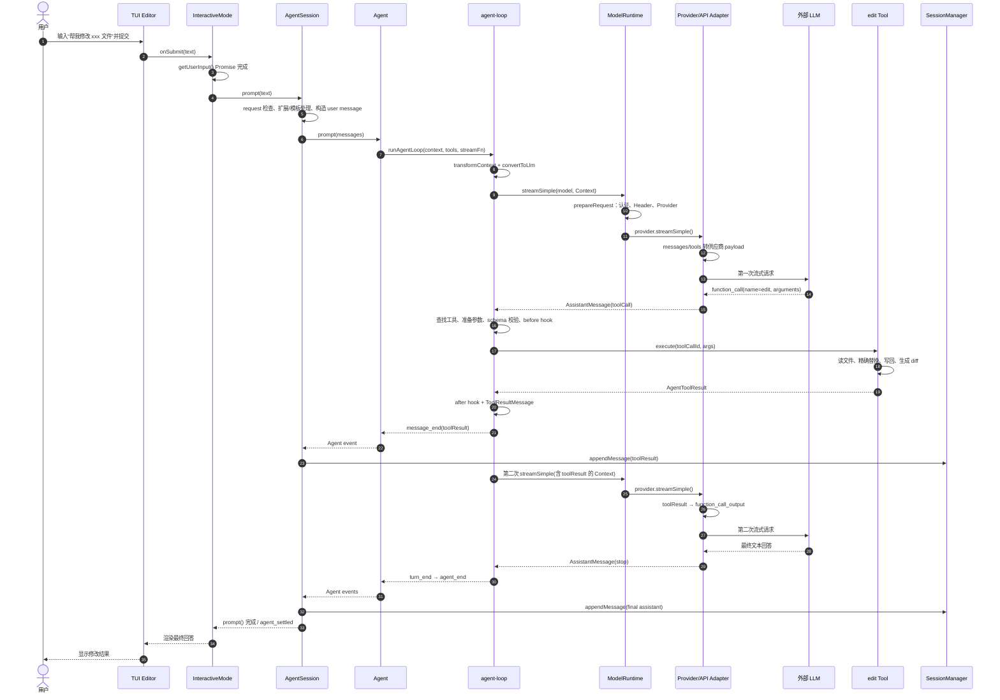

# 一次完整的 Agent 执行流程

本文从交互模式下用户输入：

```text
帮我修改 xxx 文件
```

开始，沿当前 `pi` CLI 的真实代码路径追踪一次完整执行：输入进入 TUI、构造请求和消息、调用 LLM、接收 ToolCall、执行 `edit`、把 ToolResult 回注上下文，再发起下一轮 LLM 推理。

## 范围与结论

本文追踪的是当前产品主链：

```text
packages/coding-agent
  → packages/agent
  → packages/ai
  → 外部 LLM
  → packages/agent
  → coding-agent Tool
```

需要先明确两个事实：

1. `"帮我修改 xxx 文件"` 本身没有说明具体修改内容。真实模型可能先追问，也可能先调用 `read` 检查文件；只有当模型返回 `edit` ToolCall 时，才会进入本文的具体文件修改分支。
2. 本地代码不通过 `if (prompt.includes("修改"))` 选择工具。代码只把工具名称、描述和参数 schema 发给 LLM，真正的工具选择由 LLM 输出的 ToolCall 决定。

为了完整展示工具回路，下面假设文件路径和修改目标已经能从当前对话上下文中确定，并且第一次 LLM 响应选择 `edit`。

## 总览

| 阶段 | 主要文件 | 类/函数 | 核心产物 |
|---:|---|---|---|
| 1. 入口 | `packages/coding-agent/src/cli.ts`、`packages/coding-agent/src/main.ts`、`packages/coding-agent/src/modes/interactive/interactive-mode.ts` | 模块入口、`main()`、`InteractiveMode.run()`、`getUserInput()` | 用户文本进入 `AgentSession` |
| 2. Request 处理 | `packages/coding-agent/src/core/agent-session.ts` | `AgentSession.prompt()` | 通过命令、扩展、压缩、模型和认证检查的请求 |
| 3. Message 构造 | `packages/coding-agent/src/core/agent-session.ts`、`packages/coding-agent/src/core/messages.ts`、`packages/agent/src/agent-loop.ts` | `AgentSession.prompt()`、`convertToLlm()`、`streamAssistantResponse()` | `user` AgentMessage 和统一 `Context` |
| 4. LLM 调用 | `packages/coding-agent/src/core/sdk.ts`、`packages/coding-agent/src/core/model-runtime.ts`、`packages/ai/src/api/openai-responses.ts` | 注入的 `streamFn`、`ModelRuntime.streamSimple()`、Provider `streamSimple()` | Provider 请求和流式 AssistantMessage |
| 5. Tool 选择 | `packages/ai/src/api/openai-responses.ts`、`packages/ai/src/api/openai-responses-shared.ts` | `convertResponsesTools()`、`processResponsesStream()` | 统一的 `ToolCall { id, name, arguments }` |
| 6. Tool 执行 | `packages/agent/src/agent-loop.ts`、`packages/coding-agent/src/core/tools/edit.ts` | `executeToolCalls()`、`prepareToolCall()`、`executePreparedToolCall()`、`createEditToolDefinition().execute()` | 文件修改和 `AgentToolResult` |
| 7. 结果返回 | `packages/agent/src/agent-loop.ts`、`packages/coding-agent/src/core/agent-session.ts` | `createToolResultMessage()`、`emitToolResultMessage()`、`_handleAgentEvent()` | `toolResult` 进入内存、会话文件和 UI 事件流 |
| 8. 下一轮推理 | `packages/agent/src/agent-loop.ts`、`packages/ai/src/api/openai-responses-shared.ts` | `runLoop()`、`streamAssistantResponse()`、`convertResponsesMessages()` | 第二次 LLM 请求和最终回答 |

## 1. 入口函数：从终端输入进入 AgentSession

### 文件路径

- `packages/coding-agent/src/cli.ts`
- `packages/coding-agent/src/main.ts`
- `packages/coding-agent/src/modes/interactive/interactive-mode.ts`

### 类/函数名

- `cli.ts` 模块顶层入口
- `main(args)`
- `InteractiveMode.init()`
- `InteractiveMode.setupEditorSubmitHandler()`
- `InteractiveMode.getUserInput()`
- `InteractiveMode.run()`

### 核心代码解释

进程入口在 `cli.ts`。它先配置全局 HTTP dispatcher，再调用：

```ts
main(process.argv.slice(2));
```

`main()` 解析参数、创建 Session/Model/Resource 等运行时服务，然后在交互模式下创建 `InteractiveMode` 并执行 `interactiveMode.run()`。

TUI 初始化时，`setupEditorSubmitHandler()` 给编辑器注册 `onSubmit`。空闲状态下，用户按 Enter 后并不直接调用 LLM，而是：

1. 清理输入并处理 slash command、bash command、compaction 和 streaming 等特殊状态。
2. 普通文本通过 `onInputCallback(text)` 交给正在等待的 `getUserInput()`；如果尚未开始等待，则进入 `pendingUserInputs`。
3. `run()` 的主循环得到文本后执行 `await this.session.prompt(userInput)`。

对应的实际控制流是：

```text
Editor.onSubmit
  → InteractiveMode.setupEditorSubmitHandler()
  → onInputCallback / pendingUserInputs
  → InteractiveMode.getUserInput()
  → InteractiveMode.run()
  → AgentSession.prompt(userInput)
```

### 为什么这样设计

TUI 输入是事件驱动的，但 Agent 请求适合用顺序 `await` 表达。`getUserInput()` 用 Promise 把两种模型连接起来，使主循环保持简单，同时编辑器仍能在 streaming、compaction 和命令模式下采用不同处理策略。

## 2. Request 处理：命令、扩展、队列、模型与认证检查

### 文件路径

- `packages/coding-agent/src/core/agent-session.ts`

### 类/函数名

- `AgentSession.prompt(text, options)`
- `AgentSession._tryExecuteExtensionCommand()`
- `AgentSession._expandSkillCommand()`
- `expandPromptTemplate()`
- `ExtensionRunner.emitInput()`
- `ExtensionRunner.emitBeforeAgentStart()`

### 核心代码解释

`AgentSession.prompt()` 是产品层的请求边界。普通文本在真正进入 Agent Core 前依次经过：

1. 检查是否为 Extension command。
2. 拒绝与手动 compaction 冲突的提交。
3. 触发 Extension `input` hook；扩展可以处理或改写文本和图片。
4. 展开 Skill command 和 Prompt Template。
5. 如果 Agent 已在 streaming，则按 `steer` 或 `followUp` 入队，不启动第二个并发 run。
6. flush 之前累积的 bash 上下文。
7. 验证是否已选择模型，以及 Provider 是否有可用认证。
8. 必要时在新 prompt 前执行 context compaction 检查。
9. 触发 `before_agent_start`，允许 Extension 添加自定义消息或覆盖本轮 system prompt。

本例不是 slash command，也不处于 streaming/compaction 状态，因此会继续构造普通 user message。

### 为什么这样设计

`AgentSession` 集中处理产品语义，避免 TUI、Print 和 RPC 三种模式各自重复实现命令、扩展、认证、队列与 compaction 逻辑。Agent Core 因此只需要处理已经合法化的消息和工具循环。

## 3. Message 构造：从字符串到统一 LLM Context

### 文件路径

- `packages/coding-agent/src/core/agent-session.ts`
- `packages/coding-agent/src/core/messages.ts`
- `packages/coding-agent/src/core/sdk.ts`
- `packages/agent/src/agent.ts`
- `packages/agent/src/agent-loop.ts`

### 类/函数名

- `AgentSession.prompt()`
- `AgentSession._runAgentPrompt()`
- `Agent.prompt()`
- `Agent.createContextSnapshot()`
- `convertToLlm()`
- `streamAssistantResponse()`

### 核心代码解释

`AgentSession.prompt()` 把展开后的文本构造成标准 user message：

```ts
{
  role: "user",
  content: [{ type: "text", text: expandedText }],
  timestamp: Date.now(),
}
```

图片会追加到 `content`。`nextTurn` 自定义消息和 `before_agent_start` 注入的消息也会加入同一批 `messages`。随后：

```text
AgentSession._runAgentPrompt(messages)
  → Agent.prompt(messages)
  → Agent.runPromptMessages()
  → runAgentLoop()
```

`runAgentLoop()` 把新消息追加到当前上下文，并发出 user message 的 `message_start`/`message_end` 事件。

第一次调用模型前，`streamAssistantResponse()` 再执行两层转换：

1. `transformContext()`：让 Extension 在 AgentMessage 层转换上下文。
2. `convertToLlm()`：把 Coding Agent 的自定义消息投影成 `pi-ai` 支持的 `user`、`assistant`、`toolResult`，并过滤不应发送给模型的 UI-only 内容。

最终统一上下文是：

```ts
{
  systemPrompt: context.systemPrompt,
  messages: llmMessages,
  tools: context.tools,
}
```

`tools` 已在 Session 启动时由 `AgentSession._buildRuntime()` 创建并放入 `agent.state.tools`。默认启用的内置工具是 `read`、`bash`、`edit`、`write`，同时可加入 Extension/SDK 工具，并受 allowlist、exclude 和 active tools 配置约束。

### 为什么这样设计

系统保留两种消息模型：

- `AgentMessage` 可以承载 UI、bash、compaction 和 Extension 自定义消息。
- `pi-ai Message` 只承载供应商能够理解的对话消息。

只在 LLM 边界转换，可让产品状态保持丰富，同时让 Agent Core 和 Provider 接口保持统一。

## 4. LLM 调用：从 Agent StreamFn 到具体 Provider API

### 文件路径

- `packages/coding-agent/src/core/sdk.ts`
- `packages/coding-agent/src/core/model-runtime.ts`
- `packages/ai/src/providers/openai.ts`
- `packages/ai/src/api/openai-responses.lazy.ts`
- `packages/ai/src/api/openai-responses.ts`
- `packages/ai/src/api/openai-responses-shared.ts`

### 类/函数名

- `createAgentSession()` 中注入给 `new Agent()` 的 `streamFn`
- `ModelRuntime.streamSimple()`
- `ModelRuntime.prepareRequest()`
- `Provider.streamSimple()`
- OpenAI 例子的 `streamSimple()`、`stream()`、`buildParams()`
- `client.responses.create()`

### 核心代码解释

`Agent` 不直接依赖任何 Provider。`createAgentSession()` 在创建 `Agent` 时注入 `streamFn`。该函数读取 timeout、retry、transport 和 attribution header 设置，再调用：

```text
ModelRuntime.streamSimple(model, context, options)
```

`ModelRuntime.streamSimple()` 使用 `lazyStream()` 延迟准备请求。真正开始消费流时，`prepareRequest()`：

1. 根据 `model.provider` 找到 Provider。
2. 在请求时重新解析 API key/OAuth、base URL、headers 和 env。
3. 合并配置 Header 和 Extension 的 Header 变换。
4. 调用 `prepared.provider.streamSimple(...)`。

Provider 再根据模型的 API adapter 构造具体协议。

以当前内置 OpenAI Provider 为具体例子：

```text
openaiProvider()
  → openAIResponsesApi() lazy adapter
  → openai-responses.streamSimple()
  → openai-responses.stream()
  → buildParams()
  → client.responses.create(...).withResponse()
```

`buildParams()` 把统一消息转换为 Responses API input，把工具转换为 function/custom tools，并设置 `stream: true`。响应再由 `processResponsesStream()` 归一化为 `AssistantMessageEventStream`。

如果当前模型使用 Anthropic、OpenAI Completions、Google 或其他 API，最后几步会进入对应 adapter，但 `Agent → ModelRuntime → Provider.streamSimple` 主链不变。

### 为什么这样设计

`StreamFn` 是依赖反转边界：Agent Core 只知道“给定 Model 和 Context，返回统一事件流”，不知道认证、HTTP SDK 或供应商协议。这样同一 Agent Loop 可以运行真实 Provider、代理 Provider、Faux 测试 Provider 或扩展 Provider。

认证在请求时解析，而不是启动时固定，可以支持执行工具期间过期的短期 OAuth token。

## 5. Tool 选择：LLM 决定，代码负责暴露与解析

### 文件路径

- `packages/coding-agent/src/core/agent-session.ts`
- `packages/coding-agent/src/core/tools/index.ts`
- `packages/ai/src/api/openai-responses.ts`
- `packages/ai/src/api/openai-responses-shared.ts`
- `packages/agent/src/agent-loop.ts`

### 类/函数名

- `AgentSession._buildRuntime()`
- `AgentSession._refreshToolRegistry()`
- `createAllToolDefinitions()`
- `convertResponsesTools()`
- `processResponsesStream()`
- `runLoop()`

### 核心代码解释

Session 启动时，`_buildRuntime()` 通过 `createAllToolDefinitions()` 创建内置工具定义，合并 Extension/SDK 工具，并把活动工具放入 `agent.state.tools`。

首次 LLM 请求时，OpenAI adapter 的 `convertResponsesTools()` 把每个工具转换为：

```text
name + description + JSON Schema parameters
```

对于 `edit`，模型看到的关键信息包括：单文件精确文本替换、`path` 参数和 `edits[{oldText,newText}]` 参数约束。

LLM 如果决定修改文件，会在流中返回 `function_call`。`processResponsesStream()` 将它归一化为：

```ts
{
  type: "toolCall",
  id,
  name: "edit",
  arguments: { path, edits },
}
```

并产生 `toolcall_start`、`toolcall_delta`、`toolcall_end` 事件。`runLoop()` 从最终 AssistantMessage 的 `content` 中筛选 `type === "toolCall"`。

### 为什么这样设计

工具选择依赖自然语言语义和当前对话上下文，适合由 LLM 决策。运行时代码只负责：

- 明确暴露允许使用的工具。
- 用 schema 限制参数结构。
- 把不同 Provider 的 ToolCall 归一化。
- 在执行前再次做本地校验和 hook 检查。

这将“决策”和“执行权限”分开：模型可以提出调用，但本地 runtime 决定该调用是否存在、是否合法、是否被 Extension 阻止，以及实际执行什么代码。

## 6. Tool 执行：从 ToolCall 到真实文件写入

### 文件路径

- `packages/agent/src/agent-loop.ts`
- `packages/ai/src/utils/validation.ts`
- `packages/coding-agent/src/core/tools/tool-definition-wrapper.ts`
- `packages/coding-agent/src/core/extensions/wrapper.ts`
- `packages/coding-agent/src/core/tools/edit.ts`
- `packages/coding-agent/src/core/tools/file-mutation-queue.ts`

### 类/函数名

- `executeToolCalls()`
- `executeToolCallsSequential()` / `executeToolCallsParallel()`
- `prepareToolCall()`
- `validateToolArguments()`
- `executePreparedToolCall()`
- `wrapToolDefinition()` / `wrapRegisteredTool()`
- `createEditToolDefinition().execute()`

### 核心代码解释

`runLoop()` 发现 ToolCall 后进入 `executeToolCalls()`。执行流程为：

1. 判断整个 batch 使用 sequential 还是 parallel。默认可并行；全局配置为 sequential，或任一工具声明 `executionMode: "sequential"` 时，整个 batch 顺序执行。
2. 发出 `tool_execution_start`。
3. 按 `toolCall.name` 在当前活动工具中查找 `AgentTool`。
4. 调用可选的 `prepareArguments()` 兼容模型输出差异。
5. 使用 TypeBox schema 执行 `validateToolArguments()`。
6. 调用 `beforeToolCall`；Extension 可以 block 或要求 terminate。
7. `executePreparedToolCall()` 调用真实的 `tool.execute()`，并转发 partial update。
8. 调用 `afterToolCall`；Extension 可以改写结果或错误状态。

对于 `edit`，ToolDefinition 经 wrapper 变成 AgentTool，最终进入 `createEditToolDefinition().execute()`：

1. `prepareEditArguments()` 兼容字符串形式、单对象形式和旧参数形式的 `edits`。
2. `validateEditInput()` 确保至少有一个 replacement。
3. `resolveToCwd()` 以当前工作目录为基准解析相对路径，同时支持绝对路径和 `~` 展开。
4. `withFileMutationQueue(absolutePath, ...)` 串行化同一文件的并发修改。
5. 检查文件可读写并读取原内容。
6. 分离 BOM，识别行尾格式，统一成 LF 后做精确替换。
7. 将原行尾格式和 BOM 恢复后写回文件。
8. 生成展示 diff、unified patch 和首个修改行号。
9. 返回 `Successfully replaced ...` 文本及结构化 details。

### 为什么这样设计

参数准备、schema 校验、权限 hook 和真实执行被拆开，使模型输出不可信时仍有本地防线。Tool 通过 throw 表示失败，Agent Loop 统一把异常转换为 error ToolResult，因此一次工具失败不会破坏对话协议。

`edit` 使用精确文本匹配而不是让模型直接提交任意整文件内容，可减少覆盖无关内容的风险；文件级 mutation queue 防止同一轮并行工具发生丢失更新。

## 7. 结果返回：AgentToolResult 变成 ToolResultMessage

### 文件路径

- `packages/agent/src/agent-loop.ts`
- `packages/agent/src/agent.ts`
- `packages/coding-agent/src/core/agent-session.ts`
- `packages/coding-agent/src/modes/interactive/interactive-mode.ts`

### 类/函数名

- `finalizeExecutedToolCall()`
- `emitToolExecutionEnd()`
- `createToolResultMessage()`
- `emitToolResultMessage()`
- `Agent.processEvents()`
- `AgentSession._handleAgentEvent()`
- `InteractiveMode.handleEvent()`

### 核心代码解释

工具执行完成后，`finalizeExecutedToolCall()` 应用 `afterToolCall` 的最终覆盖，然后：

1. `emitToolExecutionEnd()` 发出工具完成事件，供 UI 和 Extension 使用。
2. `createToolResultMessage()` 构造标准消息：

```ts
{
  role: "toolResult",
  toolCallId,
  toolName: "edit",
  content,
  details,
  isError,
  timestamp,
}
```

3. `emitToolResultMessage()` 发出该消息的 `message_start` 和 `message_end`。
4. `Agent.processEvents(message_end)` 将最终 ToolResult 追加到 `agent.state.messages`。
5. `AgentSession._handleAgentEvent(message_end)` 调用 `SessionManager.appendMessage()`，追加写入当前 JSONL Session。
6. `runLoop()` 还会把 ToolResult 追加到本轮的 `currentContext.messages` 和 `newMessages`。
7. TUI 主要通过 `tool_execution_start/update/end` 更新对应 `ToolExecutionComponent`。

并行执行多个工具时，工具完成事件可以按真实完成顺序出现，但 ToolResultMessage 会按 Assistant 原始 ToolCall 顺序进入 transcript。

### 为什么这样设计

工具结果同时服务三个消费者：

- LLM 需要协议化 ToolResult 才能继续推理。
- Session 需要持久化，才能恢复和重放。
- UI 需要生命周期事件，才能实时显示运行状态和 diff。

使用同一事件流驱动内存状态、持久化和 UI，避免三套状态独立更新后发生顺序不一致。

## 8. 下一轮推理：ToolResult 自动触发第二次 LLM 请求

### 文件路径

- `packages/agent/src/agent-loop.ts`
- `packages/coding-agent/src/core/agent-session.ts`
- `packages/ai/src/api/openai-responses-shared.ts`

### 类/函数名

- `runLoop()`
- `AgentSession._installAgentNextTurnRefresh()`
- `streamAssistantResponse()`
- `convertResponsesMessages()`
- `AgentSession._handlePostAgentRun()`

### 核心代码解释

工具 batch 执行后，`runLoop()` 设置：

```text
hasMoreToolCalls = !executedToolBatch.terminate
```

普通 `edit` 结果没有 `terminate: true`，因此内层 `while` 继续。进入下一轮前：

1. 发出上一轮 `turn_end`。
2. 调用 `prepareNextTurn`。Coding Agent 安装的 refresh 会重新提供当前 system prompt、活动工具、模型和 thinking level，使 Extension 在工具执行期间做出的变更对下一轮生效。
3. 检查 graceful stop 和 steering messages。
4. 再次调用 `streamAssistantResponse()`。

省略更早历史和 system prompt 后，第二次请求的本轮核心消息序列为：

```text
user("帮我修改 xxx 文件")
assistant(toolCall: edit)
toolResult("Successfully replaced ...")
```

OpenAI Responses adapter 的 `convertResponsesMessages()` 会把 `toolResult` 转成与原 `call_id` 对应的 `function_call_output`。因此模型能明确知道哪个工具调用完成、输出是什么，再生成最终文字回答。

如果第二次 AssistantMessage 不再包含 ToolCall，`hasMoreToolCalls` 变为 false。循环再检查 follow-up queue；没有 follow-up 时发出 `agent_end`。`AgentSession._runAgentPrompt()` 随后处理可能的自动重试、compaction 或排队 continuation，最后发出产品层 `agent_settled` 并让最初的 `await session.prompt(...)` 返回。

### 为什么这样设计

ToolResult 不是返回给用户后结束，而是模型下一轮的输入。这样 LLM 能根据真实执行结果决定：

- 修改是否成功。
- 是否需要再次读取或修正。
- 是否需要调用更多工具。
- 何时给用户最终答复。

循环只根据结构化状态继续，不依赖某个供应商的文本约定，因此同一逻辑适用于所有 Provider。

## 消息与状态的完整变化

一次单 `edit` 调用的理想化 transcript 如下：

```text
M0  [...历史消息]

M1  [...历史消息,
     user("帮我修改 xxx 文件")]

M2  [...历史消息,
     user(...),
     assistant(toolCall: edit)]

M3  [...历史消息,
     user(...),
     assistant(toolCall: edit),
     toolResult(edit 成功或失败)]

M4  [...历史消息,
     user(...),
     assistant(toolCall: edit),
     toolResult(...),
     assistant(最终回答)]
```

`message_end` 是 finalized message 进入 Agent state 和 JSONL Session 的关键提交点。流式 partial assistant 只用于当前显示，不作为独立的最终消息持久化。

## 最终调用链



## 可用于调试的断点顺序

如果要在调试器中验证这条链，按以下顺序下断点：

1. `InteractiveMode.setupEditorSubmitHandler()`
2. `InteractiveMode.run()` 中的 `this.session.prompt(userInput)`
3. `AgentSession.prompt()`
4. `AgentSession._runAgentPrompt()`
5. `Agent.prompt()`
6. `runAgentLoop()`
7. `streamAssistantResponse()`
8. `ModelRuntime.streamSimple()` / `prepareRequest()`
9. 当前 Provider adapter 的 `streamSimple()` / `stream()`
10. `executeToolCalls()` / `prepareToolCall()`
11. `createEditToolDefinition().execute()`
12. `createToolResultMessage()`
13. 第二次 `streamAssistantResponse()`

验证成功时，最小消息角色序列应为：

```text
user → assistant → toolResult → assistant
```

仓库中的 `packages/coding-agent/test/suite/agent-session-prompt.test.ts` 已用 Faux Provider 验证：`AgentSession.prompt()` 会执行 ToolCall，并等待消费 ToolResult 的 follow-up LLM 响应后才完成。
