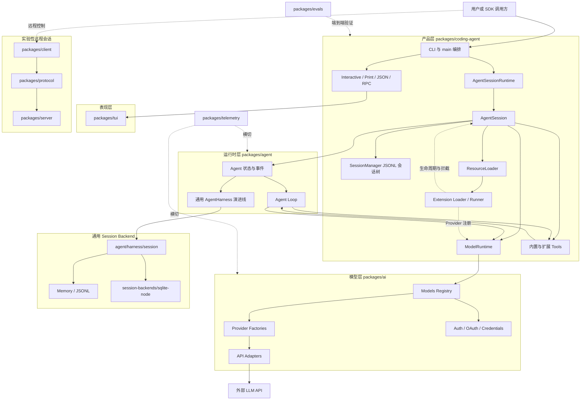

# Pi Agent 源码架构学习指南

本目录是一套面向一周学习周期的源码阅读课程。目标不是记住每个类和函数，而是建立一张能够解释系统运行方式、模块边界和关键设计取舍的架构地图。

本指南基于仓库当前结构编写。阅读过程中应以本地源码为最终依据；如果文件移动或实现发生变化，先更新路径和调用链，再继续学习。

## 学习目标

完成本课程后，应能够独立回答以下问题：

1. Pi 为什么被组织成 `coding-agent → agent-core → pi-ai` 三层？
2. 用户输入从 CLI 到 LLM，再到工具调用和最终输出，经过哪些对象？
3. `Agent`、`AgentSession`、`SessionManager` 和 `ModelRuntime` 分别拥有哪部分状态？
4. Agent 主循环如何决定继续调用模型、执行工具或结束运行？
5. Provider、Model、API Adapter 和认证系统如何配合完成一次 LLM 请求？
6. 会话树、Context、Compaction 和 Branch Summary 之间是什么关系？
7. Extension 如何注册工具、命令、Provider，并拦截 Context、Tool 和 Session 生命周期？
8. 本地 CLI 主链和实验性 `AgentHarness/Protocol/Client/Server` 演进链有什么区别？
9. 如果需要修改某项能力，应该从哪个 package 和哪个边界开始？

## 文档导航

建议按以下顺序使用本目录：

1. [七天学习计划](01-one-week-plan.md)：每天读什么、做什么、产出什么。
2. [逐文件阅读顺序](02-source-reading-order.md)：分阶段的文件清单、阅读重点和跳过项。
3. [核心调用链导读](03-call-chain-guides.md)：沿真实运行路径阅读源码。
4. [练习与验收清单](04-exercises-and-checklists.md)：检查是否真正掌握，而不是只看完文件。
5. [一次完整的 Agent 执行流程](05-complete-agent-execution-flow.md)：从交互输入追踪到 LLM、ToolResult 和下一轮推理。
6. [pi-agent-core Runtime 源码分析](06-pi-agent-core-runtime-analysis.md)：集中解释 Runtime、状态、消息、工具、中断、多轮对话和 session 恢复。
7. [Pi Tool 系统源码分析](07-pi-tool-system-analysis.md)：深入解释 Tool 接口、schema、Provider 暴露、参数解析、异常处理和 ToolResult 回注。

## 建议时间投入

默认计划按每天 3 小时、连续 7 天设计，总计约 21 小时：

- 30 分钟：回顾前一天架构图和问题。
- 90 分钟：按调用链阅读当天源码。
- 40 分钟：画图或写结构化笔记。
- 20 分钟：口述、问答或小练习验收。

如果每天只有 1.5 小时，保留“调用链阅读”和“当天产出”，将扩展阅读放到第二周。如果每天有 5 小时，不要盲目增加文件数量，优先增加调试跟踪、测试阅读和设计取舍分析。

## 项目总体架构

Pi 是一个 TypeScript monorepo。它的核心形态是“分层的模块化单体 + 可嵌入 SDK”，并包含一条仍在发展的远程会话和通用 Harness 架构线。



## 当前主链与演进链

阅读本仓库最容易犯的错误，是把两条架构线混成一条。

### 当前 CLI 主链

当前 `pi` CLI 的完整产品路径是：

```text
coding-agent CLI/main
  → AgentSessionRuntime
  → AgentSession
  → agent-core Agent
  → agent-core agent-loop
  → coding-agent ModelRuntime
  → pi-ai Provider/API
```

会话持久化主要由 `packages/coding-agent/src/core/session-manager.ts` 提供，是基于 JSONL 的追加式会话树。工具、Extension、自动压缩和交互界面也主要由 `coding-agent` 负责。

### 通用 Harness 演进链

仓库还包含：

```text
agent/AgentHarness
  → agent/harness/session
  → InMemory / JSONL / SQLite backend
  → protocol / client / server
```

这条线面向更通用的持久化、恢复、lane 和远程会话能力。当前 `AgentHarness` 中仍有多项操作明确返回“未实现”，因此不能把它当作当前 CLI 已经采用的完整主循环。

学习顺序应先掌握当前主链，再阅读演进链。否则容易在大量接口和未来设计中失去方向。

## Package 地图

| Package | 核心职责 | 第一周优先级 | 关键入口 |
|---|---|---:|---|
| `packages/coding-agent` | 产品编排、CLI、SDK、AgentSession、会话、工具、扩展、配置、模式 | 最高 | `src/cli.ts`、`src/main.ts`、`src/core/sdk.ts` |
| `packages/agent` | Agent 状态、事件、主循环和通用 Harness 基础 | 最高 | `src/agent.ts`、`src/agent-loop.ts` |
| `packages/ai` | Model/Provider 注册、认证、API 适配和流式响应 | 最高 | `src/models.ts`、`src/providers/all.ts` |
| `packages/tui` | 终端渲染、输入、布局和组件 | 中 | `src/index.ts`、`src/tui.ts` |
| `packages/telemetry` | 无供应商绑定的遥测契约和 schema | 低 | `src/index.ts` |
| `packages/protocol` | 远程会话 schema、CBOR 和 framing | 中低 | `src/schemas.ts`、`src/codec.ts` |
| `packages/client` | 远程 session client、连接和 lease | 中低 | `src/client.ts` |
| `packages/server` | 实验性 session server 核心 | 中低 | `src/server.ts` |
| `packages/session-backends/sqlite-node` | 通用 Session 的 SQLite Repository 和 FTS | 低 | `src/sqlite/repo.ts` |
| `packages/evals` | 端到端 Agent 能力评测 | 低 | `src/pi-harness.ts` |

## 关键对象的职责边界

### `Agent`

负责通用运行态：

- 当前模型、系统提示词、消息和工具列表。
- streaming、pending tool call 和错误状态。
- steering/follow-up 队列。
- 调用低层 Agent Loop。
- 把循环事件归约到自身状态并通知订阅者。

它不应该知道具体 CLI、TUI、JSONL 文件格式或某个 Provider SDK。

### `AgentSession`

负责 Coding Agent 产品级生命周期：

- 将 Agent、SessionManager、ModelRuntime、Settings 和 ResourceLoader 组合起来。
- 保存 Agent 事件到会话。
- 处理 Extension 生命周期和 Tool 前后置 hook。
- 构建系统提示词和有效工具集合。
- 处理自动重试、Compaction、分支导航和 Bash 等产品行为。

它是当前产品主链中最重要、也最复杂的协调器。

### `SessionManager`

负责当前 CLI 的会话事实：

- JSONL 追加写入。
- 通过 `id/parentId` 维护树结构。
- 维护当前 leaf。
- 保存消息、模型变更、thinking level、compaction、branch summary 和扩展数据。
- 从当前分支重建发送给 LLM 的 Context。

### `ModelRuntime`

负责 Coding Agent 的模型运行环境：

- 组合内置 Provider、配置文件 Provider 和 Extension Provider。
- 管理认证、模型目录、可用性和刷新。
- 对请求应用配置、认证和 Header 转换。
- 将请求分发给具体 Provider。

### `ExtensionRunner`

负责运行已经加载的 Extension：

- 保存注册的工具、命令、快捷键、Provider 和事件 handler。
- 分发生命周期事件。
- 为 Extension 创建受当前 Session 约束的 Context。
- 在 Session 被替换或 reload 后使旧 Context 失效。

## 五条必须掌握的运行链

一周内至少要能够不看源码画出以下五条链：

### 启动链

```text
cli.ts
  → main()
  → 解析参数与运行模式
  → 创建 SessionManager
  → 创建 Settings/Model/Resource 服务
  → createAgentSession()
  → 创建 AgentSessionRuntime
  → 进入 Interactive、Print 或 RPC 模式
```

### 普通 Prompt 链

```text
Mode
  → AgentSession.prompt()
  → Extension input/before_agent_start
  → Agent.prompt()
  → runAgentLoop()
  → streamAssistantResponse()
  → ModelRuntime.streamSimple()
  → Provider/API
```

### Tool 链

```text
LLM ToolCall
  → Agent Loop 查找 Tool
  → 参数准备与校验
  → beforeToolCall Extension hook
  → Tool.execute()
  → afterToolCall Extension hook
  → ToolResultMessage
  → 下一轮 LLM 请求
```

### Session/Context 链

```text
Agent message_end
  → AgentSession 订阅事件
  → SessionManager.appendMessage()
  → JSONL 追加写入

恢复或压缩后：
SessionManager.buildSessionContext()
  → 当前分支
  → 应用最近一次 Compaction
  → 生成 AgentMessage[]
  → convertToLlm()
```

### Extension 链

```text
ResourceLoader
  → 发现全局、项目和 Package 资源
  → Extension Loader 执行 factory
  → Extension 注册 Tool/Command/Provider/Event
  → ExtensionRunner
  → AgentSession 接入 Tool、Context、Provider、Session 和 UI
```

## 阅读原则

### 先追调用链，再理解类的全部能力

第一遍只回答：谁创建它、谁调用它、它调用谁、状态存在哪里。第二遍再研究错误处理、并发、重试和边界条件。

### 区分“定义文件”和“运行文件”

- `types.ts` 主要告诉你系统允许表达什么。
- `index.ts` 主要告诉你公开了什么。
- `loader/registry` 主要告诉你组件如何被发现和组装。
- `runner/loop/session` 才告诉你运行时真正发生了什么。

第一遍不要从大型 `types.ts` 开始。

### 每读一个文件都写四句话

1. 这个文件属于哪一层？
2. 它拥有哪部分状态？
3. 它的上游调用者是谁？
4. 它的下游依赖是谁？

无法回答时，说明当前阅读仍停留在局部实现层面。

### 对大型文件采用三遍法

`main.ts`、`agent-session.ts`、`session-manager.ts`、`interactive-mode.ts` 等文件不适合逐行硬读：

1. 第一遍：只读 imports、公开类型、class 字段和方法名。
2. 第二遍：只追本阶段关注的调用链。
3. 第三遍：阅读错误、重试、清理和边界条件。

### 用测试验证理解

测试不是第一入口，但非常适合验证推断：

- 如果你认为某个事件顺序固定，找对应事件测试。
- 如果你认为 Session 是追加式树，找 branch/context/session-manager 测试。
- 如果你认为 Tool 可以并行，找 agent-loop 的 tool execution 测试。
- 如果你认为 Extension 可以拦截某阶段，找 suite/regressions 和 extension 示例。

## 第一周暂时跳过的内容

除非当天计划明确要求，否则第一周第一遍可以跳过：

- `*.generated.ts` 和 Provider 模型数据。
- 各 Provider 的全部协议细节。
- TUI 所有视觉组件和终端转义序列。
- HTML 导出模板和图片处理实现。
- 发布、打包、二进制构建和 shrinkwrap 脚本。
- 大量 issue-specific regression 测试。
- `AgentHarness` 中尚未实现方法的细节。

这些内容并非不重要，而是不会帮助你更快建立主架构。

## 学习完成的定义

“看完文件”不等于完成。达到以下标准才算完成第一周：

- 能在 10 分钟内画出 package 架构图。
- 能在 5 分钟内讲清普通 Prompt 和 Tool Prompt 两条链。
- 能准确区分 Agent、AgentSession、SessionManager 和 ModelRuntime。
- 能指出 Context 在哪些阶段被重建、转换和拦截。
- 能解释为什么当前 Session 不是传统向量 Memory。
- 能说明 Extension 的发现、注册、运行和失效过程。
- 能指出当前主链与实验性 Harness/远程链的边界。
- 面对一个新需求，能判断首先应进入哪个 package。
